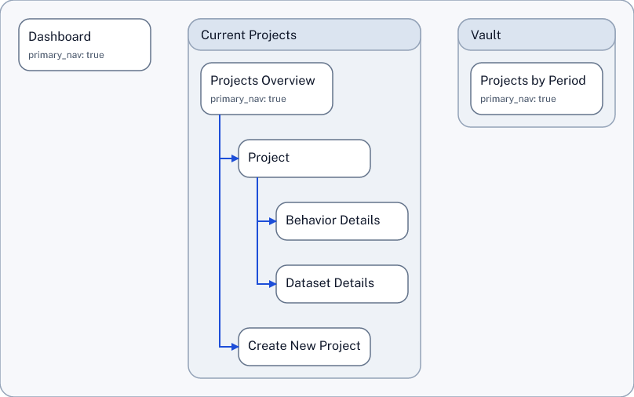
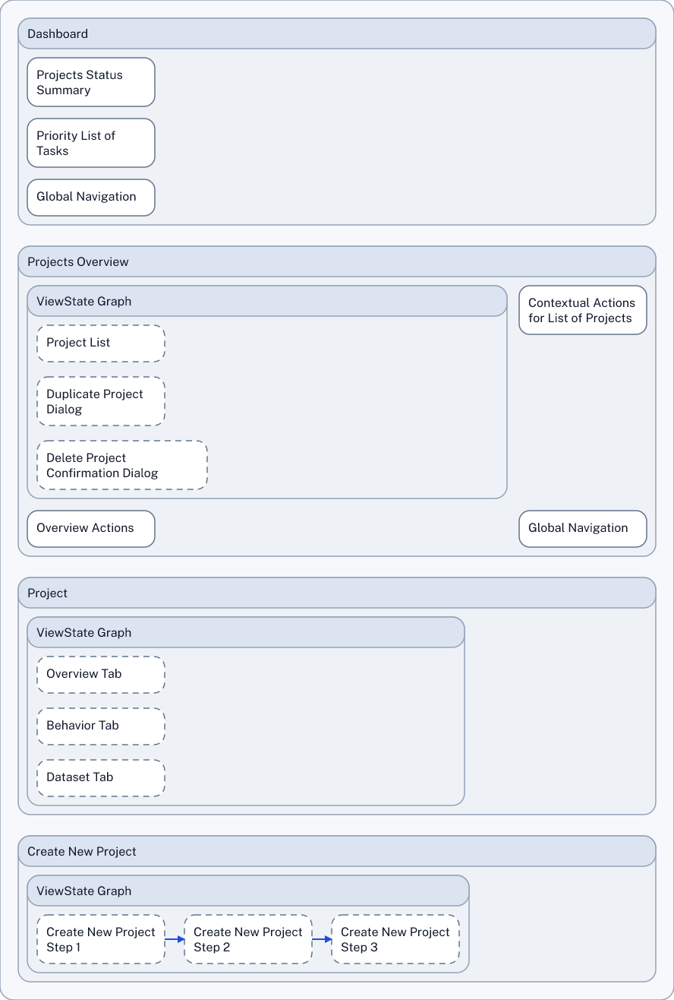

# README: Structured Design Documents

SDD-Text is a compact language for describing software product design as a structured map. SDD-Text is easy to read and write, for people and for LLMs.

SDD-Text makes design elements and their relationships explicit, in a unified "Product Design Graph", which captures a variety of product design perspectives as a single, interconnected set of nodes. In technical terms, it is a DSL (Domain Specific Language) for authoring a structured graph of design information.

Different aspects of the unified graph can be shown (rendered) as diagrams. Usable staged SVG/PNG renderers are currently available for IA / Place Map, UI Contract, Service Blueprint, and Scenario Flow views. See [Diagram Types](docs/readme_support_docs/diagram_types/).

This repository contains the spec bundle defining the language. The bundle is meant to evolve, to improve the language. The repository also contains a toolchain that validates and compiles SDD source into canonical JSON for tooling and renders different views of the same graph as diagrams. 

Because rendering is separate from the source model, tools that work with design structure do not need graphical capabilities, while rendering tools can focus solely on presentation.

## Why It Exists

- To provide a structured source of truth for product design instead of fragmented diagrams and documents.
- To make design structure machine-readable for validation, tooling, and deterministic rendering.
- To create design artifacts that AI and LLM workflows can consume without relying on image interpretation.
- To provide a means to AI and LLM workflows to "speak design", so they can create structural design information outside blobs of code.
- To give "traditional" product, design, and diagramming tools a shared semantic layer they can integrate with.

## Quick Start

Prerequisites: [Git](https://github.com/git/git), [Node.js 22 LTS](https://github.com/nodejs/node), and [pnpm](https://github.com/pnpm/pnpm). Install Node.js 22 first; `pnpm` will be activated via Corepack in the steps below.

```bash
git clone https://github.com/knutopia/Structured-Design-Documents.git
cd Structured-Design-Documents
corepack enable
pnpm install
pnpm run build
pnpm sdd --help
pnpm sdd show docs/readme_support_docs/small_app_example/small_app.sdd --profile simple --view ia_place_map --out my_first_ia.svg
```

Notes:

- `corepack enable` activates the repo-pinned `pnpm` version declared in `package.json`.
- If you hit temp-directory permission errors in some WSL setups, rerun commands with `TMPDIR=/tmp`. For more environment details, see [docs/toolchain/development.md](/home/knut/projects/sdd/docs/toolchain/development.md). See [bundle/v0.1/examples/](bundle/v0.1/examples/) for additional sample `.sdd` inputs.

## Example: Small App

Here is a small SDD-Text example showing a dashboard, a project area, and a few linked places and view states. From this source file, an Information Architecture / Place Map and a UI Contracts diagram are generated.

Full source: [`small_app.sdd`](docs/readme_support_docs/small_app_example/small_app.sdd)

```text
SDD-TEXT 0.1

# small_app.sdd example file
#
# Area nodes and Places show up in the ia_place_map diagram.
# Place nodes, their View States and Components show up in the ui_contracts diagram.
#
# This example is built for the "simple" profile, for quick sketches.

Place P-100 "Dashboard"
  description="Global project status and flow entry points"
  primary_nav=true
  COMPOSED_OF C-100 "Projects Status Summary"
  COMPOSED_OF C-110 # (Quoted target name hints are optional...)
  COMPOSED_OF C-900 "Global Navigation" # (...but can improve readability)

  + Component C-100 "Projects Status Summary"
    description="At-a-glance view of project statuses"
  END
  + Component C-110 "Priority List of Tasks"
    description="What needs to be done"
  END
END

Area A-200 "Current Projects"
  description="Ongoing work"
  CONTAINS P-210 "Projects Overview"
  CONTAINS P-220 "Project Detail"
  CONTAINS P-230 "Create New Project"
  + Place P-210 "Projects Overview"
    description="Selectable list of projects with contextual actions"
    primary_nav=true
    CONTAINS VS-210a "List of Projects"
    CONTAINS VS-210b "Duplicate Project Dialog"
    CONTAINS VS-210c "Delete Project Confirmation Dialog"
```

Rendered outputs (click to open full size):

<a href="docs/readme_support_docs/small_app_example/small_app_ia_1.png">
  
</a>
<a href="docs/readme_support_docs/small_app_example/small_app_uic_1.png">
  
</a>

See also: [Service Blueprint Slice example](docs/readme_support_docs/service_blueprint_slice_example/) for a service blueprint view that connects customer steps to frontstage, backstage, support, system, and policy lanes.

## Orientation

- [bundle/v0.1/](bundle/v0.1/) houses the tight, machine-readable specifications for version 0.1. These specifications are the source of truth for tooling.

- [definitions/v0.1/](definitions/v0.1/) houses explanatory definitions and rationale for version 0.1 and should stay consistent with the bundle.

### Learn More

- SDD Skill Guide (Codex Skill): [SDD Skill Guide](docs/readme_support_docs/sdd-skill/)

- SDD CLI Guide ("sdd show" etc): [SDD CLI User Guide](docs/readme_support_docs/sdd_cli_tools/)

- SDD Helper Guide (JSON-first companion for the skill): [SDD Helper Guide](docs/readme_support_docs/sdd-helper/)

- Authoring Spec: [SDD-Text v0.1 — Authoring Spec (Type-first DSL)](definitions/v0.1/authoring_spec_type_first_dsl_sdd_text_v_0_dot_1.md)

- [Initial Concepts 1: a 6-Diagram Suite v0.1](<initial_concepts/Initial Concepts1 a 6-Diagram Suite v0dot1.md>)

- [Initial Concepts 2: One-page Schema v0.1](<initial_concepts/Initial Concepts2 One-page Schema v0dot1.md>)

- Original document outlining the idea: [Structured Design Artifacts to Advance the Software Product Design Practice](<initial_concepts/Structured Design Artifacts to Advance the Software Product Design Practice.md>)

- [Strategic Potential of SDD in the Product Lifecycle](<docs/readme_support_docs/strategic_potential/README.md>)

## Current Status

### Working Now

- Solid v0.1 SDDT spec bundle
- Completed initial compile-validate-render pipeline.
- Completed usable staged SVG renderers for IA / Place Map, UI Contract, Service Blueprint, and Scenario Flow
- sdd-helper app available to assist agentic skills

### Known Limitations

- Outcome-Opportunity Map and Journey Map renderers do not produce usable output yet.
  - examples show unusable diagrams relying on poor Graphviz-based implementation
- Styling for renderers lives in TypeScript source and should be in CSS files
- Example corpus is spotty
- No "simple" non-technical user guidance available yet

### Current Focus

- LLM integration (Skills, MCP Server)

## Planned Additions

- Solve renderers for more diagram types
- Possibly standalone SDDT file server?

## License And Contributions

- License: this project is available under the [MIT License](LICENSE).
- Contributing: please read [CONTRIBUTING.md](CONTRIBUTING.md) before opening an issue or pull request. This repository is currently coordination-first and is not accepting unsolicited pull requests.
- Contributor License Agreement: accepted outside contributions also require written acceptance of the [CLA](CLA.md) before implementation or merge.
