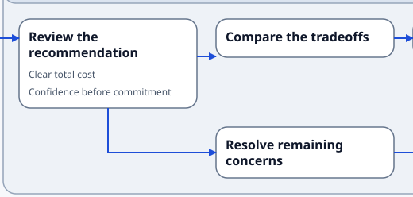
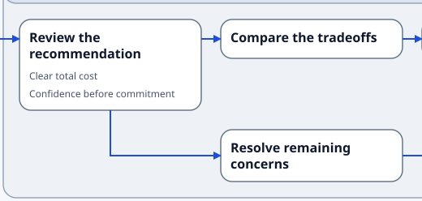
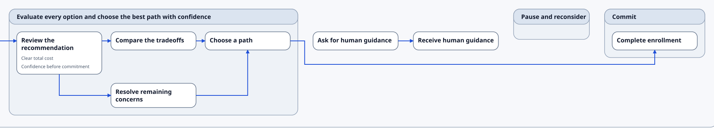

# [Done] Journey Map Stage-2 Visual Remediation — Comparison Record

Status: **accepted by visual review on 2026-07-23**

Evidence date: 2026-07-23

Issues under review:

- `JM-VIS-009` — direct connector vertical balance — closed.
- `JM-VIS-010` — span-local long-forward track — closed.

Before revision: `66dfccf`

After source state: working tree based on `66dfccf`; implementation/contract/test/current-state diff SHA-256 `ab6563aa82c2140f3463c6d81c733d891e7e186306753be55a4967669c07cd4b`.

This record preserves the accepted visual-review checkpoint for the Stage-2 Journey Map remediation. Both issues closed after explicit visual approval. The historical completed plans and the prior [comparison record](journey_map_visual_remediation_comparison_record.md) remain unchanged, and the rendered corpus remains unpromoted.

The SVGs under [`assets/visual-remediation-stage2-2026-07-23/full/`](assets/visual-remediation-stage2-2026-07-23/full/) are immutable full proofs. The files under [`focus/`](assets/visual-remediation-stage2-2026-07-23/focus/) change only the outer SVG `width`, `height`, and `viewBox`; every rendered element remains present. Each focus viewBox has 24px proof padding.

## `JM2-RM-01` — balanced straight connectors

Issue: `JM-VIS-009` — closed after visual approval.

### Primary sequence: `J-101..J-103`

| Before | After |
| --- | --- |
|  |  |

- **Proof edges:** `J-101→J-102` and `J-102→J-103`, with `J-103→J-201` visible at the right boundary.
- **Expected visible change:** `J-102→J-103` moves from `y=124` to `y=116`, the center of the less-tall `J-103` edge.
- **Regression controls:** `J-101→J-102` and `J-103→J-201` remain at `y=116`; all three proofs remain one horizontal segment with an unambiguous arrowhead.
- **Intrinsic size and focus viewBox:** full `2775.576×344`; `28 68 848 112`.

### Primary branch: `J-201→J-202`

| Before | After |
| --- | --- |
|  |  |

- **Proof edges:** `J-201→J-202`, with `J-201→J-203` retained as lower-branch context.
- **Expected visible change:** `J-201→J-202` moves from `y=139` to `y=116`, the center of the less-tall `J-202` edge.
- **Regression controls:** the lower branch remains `M 1044 204 L 1044 260 L 1180 260`; there is no shared trunk or ambiguous junction.
- **Intrinsic size and focus viewBox:** full `2775.576×344`; `908 68 520 248`.

### Public proof: `J-001→J-002`

| Before | After |
| --- | --- |
|  |  |

- **Proof edge:** `J-001→J-002`.
- **Expected visible change:** the route moves from `y=127` to `y=116`, the center of the less-tall `J-002` edge.
- **Regression controls:** the route remains exactly `M 276 116 L 300 116` after remediation; card geometry and the single arrowhead are unchanged.
- **Intrinsic size and focus viewBox:** full `576×214`; `28 68 520 112`.

### `JM2-RM-01` evidence summary

- **Full SVGs:** primary [before](assets/visual-remediation-stage2-2026-07-23/full/primary.before.svg), [after](assets/visual-remediation-stage2-2026-07-23/full/primary.after.svg); public [before](assets/visual-remediation-stage2-2026-07-23/full/public-outcome-to-ia.before.svg), [after](assets/visual-remediation-stage2-2026-07-23/full/public-outcome-to-ia.after.svg).
- **Diagnostics:** the primary proof retains one existing informational `renderer.scene.journey_map_disconnected_chain` diagnostic and has zero warnings or errors before and after. The public proof has no diagnostics before or after.
- **Reviewer result:** accepted on 2026-07-23. All three routes are visibly balanced, remain single horizontal segments, and retain clear arrowheads without card or header intersections.

## `JM2-RM-02` — locally clear long-forward track

Issue: `JM-VIS-010` — closed after visual approval.

| Before | After |
| --- | --- |
|  |  |

- **Proof edge:** `J-204→J-401`.
- **Proof bounds:** the `G-200` east edge through `G-400`, including root Steps `J-250`, `J-260`, and `G-300`.
- **Expected visible change:** the root-owned horizontal segment moves from `y=330` to the bounds-derived `y=178`. The local clearance envelope ends at `y=160`, leaving the authoritative 18px preferred clearance.
- **Route contract after remediation:** source-east endpoint `1652,116`; source Stage east gate `1672,116`; track span `1690..2611.576`; target Stage south gate `2611.576,160`; target south endpoint `2611.576,140`.
- **Local clearance IDs:** `J-250`, `J-260`, `G-300`, and target Stage `G-400`, in root order. The non-overlapping tall `G-200` is not part of the local clearance calculation.
- **Regression controls:** source-east egress, target-south entry, the terminal arrowhead, root child order, and all Step and Stage bounds remain unchanged. No full-row fallback warning is present in the nominal proof.
- **Full SVGs:** [before](assets/visual-remediation-stage2-2026-07-23/full/primary.before.svg), [after](assets/visual-remediation-stage2-2026-07-23/full/primary.after.svg).
- **Intrinsic size and focus viewBox:** full `2775.576×344`; `888 8 1879.576 346`.
- **Diagnostics:** one existing informational disconnected-chain diagnostic; zero warnings and errors before and after.
- **Reviewer result:** accepted on 2026-07-23. The route retains east egress and south entry, sits close beneath locally overlapping content, and introduces no intersection or unnecessary Stage/root growth.

## Geometry and identity controls

The primary full-SVG diff is limited to the three intended edge path changes, plus the source files' pre-existing trailing-newline difference. The public diff is limited to the intended `J-001→J-002` path coordinate.

| Control | Before | After |
| --- | ---: | ---: |
| Root size | `2775.576×344` | `2775.576×344` |
| `G-200` bounds | `912,32 760×280` | `912,32 760×280` |
| `G-400` bounds | `2479.576,32 264×128` | `2479.576,32 264×128` |
| Root child order | `G-100, G-200, J-250, J-260, G-300, G-400` | unchanged |
| Primary edge count | `9` | `9` |
| Public root size | `576×214` | `576×214` |
| Public edge count | `1` | `1` |

The protected pre-routing snapshot suite passed unchanged, so measurement, macro-layout, pre-routing geometry, item ordering, and edge identity remain outside this remediation.

## Human review criteria

- Direct lines visibly center on the less-tall edge or occupy the closest legal 16px-separated slot.
- Every direct proof remains one horizontal segment with a clear arrowhead.
- The long route retains east egress and south target entry, while its horizontal segment sits close beneath locally overlapping content.
- No route/card/header/secondary-content intersection, ambiguous junction, or unnecessary Stage/root growth appears.

## Validation checkpoint

- `TMPDIR=/tmp pnpm exec vitest run tests/journeyMapRouting.spec.ts tests/journeyMapVisualAcceptance.spec.ts` — 75 tests passed.
- `TMPDIR=/tmp pnpm exec vitest run tests/journeyMapRendererStageSnapshots.spec.ts` — 10 tests passed after the narrow accepted golden refresh.
- `TMPDIR=/tmp pnpm exec vitest run tests/previewWorkflow.spec.ts tests/cli.spec.ts tests/render_profile_display.spec.ts` — 76 public preview, CLI, and profile tests passed.
- Protected projection, Journey middle-layer/pre-routing/render-model, legacy DOT/Mermaid, and non-Journey staged-renderer selection — 147 tests passed.
- Unaffected Journey ordering, topology, duplicate, and rejected-dense golden checks — 4 tests passed; 6 affected or out-of-scope cases intentionally skipped by test-name selection.
- `TMPDIR=/tmp pnpm exec vitest run --no-file-parallelism --reporter=dot` — 72 test files and 635 tests passed.
- `TMPDIR=/tmp pnpm run build` — passed.
- `git diff --check` — passed.
- Two fresh post-approval render passes produced byte-identical SVGs, PNGs, and evidence manifests. The accepted primary and public SVG bytes exactly match the immutable archived after proofs.
- Both nominal strict proofs have zero warnings or errors. The primary's single informational disconnected-chain diagnostic is unchanged.
- Only the affected primary/profile Journey positioned-scene and SVG goldens plus the two degraded-plan diagnostic snapshots were refreshed. No PNG golden or rendered-corpus artifact was refreshed.

## Provenance and hashes

The before primary SVG is copied from `66dfccf:tests/goldens/renderer-stages/journey-map.primary.svg`. The before public SVG was generated from `bundle/v0.1/examples/outcome_to_ia_trace.sdd` at `66dfccf` and matches the previously accepted current-runtime documentation asset byte-for-byte.

Each after SVG was rendered twice from the recorded working-tree source state. Both independent runs produced identical bytes and identical sorted SHA-256 inventories. All archived SVG line endings are canonical LF.

### Full SVG inventory

| Archived full SVG | Source state | Intrinsic size | SHA-256 |
| --- | --- | ---: | --- |
| `primary.before.svg` | `66dfccf` accepted primary golden | `2775.576×344` | `62034aa1c6740faa17316818fe79c691f4972dd9af4cad31f00238e640d036ea` |
| `primary.after.svg` | `66dfccf` + implementation diff `ab6563aa…` | `2775.576×344` | `0dfb2d37001d74f93a1f57d24a3adba90076b2c221e1a95f0a90602d96eba110` |
| `public-outcome-to-ia.before.svg` | runtime at `66dfccf` | `576×214` | `58875a5db0a29a5f73659a62096b54ce2ce9b05472775f8ac621a86f1b7a4b11` |
| `public-outcome-to-ia.after.svg` | `66dfccf` + implementation diff `ab6563aa…` | `576×214` | `297c51d9cee68f51aa087ea5f9cc4dd111fd3af04007e798dfbe59bc034814d6` |

### Focus SVG inventory

| Focus SVG | ViewBox | SHA-256 |
| --- | --- | --- |
| `jm2-rm-01-sequence.before.svg` | `28 68 848 112` | `70531af14a839df458e0b0ea9f938ee84f9928347dee493bf958b97a0f4d38aa` |
| `jm2-rm-01-sequence.after.svg` | `28 68 848 112` | `0e5c9e2943f6d7b4b4543eae998f1c5d9f1cdc76b76f9e24792faa050ae03ace` |
| `jm2-rm-01-branch.before.svg` | `908 68 520 248` | `e5c19f2318afd21d3dce720fd383a62491f184d70f45c437847ef6199e093d28` |
| `jm2-rm-01-branch.after.svg` | `908 68 520 248` | `20cf120770a81ebce25c2282bff5bd5adf6c86952ce7c95705a2156f5f580f26` |
| `jm2-rm-01-public.before.svg` | `28 68 520 112` | `847cd12df4bb6bfbd3a7be57a2177ece486f331602a0cb5a22cd86f2224fc957` |
| `jm2-rm-01-public.after.svg` | `28 68 520 112` | `67c9e2734fe3324e7828b5f58353e1e73a430fc6030631262e125f2bf3a3dd38` |
| `jm2-rm-02-forward.before.svg` | `888 8 1879.576 346` | `c9e8a12ceff75d269c079ca53e091ca8a70a497e2b3acbd39748dd2ab2a7152f` |
| `jm2-rm-02-forward.after.svg` | `888 8 1879.576 346` | `b99247ad7481ec1bde78ee0a0ae3a15cf497995907aa96833e19f7ad726c1ba8` |

## Review result

Visual review passed for both plates on 2026-07-23. `JM-VIS-009` and `JM-VIS-010` are closed. The affected accepted Journey primary/profile renderer-stage scenes and SVG goldens were refreshed and inspected; their diffs are limited to the approved direct-endpoint Y coordinates and span-local bypass geometry. The two degraded-plan diagnostics changed only to name the accepted exclusive root-span/root-outer metadata contract. Rendered-corpus promotion remains prohibited by the prior dense/corpus stop.
