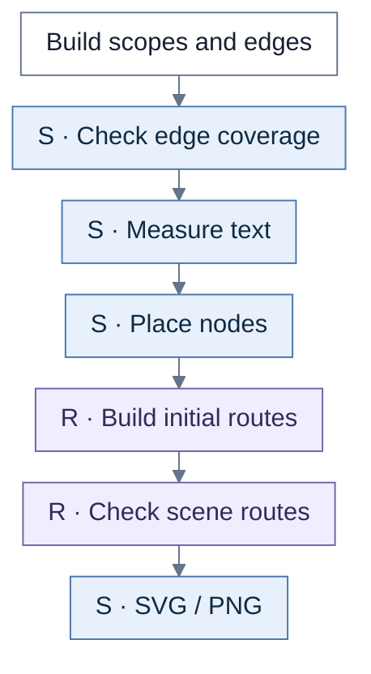
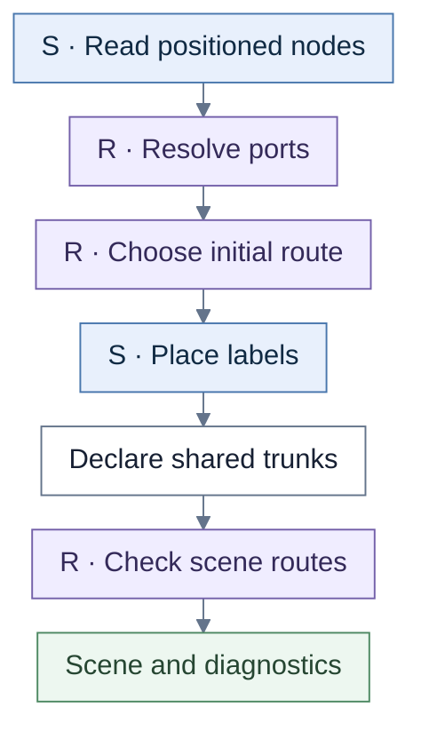

# IA Place Map

IA builds containment/navigation structure and uses generic shared routing. Its final validation declares intentional source trunks.

**S** = shared rendering. **R** = shared routing. Unmarked steps belong to the view unless a callback or caller is named.

## Overview

The shared staged pipeline handles measurement, positioning, and routing. IA has no dedicated preparation/expansion loop or shared lifecycle call in this path.

| Chart step | Implementation |
| --- | --- |
| Scene | `buildIaPlaceMapRendererScene` |
| Coverage / pipeline | `completeExactSceneConnections`, `runStagedRendererPipeline` |

## Routing and validation

Initial routing chooses a hint, local pattern, contract lane, or default route; the priority is shown in [shared pipeline](shared-pipeline.md#initial-route-choice). Only default shared routes receive parallel offsets. Edges classed `shared_trunk` receive `ia-trunk:<source ID>` on every segment; other same-source edges do not receive that exemption.

| Chart step | Implementation |
| --- | --- |
| Initial geometry / routes | `positionMeasuredScene`, `positionMeasuredEdge` |
| Endpoint resolution | `resolveEdgeEndpoint` |
| Scene validation | `validatePositionedSceneRouting` |

## Source files

- [iaPlaceMap.ts](../../src/renderer/staged/iaPlaceMap.ts)
- [pipeline.ts](../../src/renderer/staged/pipeline.ts)
- [macroLayout.ts](../../src/renderer/staged/macroLayout.ts)
- [routingCore/sceneValidation.ts](../../src/renderer/staged/routingCore/sceneValidation.ts)
