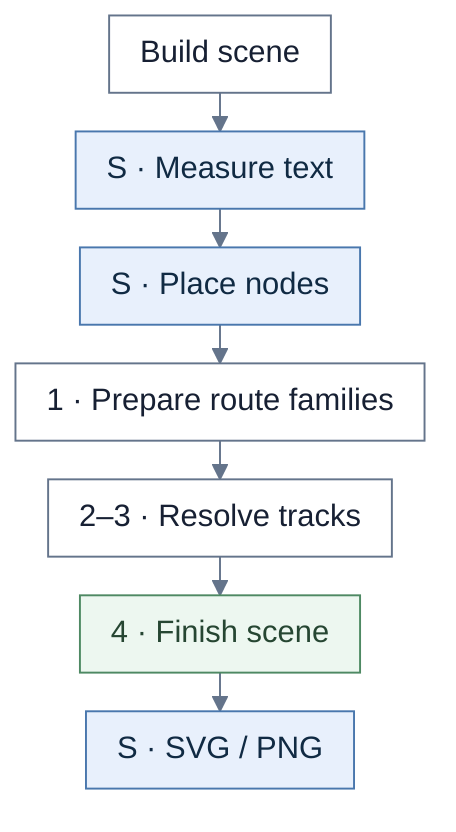
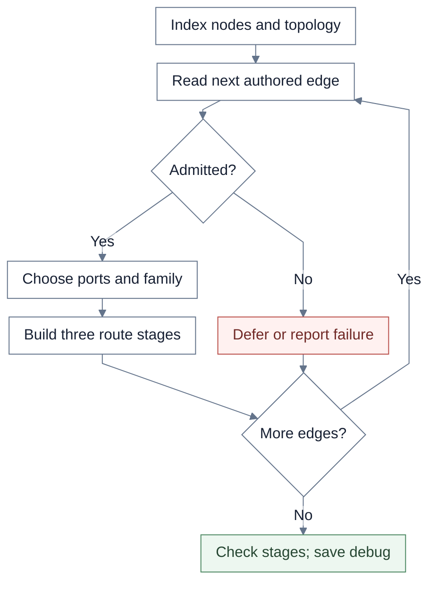
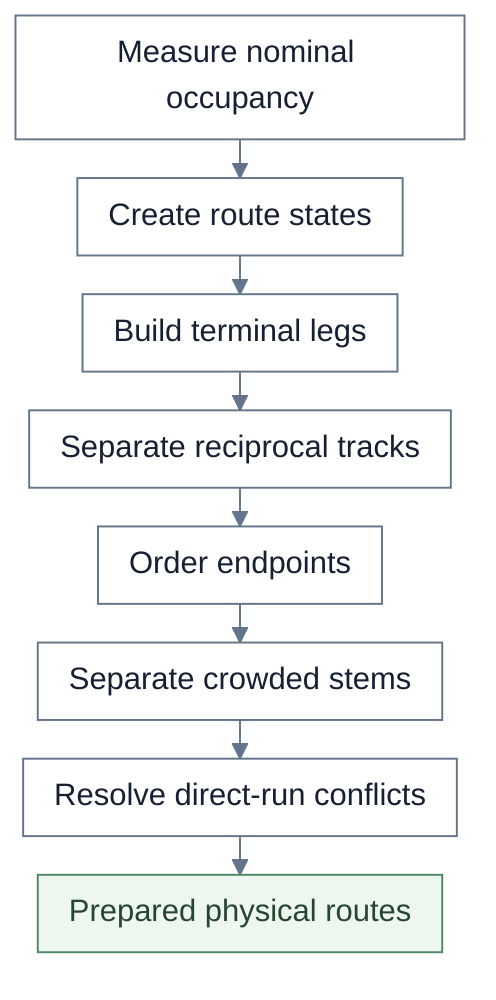
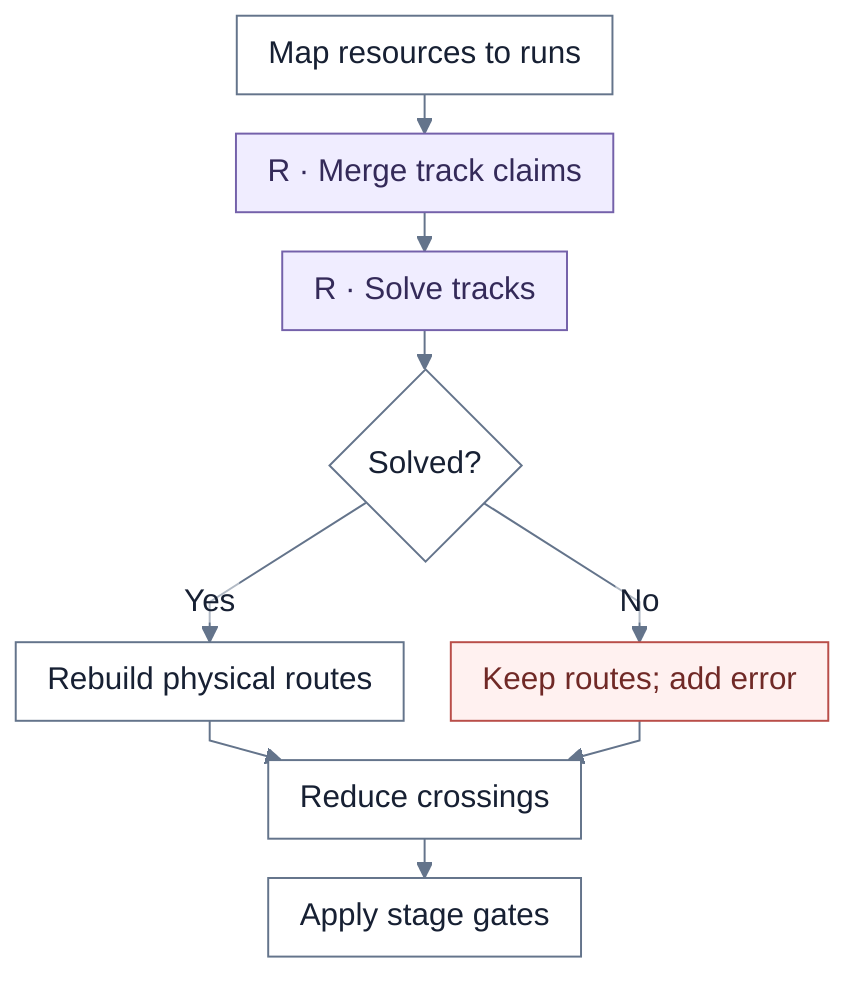
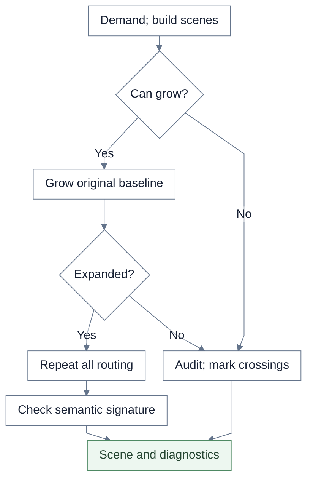

# Journey Map

Journey Map owns route families, preparation, expansion, and final validation. It calls the shared track solver directly.

**S** = shared rendering. **R** = shared routing. Unmarked steps belong to the view unless a callback or caller is named.

## Overview

Scene construction reads the loaded Journey layout policy and builds nested Stages, root Steps, branch groups, and lineages. Placement aligns uncontained Steps with Stage content. Journey does not call the shared final-routing lifecycle.

| Chart step | Implementation |
| --- | --- |
| Scene | `buildJourneyMapRendererScene`, `buildJourneyScenePlacement` |
| Placement / routing | `positionJourneyMapMeasuredSceneBeforeRouting`, `buildJourneyMapRoutingStages` |

## 1. Admit and build routes

Indexes include degree, cycle, and duplicate-group admission. Route selection includes gates, bypasses, self-loops, duplicate fans, branches, and joins. The three stages are step-2, provisional, and final-basic. Deferred families are recorded; invalid IDs, endpoints, ownership, and failed atomic groups produce errors.

| Chart step | Implementation |
| --- | --- |
| Route orchestration | `buildJourneyMapRoutingStagesInternal` |
| Admission / family | `resolveRouteEligibility`, `buildBranchPlan`, `buildJoinPlan` |
| Stage checks | `validateJourneyMapBasicRoutes`, `validateJourneyMapRoutes` |

## 2. Prepare physical tracks

These Journey-owned transforms run before shared assignment because they can change physical runs and spans. Endpoint ordering includes both late ordering and reciprocal ordering.

| Chart step | Implementation |
| --- | --- |
| State / terminals | `buildInitialResolvedConnectorState`, `applyPreferredTerminalLegConstruction` |
| Reciprocal / order | `resolveSimpleReciprocalTracks`, `applyLateEndpointOrdering`, `applySimpleReciprocalEndpointOrdering` |
| Stems / conflicts | `resolveCrowdedPreparedStems`, `resolveLateDirectRunConflicts` |

## 3. Assign tracks

Journey selects a 250-state shared search with 16-unit separation and a 0.001 epsilon. Crossing swaps must preserve separation and collinear-overlap quality. Shared assignment is followed by Journey reconstruction and validation.

| Chart step | Implementation |
| --- | --- |
| Journey adapter | `resolveJourneyMapTrackOccupancy` |
| Shared assignment | `aggregateRoutingObservations`, `solveRoutingClaims` |
| Post-assignment | `reconstructRouteFromResolvedRuns`, `minimizeJourneyMapCrossings`, `applyResolvedStageGates` |

## 4. Expand or validate

“Can grow” requires a non-repeating funded request and fewer than **four expansion attempts**. Demands include reciprocal, track, stem, branch/join, intersection, and terminal-leg capacity. Recursion preserves the connector signature and original early debug scenes; signature drift throws. Final Journey checks cover ownership, gates, routes, occupancy, separation, and expansion history.

| Chart step | Implementation |
| --- | --- |
| Expand / recurse | `applyJourneyMapExpansionRequests`, `buildJourneyMapRoutingStagesInternal` |
| Final checks | `validateJourneyMapResolvedStages` |
| Crossing diagnostics / marks | `collectJourneyMapResidualCrossings`, `withJourneyMapContinuityMarks` |

## Source files

- [journeyMap.ts](../../src/renderer/staged/journeyMap.ts)
- [journeyMapMiddleLayer.ts](../../src/renderer/staged/journeyMapMiddleLayer.ts)
- [journeyMapRouting.ts](../../src/renderer/staged/journeyMapRouting.ts)
- [routingCore/claims.ts](../../src/renderer/staged/routingCore/claims.ts)
- [routingCore/solver.ts](../../src/renderer/staged/routingCore/solver.ts)
