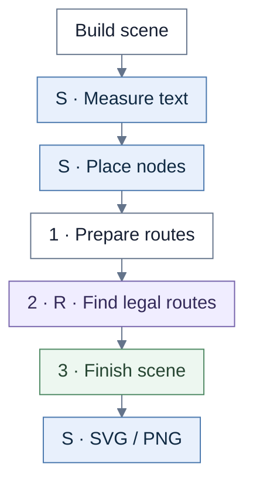
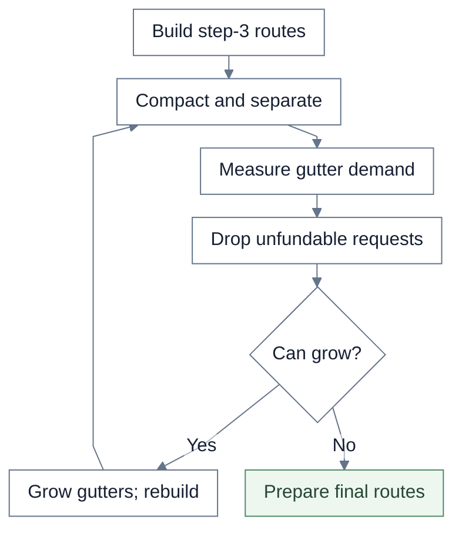
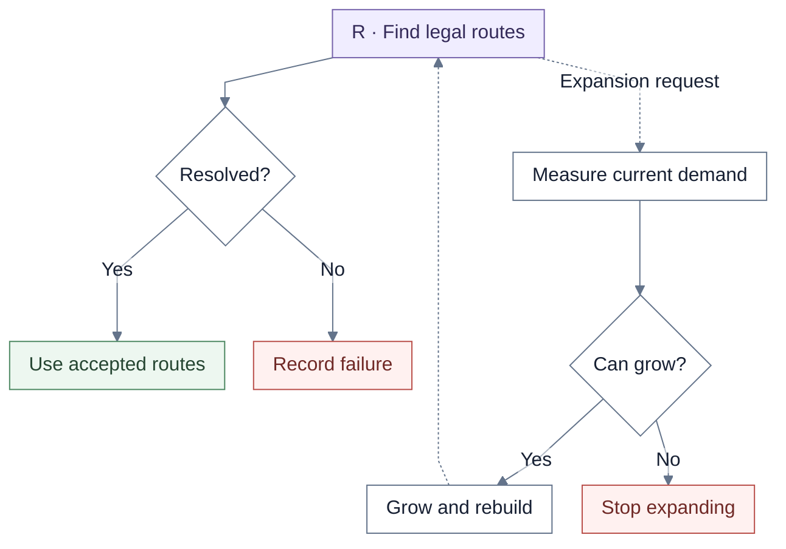
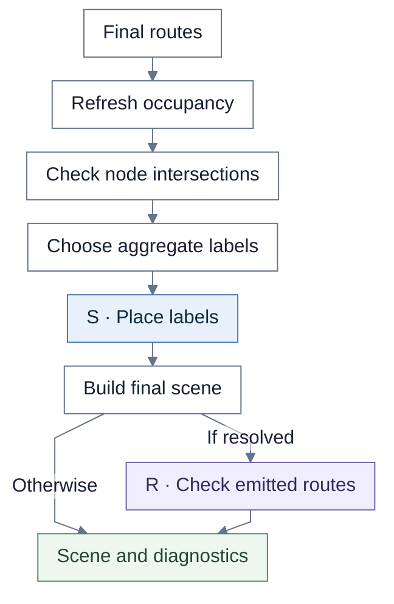

# Outcome–Opportunity Map

This renderer owns lane/column routes, occupancy preparation, and aggregate-label policy. It delegates final route search to the shared lifecycle.

**S** = shared rendering. **R** = shared routing. Unmarked steps belong to the view unless a callback or caller is named.

## Overview

The render model and middle layer define columns, lanes, cells, and edges. The wrapper adds decorations after shared placement. Initial template and refined routes have separate debug scenes.

| Chart step | Implementation |
| --- | --- |
| Scene / placement | `buildOutcomeOpportunityRenderContext`, `buildOutcomeOpportunityPreRoutingPipeline` |
| Routing entrypoint | `buildOutcomeOpportunityMapRoutingStages` |

## 1. Preparation loop

Requests beyond the last occupied row/column cannot create capacity and are discarded. Preparation and final expansion share **four passes total**. Each expansion is applied to the original positioned scene; the existing step-3 plans are rebuilt against the new geometry.

| Chart step | Implementation |
| --- | --- |
| Templates / detours | `routePlansForScene`, `applyLocalSwervesToStep3Plans` |
| Compact / separate | `buildPreparedRoutesWithObstacleCompaction`, `resolveOccupancyDisplacements` |
| Expand / final preparation | `applyGlobalGutterExpansions`, `prepareFinalRoutes` |

## 2. Acceptance and expansion

Final preparation resolves endpoint order, displacement, marker legs, node boxes, and finite bounds. The callback derives gutter demand from the current route set and violations. The shared search is detailed in [shared routing](shared-routing.md).

| Chart step | Implementation |
| --- | --- |
| Final context | `prepareFinalRoutes` |
| Shared search | `runRoutingLifecycle` |
| Expansion callback | `resolveFinalValidationGutterDemand` |

## 3. Finish the scene

Aggregate-label selection is view-owned. The shared label placer receives the suppressed edge IDs and aggregate-label obstacles. Emitted routes receive a full shared audit only after successful lifecycle acceptance.

| Chart step | Implementation |
| --- | --- |
| Aggregate labels | `buildOutcomeOpportunityAggregateLabelDecision` |
| Shared label placement | `placeLabels` → `positionConnectorLabel` |
| Scene / audit | `withStep2EdgesAndDiagnostics`, `validateFinalRouteSet` |

## Source files

- [outcomeOpportunityMap.ts](../../src/renderer/staged/outcomeOpportunityMap.ts)
- [outcomeOpportunityMapRouting.ts](../../src/renderer/staged/outcomeOpportunityMapRouting.ts)
- [routingCore/lifecycle.ts](../../src/renderer/staged/routingCore/lifecycle.ts)
