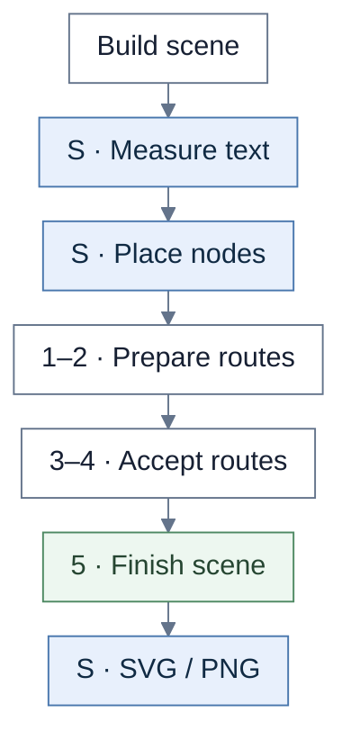
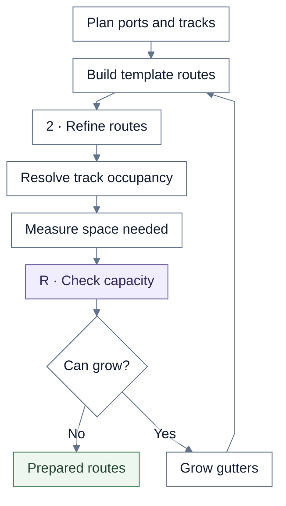
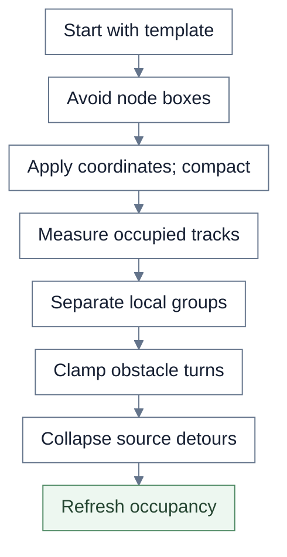
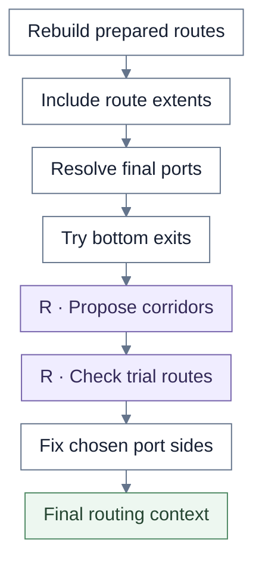
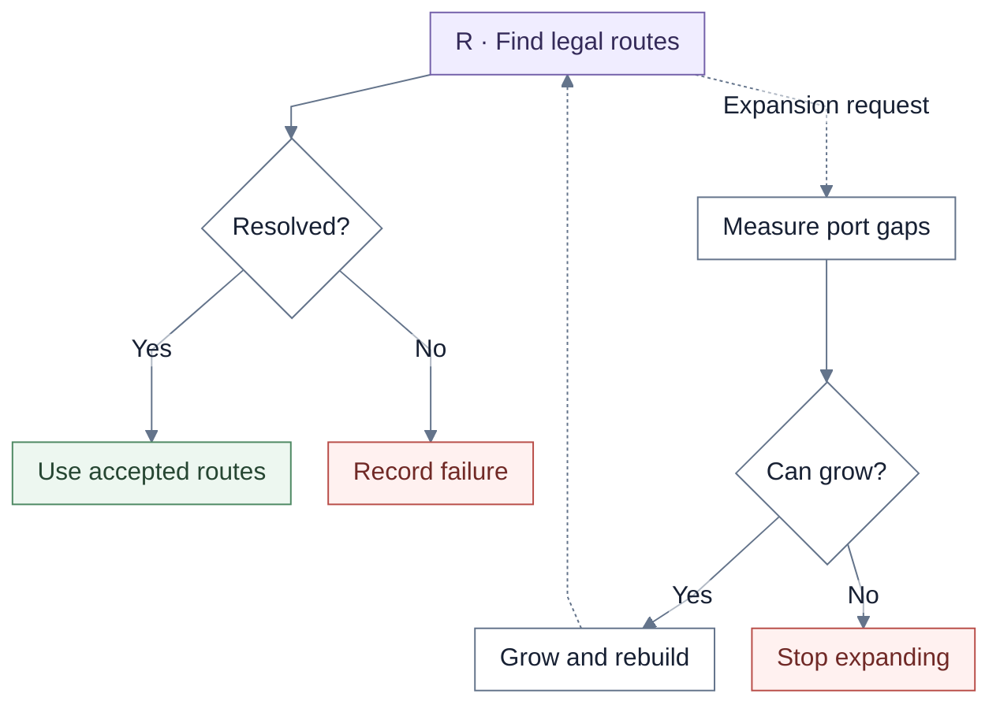
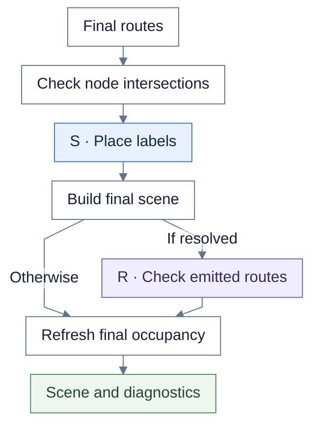

# Scenario Flow

Follow the overview, then the numbered routing stages. **S** marks shared rendering; **R** marks shared routing. Unmarked steps belong to Scenario Flow.

## Overview

Scene construction includes the render model, lane/track middle layer, grid cells, and edges. Node placement adds lane titles and dividers before routing. Export and the public artifact gate are covered in [shared pipeline](shared-pipeline.md).

| Chart step | Implementation |
| --- | --- |
| Build scene | `buildScenarioFlowRenderContext` |
| Measure / place | `measureScene` → `positionMeasuredSceneBeforeRouting` |
| Route stages | `buildScenarioFlowRoutingStages` |

## 1. Preparation loop

“Can grow” requires positive capacity demand and remaining budget. Preparation and final expansion share **eight passes total**. Expansions accumulate against the original positioned scene. Step-2 and step-3 debug scenes capture the initial templates and refinement, before the expansion loop.

| Chart step | Implementation |
| --- | --- |
| Plan ports and tracks | `buildConnectorPlans`, `buildNodeEdgeBuckets`, `buildEndpointOffsets` |
| Template / refine | `buildTemplateRoute`, `buildStep3Routes` |
| Resolve occupancy | `resolveOccupancyCoordinates` |
| Shared capacity check | `measureRoutingCorridorDeficits` |
| Grow gutters | `applyGlobalGutterExpansions` |

## 2. Route refinement

Occupancy is rebuilt after local separation, clamping, and collapse. Supplied segment coordinates can trigger another obstacle-refinement pass before compaction. These steps are view-owned; “bundle-local” in the code names a connector grouping.

| Chart step | Implementation |
| --- | --- |
| Refine route | `buildPreparedRoutes`, `buildStep3Routes` |
| Avoid / compact | `refineRouteAgainstObstacles`, `applyObstacleLocalCompaction` |
| Measure / separate | `buildOccupancyByConnector`, `resolveOccupancyCoordinates` |
| Clamp / collapse | `resolveObstacleBoundaryClampCoordinates`, `applySourceEdgeSwerveEntryCollapse` |

## 3. Prepare acceptance

The context includes ports, marker legs, node boxes, lane-title blockers, and finite bounds. Each eligible bottom exit is considered once, with at most 65 candidates. Only legal whole-route-set trials with an acceptable cost are committed.

| Chart step | Implementation |
| --- | --- |
| Rebuild / resolve context | `prepareFinalContext` |
| Bottom exits | `selectOptionalBottomExits` |
| Shared proposals / checks | `buildPortCorridorCandidates`, `validateFinalRouteSet` |

## 4. Acceptance and expansion

The callback can grow geometry for measured facing-port and marker/stub deficits. It can return no expansion even when route violations remain. The detailed search and its stopping conditions are in [shared routing](shared-routing.md). Failed routing retains diagnostic geometry and records its reason and trace.

| Chart step | Implementation |
| --- | --- |
| Shared search | `runRoutingLifecycle` |
| Expansion callback | `buildScenarioFlowRoutingStages` callback → `prepareFinalContext` |

## 5. Finish the scene

Labels avoid nodes, dividers, routes, and earlier labels. Emitted routes receive a full shared audit only after the lifecycle resolves. Optional-exit occupancy and endpoint buckets are refreshed before returning.

| Chart step | Implementation |
| --- | --- |
| Intersection / labels / scene | `emitFinalIntersectionDiagnostics`, `placeLabels`, `withEdgesAndDiagnostics` |
| Shared label placement | `positionConnectorLabel` |
| Shared emitted audit | `validateFinalRouteSet` |
| Final occupancy | `refreshOptionalExitOccupancy` |

## Source files

| File | Role |
| --- | --- |
| [scenarioFlow.ts](../../src/renderer/staged/scenarioFlow.ts) | Scene construction, positioning, artifact wrappers |
| [scenarioFlowRouting.ts](../../src/renderer/staged/scenarioFlowRouting.ts) | Preparation, endpoint selection, expansion, finalization |
| [capacity.ts](../../src/renderer/staged/routingCore/capacity.ts) | Shared capacity measurement |
| [lifecycle.ts](../../src/renderer/staged/routingCore/lifecycle.ts) | Shared acceptance and complete route validation |

Implementation reference: `6a784814f6e9c70b207c19efb6ec267551a2c98e`, 2026-10-06.
