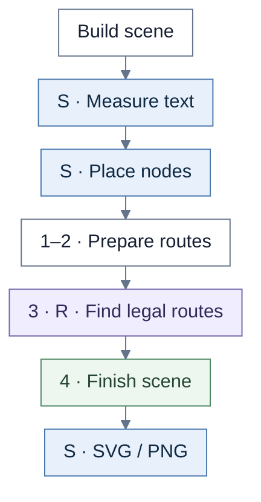
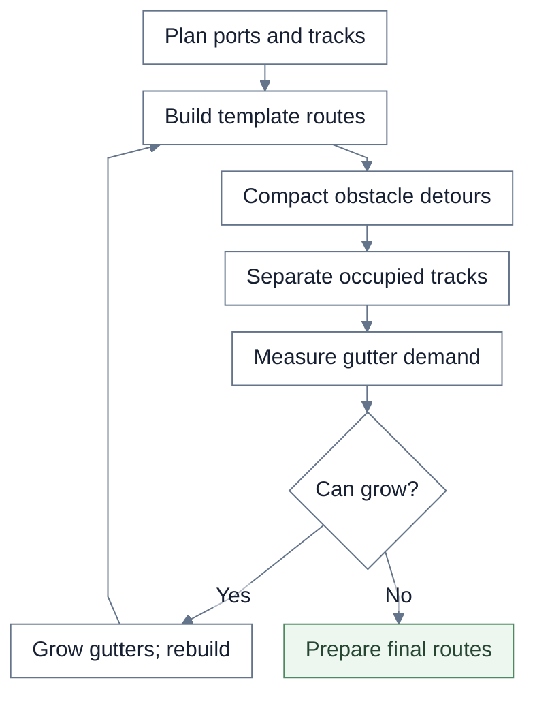
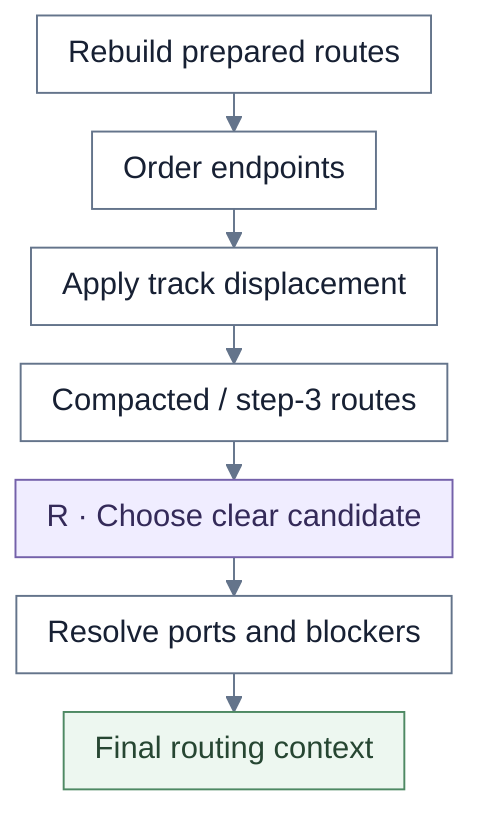
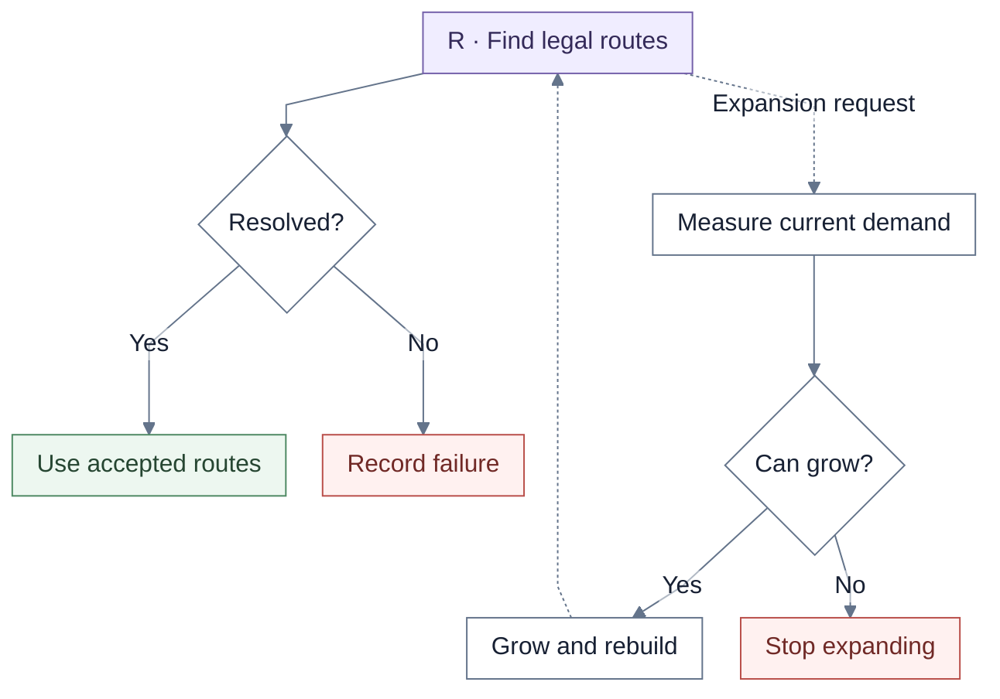
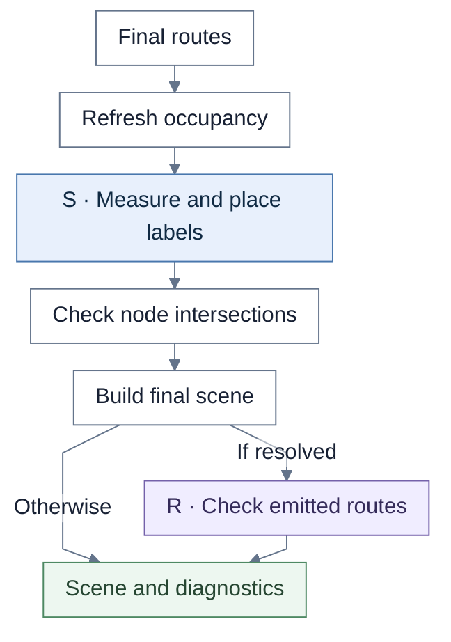

# Service Blueprint

Service Blueprint owns lane/cell geometry, route preparation, and expansion. It uses shared route search for final acceptance.

**S** = shared rendering. **R** = shared routing. Unmarked steps belong to the view unless a callback or caller is named.

## Overview

After shared placement, the macro-layout helpers normalize and validate cell contents. The wrapper then adds lane titles and dividers. Optional debug artifacts capture the pre-routing, step-2, and step-3 scenes.

| Chart step | Implementation |
| --- | --- |
| Scene / placement | `buildServiceBlueprintRenderContext`, `applyServiceBlueprintPostLayoutStep` |
| Routing entrypoint | `buildServiceBlueprintRoutingStages` |

## 1. Preparation loop

“Can grow” requires positive space demand and remaining budget. Preparation and final expansion share **four passes total**, applied to the original positioned scene. Late endpoint ordering is part of obstacle preparation.

| Chart step | Implementation |
| --- | --- |
| Plans / templates | `buildConnectorPlans`, `buildStep3ConnectorPlansForScene` |
| Compact / separate | `buildPreparedRoutesWithObstacleCompaction`, `resolveOccupancyDisplacements` |
| Expand | `applyGlobalGutterExpansions` |

## 2. Choose final candidates

The shared selector tries the supplied candidates in order and checks orthogonality and non-endpoint node intersections. Complete acceptance happens later. The context adds marker legs, node boxes, painted lane-title blockers, and finite bounds.

| Chart step | Implementation |
| --- | --- |
| Rebuild final routes | `prepareFinal` |
| Shared selector | `selectRouteCandidate` |
| Complete acceptance | `runRoutingLifecycle` |

## 3. Acceptance and expansion

The callback measures implicated gutter occupancy plus facing-port marker/stub deficits. It rebuilds final preparation after growing the original baseline. The shared search is detailed in [shared routing](shared-routing.md).

| Chart step | Implementation |
| --- | --- |
| Shared search | `runRoutingLifecycle` |
| Callback | `extractGutterOccupancyByConnector`, `resolveRequiredColumnExpansions`, `resolveRequiredLaneExpansions`, `prepareFinal` |

## 4. Finish the scene

Final labels use the final routed geometry. The shared emitted-route audit runs only after successful lifecycle acceptance. SVG/PNG export and the public artifact gate are covered in [shared pipeline](shared-pipeline.md).

| Chart step | Implementation |
| --- | --- |
| Labels | `createEdgeLabelMeasurementService`, `buildFinalPositionedEdgesWithLabels`, `positionConnectorLabel` |
| Scene / audit | `buildStageScene`, `validateFinalRouteSet` |

## Source files

- [serviceBlueprint.ts](../../src/renderer/staged/serviceBlueprint.ts)
- [serviceBlueprintRouting.ts](../../src/renderer/staged/serviceBlueprintRouting.ts)
- [macroLayout.ts](../../src/renderer/staged/macroLayout.ts)
- [routingCore/candidates.ts](../../src/renderer/staged/routingCore/candidates.ts)
