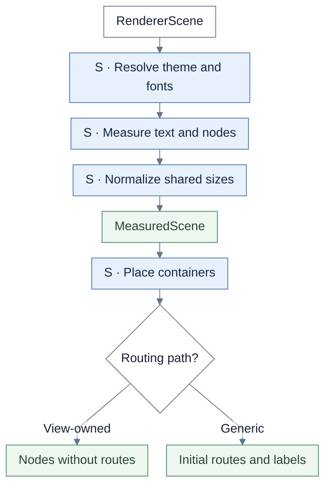
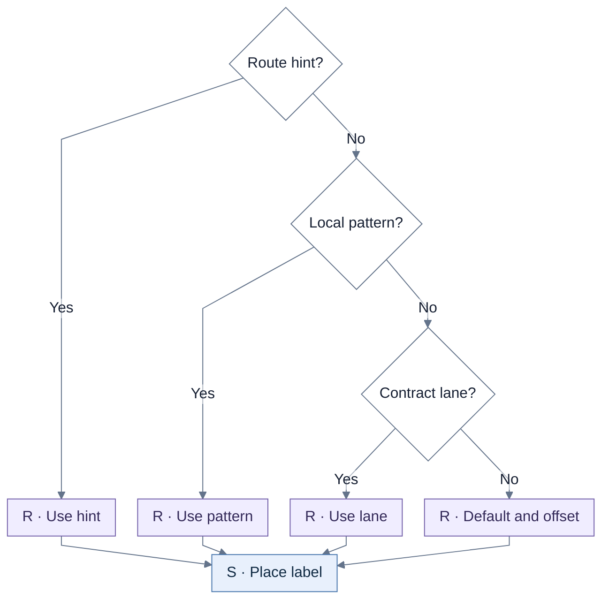
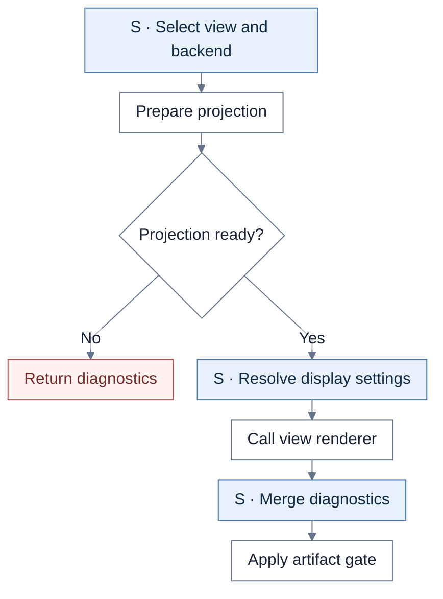
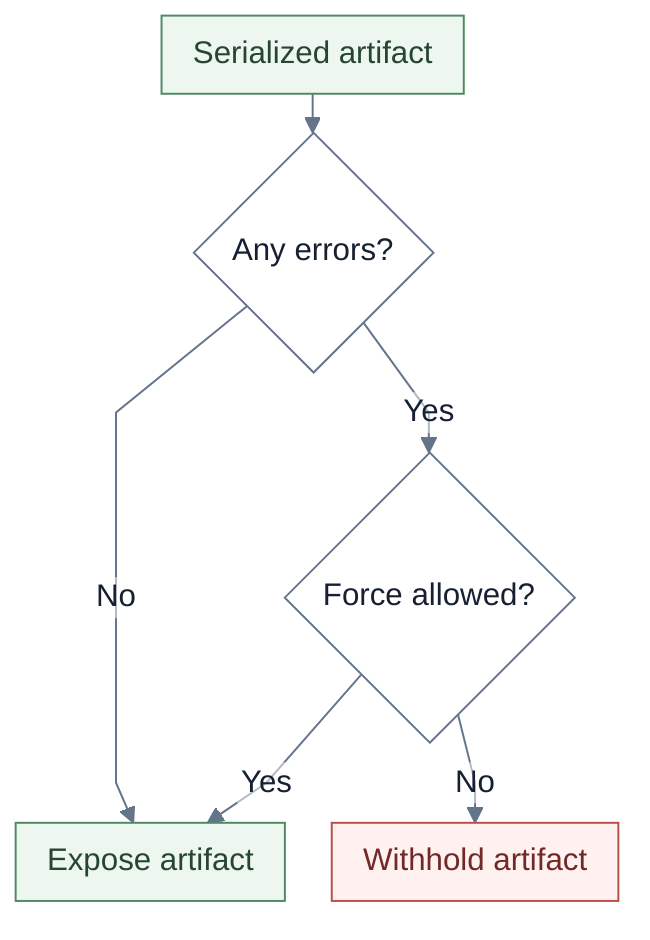
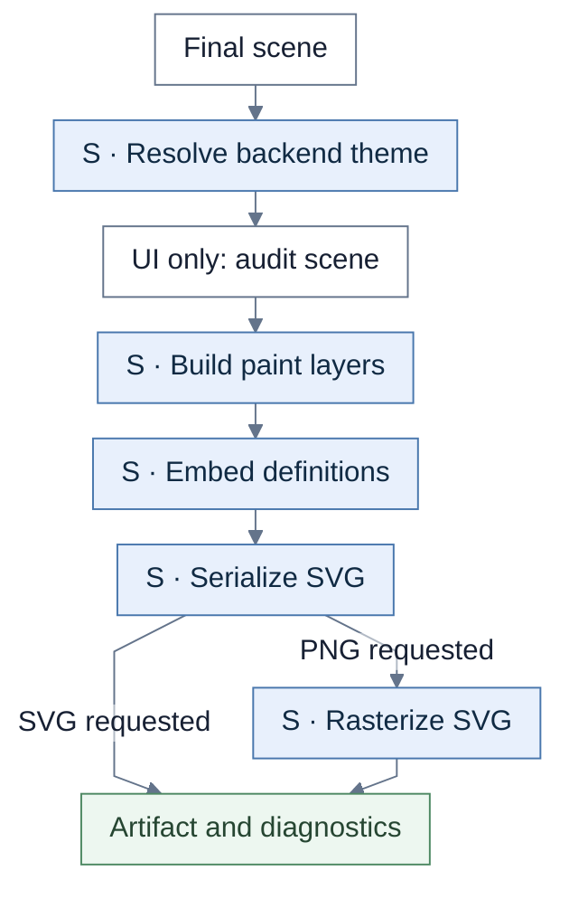

# Shared pipeline and export

All six views use shared measurement, placement, and SVG/PNG export. IA and UI also use generic initial routing.

**S** = shared rendering. **R** = shared routing. Unmarked steps belong to the view unless a callback or caller is named.

## Measurement and placement

Scene contracts retain the sequence projection → RendererScene → MeasuredScene → PositionedScene. Scenario, Service, Outcome, and Journey use the nodes-only branch, then their own routing orchestration. IA and UI take generic routing. Post-layout callbacks normalize Service cells or align Journey Steps.

| Chart step | Implementation |
| --- | --- |
| Measurement | `measureRendererScene` |
| Placement | `layoutMeasuredSceneRoot`, `positionMeasuredSceneBeforeRouting`, `positionMeasuredScene` |

## Initial route choice

Before this choice, shared code resolves ports, ownership, available patterns, contract lanes, and route hints. Only default shared routes receive parallel offsets. Labels use a lane, strict segment, or general route anchor. This constructs initial geometry; later validation or repair is owned by the caller.

| Chart step | Implementation |
| --- | --- |
| Entrypoint / ports | `positionMeasuredEdge`, `resolveEdgeEndpoint` |
| Ordered choices | `buildRouteFromLocalHint`, `buildLocalPatternRoute`, `buildSourceContractLaneRoute`, `buildSharedRoute` |
| Offsets / labels | `offsetParallelOrthogonalRoute`, `positionEdgeLabelInLane`, `tryPositionEdgeLabelOnSegment`, `positionEdgeLabel` |

## Preview dispatch

This begins with a compiled graph; source parsing, compilation, and validation happen earlier. The selected staged backend requires projection input and a matching view. Bundle data supplies theme, detail, and node-decorator settings. Graphviz is a separate backend selection, not an automatic retry in this flow.

| Chart step | Implementation |
| --- | --- |
| Projection preparation | `prepareCompiledGraphPreview` |
| Dispatch | `createStagedProjectionPreviewBackend` |
| Result / diagnostics | `renderPreparedCompiledGraphPreview` |

## Artifact gate

Force is allowed here only when enabled **and no named diagram is selected**. Named-diagram errors withhold the public artifact even with force. A backend may already have serialized diagnostic geometry before this gate.

| Chart step | Implementation |
| --- | --- |
| Gate | `renderPreparedCompiledGraphPreview` |

## SVG and PNG export

UI's read-only final audit checks routes and labels before serialization. SVG uses scene paint order, embedded fonts, and LF newlines. PNG derives from SVG. Scenario, Outcome, and Journey PNG wrappers call their SVG wrapper before the shared PNG helper, so their scene is serialized twice.

| Chart step | Implementation |
| --- | --- |
| SVG / PNG | `renderPositionedSceneToSvg`, `renderPositionedSceneToPng` |
| UI final audit | `auditUiContractsFinalScene` |
| Rasterization | `renderSvgToPng` |

## Source files

- [previewWorkflow.ts](../../src/renderer/previewWorkflow.ts)
- [previewBackends.ts](../../src/renderer/previewBackends.ts)
- [pipeline.ts](../../src/renderer/staged/pipeline.ts)
- [microLayout.ts](../../src/renderer/staged/microLayout.ts)
- [macroLayout.ts](../../src/renderer/staged/macroLayout.ts)
- [routing.ts](../../src/renderer/staged/routing.ts)
- [svgBackend.ts](../../src/renderer/staged/svgBackend.ts)
