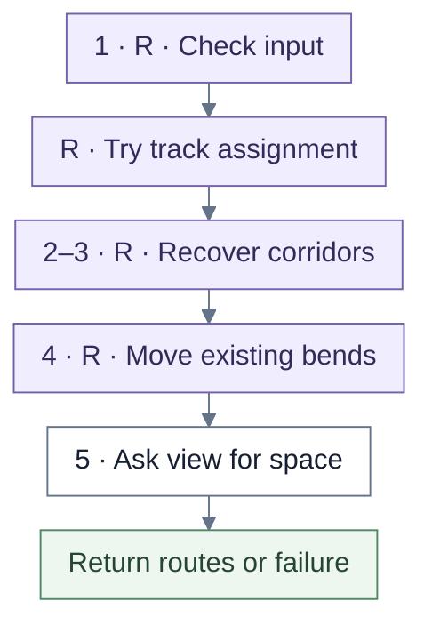
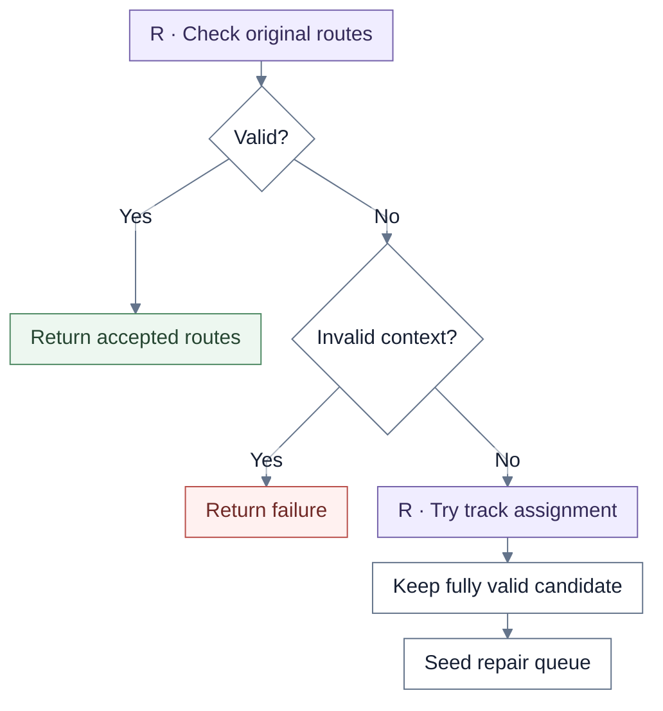
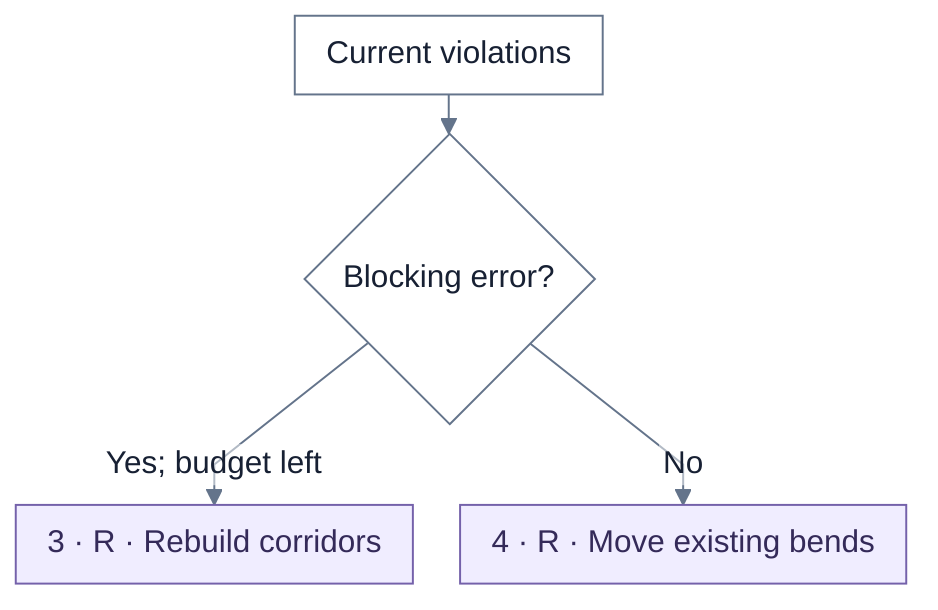
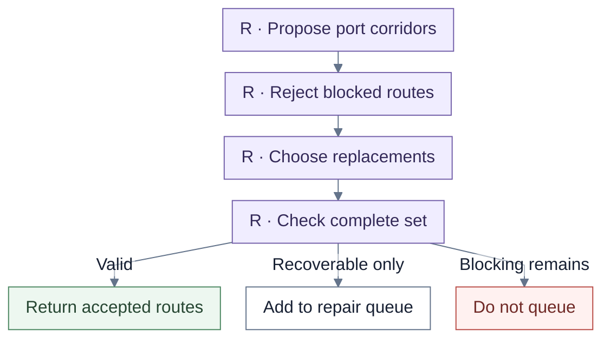
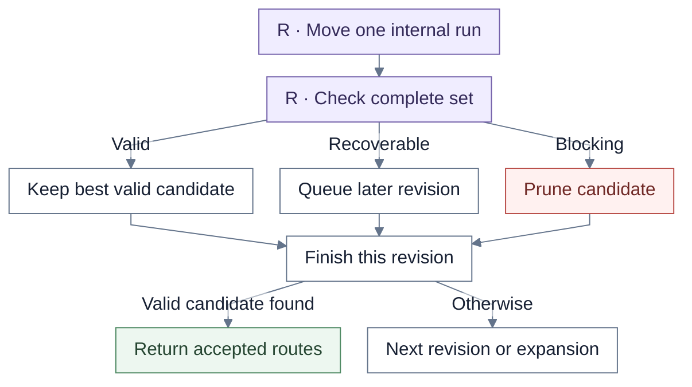
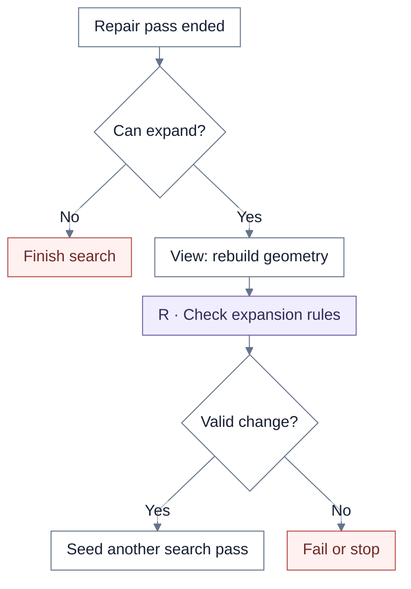
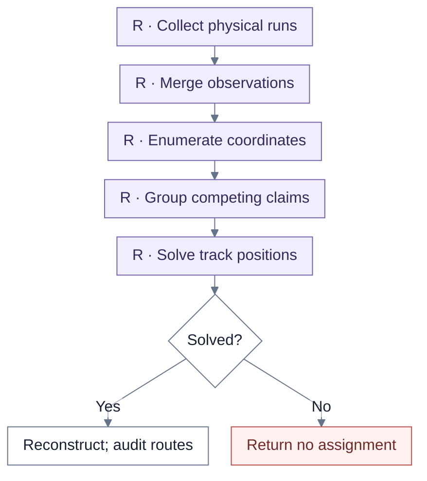
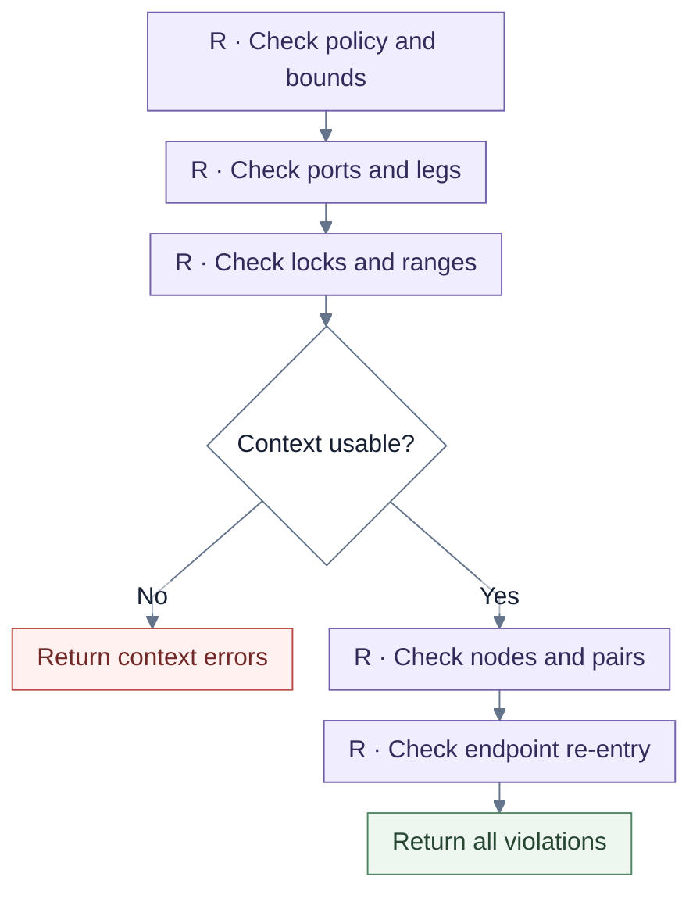

# Shared routing

**R** marks shared routing. Unmarked view callbacks own scene expansion; Journey supplies its own track adapter. Each chart shows one part of the shared search.

**S** = shared rendering. **R** = shared routing. Unmarked steps belong to the view unless a callback or caller is named.

## Overview

Valid input or a valid search candidate can return early. Track assignment is an initial candidate, not a replacement for complete-route acceptance. The lifecycle's budgets are **4,096 candidates** and **128 repair revisions**, shared across expansion passes.

| Chart step | Implementation |
| --- | --- |
| Lifecycle | `runRoutingLifecycle` |
| Track assignment | `resolveAndReconstructRouteOccupancy` |

## 1. Check and seed

Budget values must be finite safe integers. The complete validator rejects malformed contexts. An `endpoint_mismatch` causes immediate invalid-context failure. A resolved assignment is globally checked and retained only if fully legal; failed assignment still proceeds to repair.

| Chart step | Implementation |
| --- | --- |
| Input / seed | `runRoutingLifecycle`, `validateFinalRouteSet` |
| Assignment | `resolveAndReconstructRouteOccupancy` |

## 2. Corridor-recovery gate

**Overlap, track spacing, and crossings alone take the lower path.** The traversable set is exactly `collinear_overlap`, `track_separation`, and `perpendicular_crossing`. Port-corridor reconstruction is triggered only by another violation kind and remaining candidate budget. This is the branch relevant to the reported overlap failure.

| Chart step | Implementation |
| --- | --- |
| Gate | `hasBlockingViolation`, `runRoutingLifecycle` |

## 3. Rebuild corridors

Only connectors implicated in blocking kinds are considered. Candidates must stay within bounds, clear nodes/envelopes, and avoid re-entering endpoint boxes. With declared clearance envelopes, selection minimizes conflict against settled routes; otherwise it uses the first clear corridor. A new combined route set consumes candidate budget and receives full validation.

| Chart step | Implementation |
| --- | --- |
| Recovery / proposals | `buildCorridorRecovery`, `buildPortCorridorCandidates` |
| Complete check | `validateFinalRouteSet` |

## 4. Move existing bends

Each revision pops the best queued state. Repeated geometry is skipped; new candidates consume budget and are scored. Alternatives move existing internal coordinates; they **do not add bends**, though redundant points can collapse. The revision keeps the best fully valid candidate, including any retained initial assignment. Further search requires a nonempty queue and remaining budgets.

| Chart step | Implementation |
| --- | --- |
| Alternatives | `buildTerminalTurnAlternatives` |
| Check / rank / loop | `validateFinalRouteSet`, `score`, `runRoutingLifecycle` |

## 5. Ask the view to expand

Expansion requires a callback and remaining expansion, candidate, and revision budgets. It must retain IDs, endpoint sides, priorities, locks, sharing, nodes/blockers, and margins. Invalid constraints fail; unchanged geometry or shrinking bounds stops the search. Counters are not reset. On termination, a still-retained valid assignment can be returned; otherwise failure includes the best violations, debug connectors, and trace.

| Chart step | Implementation |
| --- | --- |
| Expansion / termination | `runRoutingLifecycle`, `copyForExpansion` |

## 6. Solve physical tracks

Ranges, locks, obstacle constraints, resources, and sharing are aggregated per physical run. Contradictory claims or absent candidates can return before search. Each component keeps an unchanged legal assignment or searches with a bounded best incumbent. Lifecycle occupancy and Journey use 250 states; the direct solver default is 2,000. Failure returns no partial accepted assignment.

The lifecycle wrapper reconstructs with shared code. Journey maps its own current runs/resources, calls observation aggregation and the solver directly, and reconstructs in Journey code. Both callers must audit full routes after reconstruction.

| Chart step | Implementation |
| --- | --- |
| Occupancy adapter | `resolveRouteSegmentOccupancy`, `resolvePhysicalSegmentOccupancy` |
| Claims / solver | `aggregateRoutingObservations`, `solveRoutingClaims` |
| Shared reconstruction | `reconstructRouteFromAssignments` |
| Journey reconstruction | `reconstructRouteFromResolvedRuns` |

## 7. Complete route validation

Complete checks include finite geometry, IDs/styles, outward departure, marker/stub legs, bounds, node clearance, overlaps, separation, crossings, and endpoint-box re-entry. Pairwise interactions are always enabled. Empty violations permit acceptance.

IA/UI's scene wrapper supplies routes and node boxes to the lower-level validator. It does not supply the lifecycle's full endpoint-side, marker-leg, lock, and finite-bound context. Scene sharing exemptions remain caller-specific.

| Chart step | Implementation |
| --- | --- |
| Lifecycle validation | `validateFinalRouteSet` |
| Lower-level / scene validation | `validateRouting`, `validatePositionedSceneRouting` |

## Source files

- [routingCore/lifecycle.ts](../../src/renderer/staged/routingCore/lifecycle.ts)
- [routingCore/candidates.ts](../../src/renderer/staged/routingCore/candidates.ts)
- [routingCore/occupancy.ts](../../src/renderer/staged/routingCore/occupancy.ts)
- [routingCore/claims.ts](../../src/renderer/staged/routingCore/claims.ts)
- [routingCore/solver.ts](../../src/renderer/staged/routingCore/solver.ts)
- [routingCore/reconstruction.ts](../../src/renderer/staged/routingCore/reconstruction.ts)
- [routingCore/validation.ts](../../src/renderer/staged/routingCore/validation.ts)
- [routingCore/sceneValidation.ts](../../src/renderer/staged/routingCore/sceneValidation.ts)
