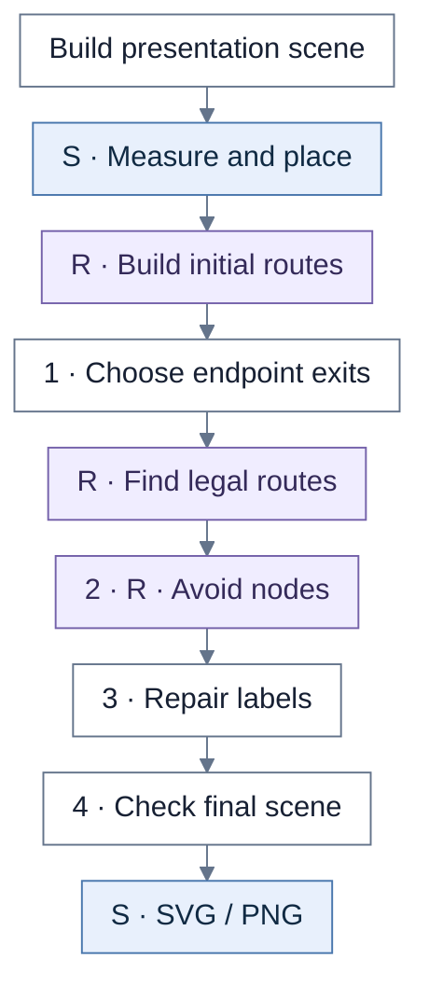
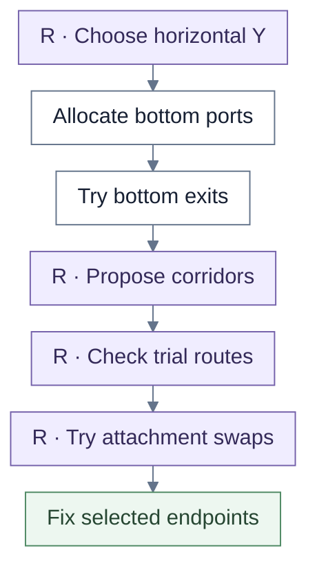
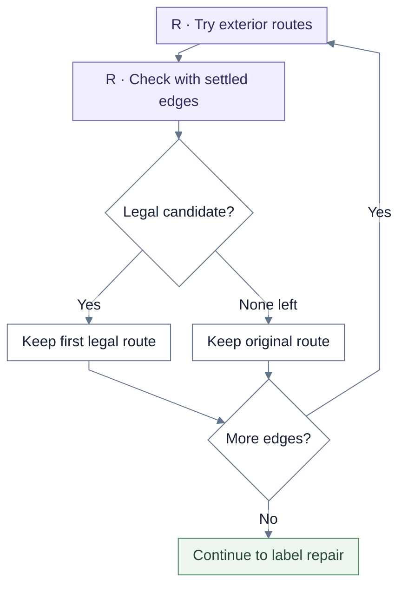
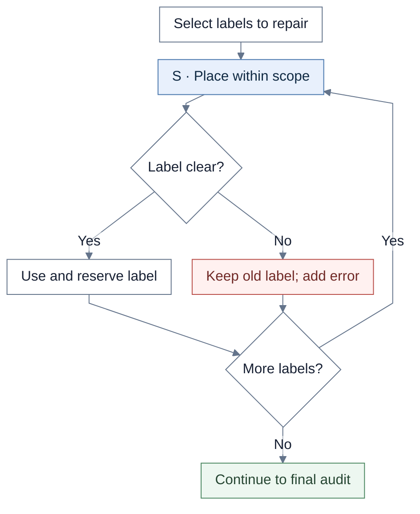
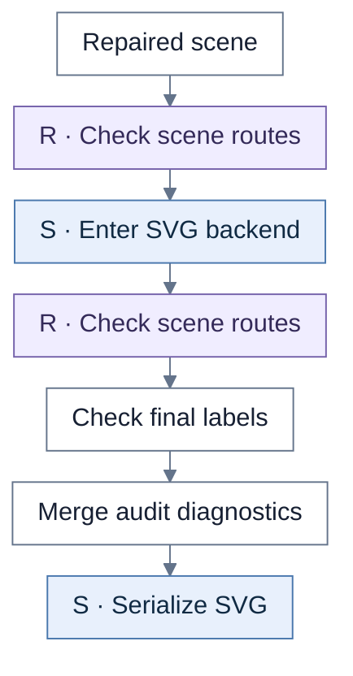

# UI Contracts

UI starts with generic routes, then selects endpoint exits, searches for legal routes, repairs node avoidance and labels, and audits the final scene.

**S** = shared rendering. **R** = shared routing. Unmarked steps belong to the view unless a callback or caller is named.

## Overview

The scene builder reads bundle-owned presentation roles/scopes and creates nodes, ports, fanouts, transition strips, and edge coverage. Shared search has **no expansion callback** here. Node repair remains a separate pass after lifecycle acceptance or failure.

| Chart step | Implementation |
| --- | --- |
| Scene | `buildUiContractsPresentationModel`, `UiContractsSceneBuilder.complete` |
| Pipeline | `runStagedRendererPipeline` |
| Shared search | `routeUiContractsScene` → `runRoutingLifecycle` |

## 1. Choose endpoint exits

View-owned selection loops use shared proposal, route-cost, and validation helpers. Horizontal alignment also uses a shared coordinate helper. Changed edge IDs are recorded for label repair. Illegal endpoint proposals are not committed.

| Chart step | Implementation |
| --- | --- |
| Alignment / allocation | `alignHorizontalTransitions`, `allocateBottomPorts` |
| Shared horizontal helper | `resolveHorizontalSharedY` |
| Selection / swapping | `selectUiBottomExits`, `optimizeSouthExitAssignments` |
| Shared proposals / checks / costs | `buildPortCorridorCandidates`, `validateFinalRouteSet`, `compareRouteCosts`, `swapSouthboundSourceAttachments` |

## 2. Repair node avoidance

The shared repair visits edges in order and tries the current route followed by exterior top/bottom/left/right routes. Its checks include settled earlier edges and node boxes. The later complete-scene audit checks all resulting edges together.

| Chart step | Implementation |
| --- | --- |
| Shared repair | `repairPositionedSceneRoutesAroundNodes` |
| Candidates / checks | `buildExteriorOrthogonalCandidates`, `validateRouting` |

## 3. Repair labels

Placement blocks scopes, nodes, headers, markers, connector segments, and already reserved labels. Labels are rechecked after placement. Unresolved candidates preserve the old label and add an error.

| Chart step | Implementation |
| --- | --- |
| Label orchestration | `repairUiContractsLabels`, `labelProblems` |
| Shared placement | `positionConnectorLabel` |

## 4. Final audits

UI allows collinear overlap only between the final segments of two edges entering the same target. The pipeline first audits routes; the SVG backend then repeats route checks and audits labels on the exact emitted scene. PNG passes through that same SVG backend.

| Chart step | Implementation |
| --- | --- |
| Route checks | `validateUiContractsRoutes` → `validatePositionedSceneRouting` |
| Final route / label audit | `auditUiContractsFinalScene` |
| Artifact backend | `renderPositionedSceneToSvg`, `renderPositionedSceneToPng` |

## Source files

- [uiContracts.ts](../../src/renderer/staged/uiContracts.ts)
- [uiContractsPresentationScene.ts](../../src/renderer/staged/uiContractsPresentationScene.ts)
- [pipeline.ts](../../src/renderer/staged/pipeline.ts)
- [uiContractsRouting.ts](../../src/renderer/staged/uiContractsRouting.ts)
- [uiContractsLabels.ts](../../src/renderer/staged/uiContractsLabels.ts)
- [routingCore/sceneValidation.ts](../../src/renderer/staged/routingCore/sceneValidation.ts)
- [svgBackend.ts](../../src/renderer/staged/svgBackend.ts)
