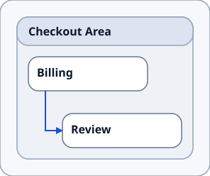
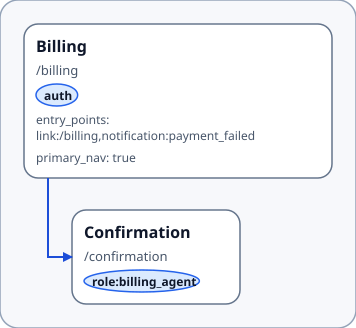
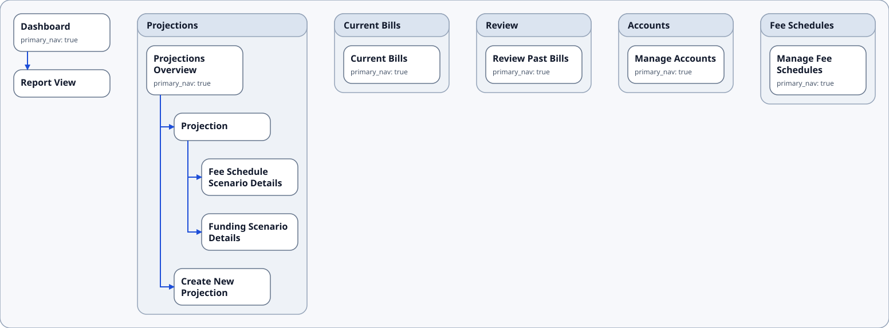
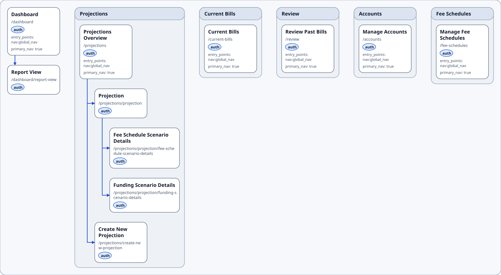
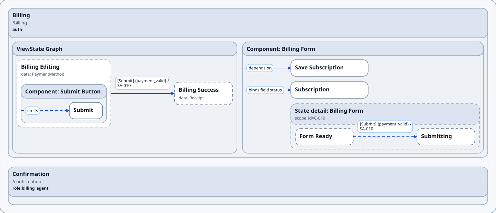
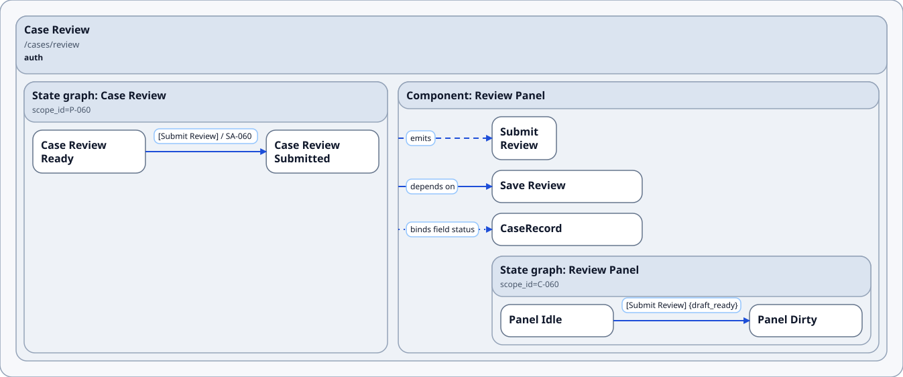
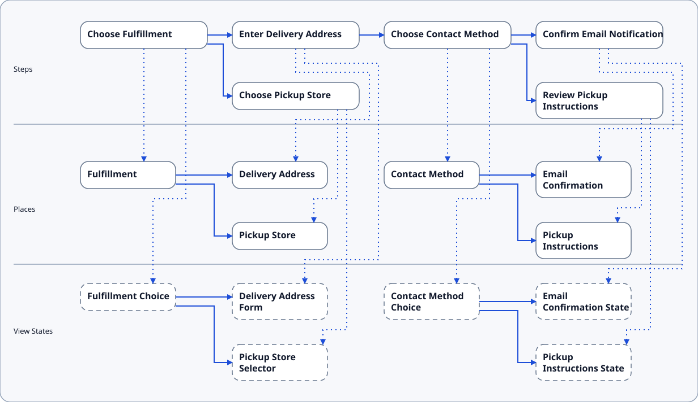
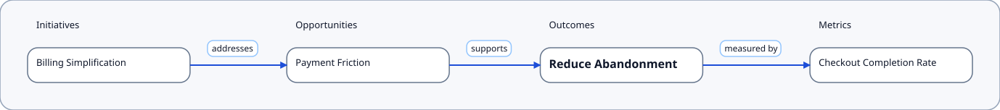
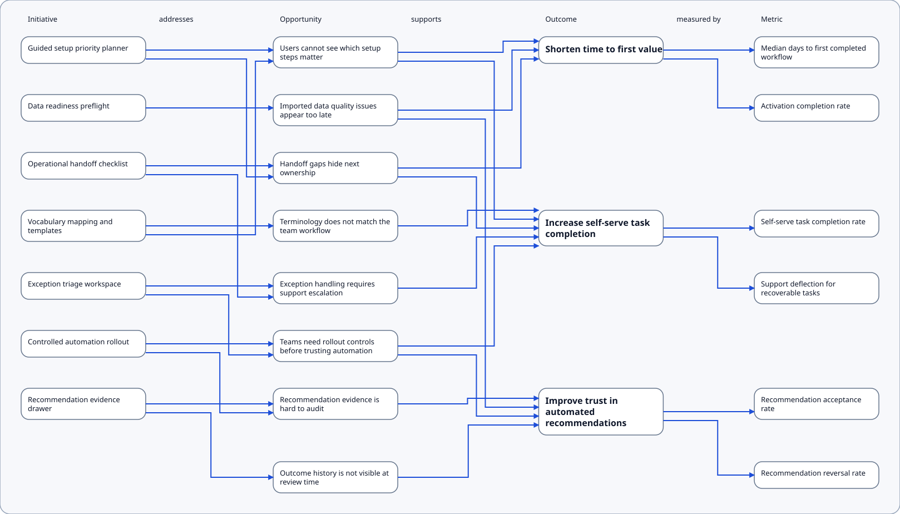

# Diagram Types

This page collects the current diagram families, their status, and links to available examples.

## IA (Information Architecture) / Place Map

  Source of truth for product structure: what exists, where it lives, and how it connects.

  This view shows Areas and Place nested with `CONTAINS`, with `NAVIGATES_TO` connections between Places.
  
  Examples:
  - outcome_to_ia_trace_example [sdd](../../../examples/rendered/v0.1/ia_place_map_diagram_type/outcome_to_ia_trace_example/outcome_to_ia_trace.sdd) / [folder](https://github.com/knutopia/Structured-Design-Documents/tree/main/examples/rendered/v0.1/ia_place_map_diagram_type/outcome_to_ia_trace_example)
  ::: details simpe profile svg
  
  :::
  
  - place_viewstate_transition_example [sdd](../../../examples/rendered/v0.1/ia_place_map_diagram_type/place_viewstate_transition_example/place_viewstate_transition.sdd) / [folder](https://github.com/knutopia/Structured-Design-Documents/tree/main/examples/rendered/v0.1/ia_place_map_diagram_type/place_viewstate_transition_example)
  ::: details simple profile svg
  
  :::
  - billSage app *simple profile* [sdd](../../../real_world_exploration/billSage_example/billSage_simple_structure.sdd) / *strict profile* [sdd](../../../real_world_exploration/billSage_example/billSage_structure.sdd) / [folder](https://github.com/knutopia/Structured-Design-Documents/tree/main/real_world_exploration/billSage_example)
  ::: details simple profile svg
  
  ::: 
  ::: details strict profile svg 
  
  ::: 

## UI Contract

  UI composition and state changes, per Place (and optionally per component).

  In this view, Places and View States act as containers for UI structure; View State or component State transitions show behavior inside those scopes, with events, data bindings, and system dependencies shown as supporting contracts.

  Examples: 
  - place_viewstate_transition_example [sdd](../../../examples/rendered/v0.1/ui_contracts_diagram_type/place_viewstate_transition_example/place_viewstate_transition.sdd) / [folder](https://github.com/knutopia/Structured-Design-Documents/tree/main/examples/rendered/v0.1/ui_contracts_diagram_type/place_viewstate_transition_example/)
  ::: details strict profile svg
  
  :::
  - ui_state_fallback_example [sdd](../../../examples/rendered/v0.1/ui_contracts_diagram_type/ui_state_fallback_example/ui_state_fallback.sdd) / [folder](https://github.com/knutopia/Structured-Design-Documents/tree/main/examples/rendered/v0.1/ui_contracts_diagram_type/ui_state_fallback_example/)
  ::: details strict profile svg
  
  :::

## Scenario Flow

  Step-by-step UI-level activities (but *without* collapsing the world into screens). 

  The x-axis shows horizontal progressions ("bands"). The y-axis shows lanes for Steps, Places and View States, with tracks for branch alternatives.

  Example: 
  - scenario_branching_example [sdd](../../../examples/rendered/v0.1/scenario_flow_diagram_type/scenario_branching_example/scenario_branching.sdd) / [folder](https://github.com/knutopia/Structured-Design-Documents/tree/main/examples/rendered/v0.1/scenario_flow_diagram_type/scenario_branching_example/)
  ::: details simple profile svg
  
  :::

## Outcome-Opportunity Map

  Product intent, explicit and traceable: what the product solves, and how to know it works.

  The x-axis shows columns for Initiatives, Opportunities, Outcomes, Metrics. The y-axis displays a band for each Outcome, stacking rows when a column contains multiple entries.

  Examples: 
  - outcome_to_ia_trace_example [sdd](../../../examples/rendered/v0.1/outcome_opportunity_map_diagram_type/outcome_to_ia_trace_example/outcome_to_ia_trace.sdd) / [folder](https://github.com/knutopia/Structured-Design-Documents/tree/main/examples/rendered/v0.1/outcome_opportunity_map_diagram_type/outcome_to_ia_trace_example/)
  ::: details simple profile svg
  
   :::
  - metric_event_instrumentation_example [sdd](../../../examples/rendered/v0.1/outcome_opportunity_map_diagram_type/metric_event_instrumentation_example/metric_event_instrumentation.sdd) / [svg](../../../examples/rendered/v0.1/outcome_opportunity_map_diagram_type/metric_event_instrumentation_example/simple_profile/metric_event_instrumentation.outcome_opportunity_map.svg) / [folder](https://github.com/knutopia/Structured-Design-Documents/tree/main/examples/rendered/v0.1/outcome_opportunity_map_diagram_type/metric_event_instrumentation_example/)
  - multiple_outcomes [sdd](../../../examples/rendered/v0.1/outcome_opportunity_map_diagram_type/multiple_outcomes_example/multiple_outcomes.sdd) /  / [folder](https://github.com/knutopia/Structured-Design-Documents/tree/main/examples/rendered/v0.1/outcome_opportunity_map_diagram_type/multiple_outcomes_example/)

## Service Blueprint:

  Connects user experience steps to the layers needed to realize it.

  The x-axis shows customer journey progression over time: Step anchor bands ordered by `PRECEDES`, with interstitial bands for operational work that advances between customer steps. The y-axis shows fixed service lanes: customer, frontstage, backstage, support, system, and policy.

  Example:
   Service Blueprint Slice example [sdd](../../../examples/rendered/v0.1/service_blueprint_diagram_type/service_blueprint_slice_example/service_blueprint_slice.sdd) / [svg](../../../examples/rendered/v0.1/service_blueprint_diagram_type/service_blueprint_slice_example/simple_profile/service_blueprint_slice.service_blueprint.svg) / [folder](https://github.com/knutopia/Structured-Design-Documents/tree/main/examples/rendered/v0.1/service_blueprint_diagram_type/service_blueprint_slice_example/)

## *Not yet Available:* Journey Map

  Experience intent from above: stages and steps, needs, friction, moments of truth.
