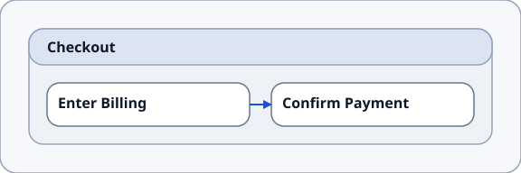

# Diagram Types

This page collects the current diagram families, their status, and links to available examples.

See the [dropdown-switch node and edge reference](./dropdown_switch_example)
for a compact comparison of the contracts available to each staged renderer
diagram type.

## IA (Information Architecture) / Place Map

  Source of truth for product structure: what exists, where it lives, and how it connects.

  This view shows Areas and Place nested with `CONTAINS`, with `NAVIGATES_TO` connections between Places.
  
  Examples:
  :::: details outcome_to_ia_trace_example <Badge type="info" text="Simple Profile" vertical="top" />
  
  :::tabs
  == Information Architecture Diagram
  
  == Source
  Area- and Place nodes: 
  showRepoLink /examples/rendered/v0.1/ia_place_map_diagram_type/outcome_to_ia_trace_example {pos: up}
  showSource ../../../examples/rendered/v0.1/ia_place_map_diagram_type/outcome_to_ia_trace_example/outcome_to_ia_trace.sdd {69, 73, 74, 84, 90, 93} {lines 68-}
  == Quick Reference
  Available node types: `Area`, `Place`.

  ### `Area`

  - `CONTAINS` → `Place`

  ### `Place`

  - `CONTAINS` → `Place`, `ViewState`
  - `NAVIGATES_TO` → `Place`

  Incoming:

  - `Area`, `Place` → `CONTAINS`
  - `Place` → `NAVIGATES_TO`
  :::
  ::::

  :::: details place_viewstate_transition_example <Badge type="info" text="Strict Profile" vertical="top" />
  :::tabs
  == Information Architecture Diagram
  
  == Source
  showRepoLink /examples/rendered/v0.1/ia_place_map_diagram_type/place_viewstate_transition_example  
  showSource ../../../examples/rendered/v0.1/ia_place_map_diagram_type/place_viewstate_transition_example/place_viewstate_transition.sdd {6, 18, 35}
  :::
  ::::

  :::: details billSage app <Badge type="info" text="Simple Profile" vertical="top" />
  :::tabs
  == Information Architecture Diagram
  
  == Source
  showRepoLink /real_world_exploration/billSage_example
  showSource ../../../real_world_exploration/billSage_example/billSage_simple_structure.sdd {3, 8, 13, 15-18, 26, 27, 37, 39, 40, 44, 47, 49, 50, 59, 64, 76, 78, 79, 86, 88, 89, 95, 98, 99, 106, 108, 109}
  :::
  ::::

## UI Contracts

  UI composition and state changes, per Place (and optionally per component).

  In this view, Places and View States act as containers for UI structure; View State or component State transitions show behavior inside those scopes, with events, data bindings, and system dependencies shown as supporting contracts.

  Examples: 
  :::: details place_viewstate_transition_example <Badge type="info" text="Strict Profile" vertical="top" />
  
  :::tabs
  == UI Contracts Diagram
  
  == Source
  showRepoLink /examples/rendered/v0.1/ui_contracts_diagram_type/place_viewstate_transition_example/
  showSource ../../../examples/rendered/v0.1/ui_contracts_diagram_type/place_viewstate_transition_example/place_viewstate_transition.sdd {6, 14-15,19-32, 66-73, 75-80, 43, 51-63, 82-89, 91-96}
  :::
  ::::

  :::: details ui_state_fallback_example <Badge type="info" text="Strict Profile" vertical="top" />
  
  :::tabs
  == Ui Contracts Diagram
  
  == Source
  showRepoLink /examples/rendered/v0.1/ui_contracts_diagram_type/ui_state_fallback_example/
  showSource ../../../examples/rendered/v0.1/ui_contracts_diagram_type/ui_state_fallback_example/ui_state_fallback.sdd {3, 9, 12, 16-20, 23, 26, 31, 34, 38, 41, 46, 49, 53-58, 60-66, 68-73}
  :::
  ::::

## Scenario Flow

  Step-by-step UI-level activities (but *without* collapsing the world into screens). 

  The x-axis shows horizontal progressions ("bands"). The y-axis shows lanes for Steps, Places and View States, with tracks for branch alternatives.

  Example: 
  :::: details scenario_branching_example <Badge type="info" text="Simple Profile" vertical="top" />
  
  :::tabs
  == Scenario Flow Diagram
  
  == Source
  showRepoLink /examples/rendered/v0.1/scenario_flow_diagram_type/scenario_branching_example/
  showSource ../../../examples/rendered/v0.1/scenario_flow_diagram_type/scenario_branching_example/scenario_branching.sdd
  :::
  ::::

## Outcome-Opportunity Map

  Product intent, explicit and traceable: what the product solves, and how to know it works.

  The x-axis shows columns for Initiatives, Opportunities, Outcomes, Metrics. The y-axis displays a band for each Outcome, stacking rows when a column contains multiple entries.

  Examples: 
  :::: details outcome_to_ia_trace_example <Badge type="info" text="Strict Profile" vertical="top" />
  
  :::tabs
  == Outcome-Opportunity Map Diagram
  
  == Source
  showRepoLink /examples/rendered/v0.1/outcome_opportunity_map_diagram_type/outcome_to_ia_trace_example/
  showSource ../../../examples/rendered/v0.1/outcome_opportunity_map_diagram_type/outcome_to_ia_trace_example/outcome_to_ia_trace.sdd {3, 9, 12, 19, 20, 23, 29, 32, 37, 38, 84}
  :::
  ::::

  :::: details metric_event_instrumentation_example <Badge type="info" text="Simple Profile" vertical="top" />
  
  :::tabs
  == Outcome-Opportunity Map Diagram
  
  == Source
  showRepoLink /examples/rendered/v0.1/outcome_opportunity_map_diagram_type/metric_event_instrumentation_example/
  showSource ../../../examples/rendered/v0.1/outcome_opportunity_map_diagram_type/metric_event_instrumentation_example/metric_event_instrumentation.sdd {3, 9, 10, 13, 20, 21, 24, 31, 32, 35, 41, 44, 49, 50}
  :::
  ::::

  :::: details multiple_outcomes <Badge type="info" text="Simple Profile" vertical="top" />
  
  :::tabs
  == Outcome-Opportunity Map Diagram
  
  == Source
  showRepoLink /examples/rendered/v0.1/outcome_opportunity_map_diagram_type/multiple_outcomes_example/
  showSource ../../../examples/rendered/v0.1/outcome_opportunity_map_diagram_type/multiple_outcomes_example/multiple_outcomes.sdd
  :::
  ::::

## Service Blueprint:

  Connects user experience steps to the layers needed to realize it.

  The x-axis shows customer journey progression over time: Anchor bands (columns) for steps connect a customer step the frontstage and backstage operations that make the step happen. Steps are ordered by `PRECEDES`. Additional interstitial bands are shown for work that advances between customer steps. The y-axis shows fixed service lanes: customer, frontstage, backstage, support, system, and policy.

  Note: a single column is sometimes called a *slice*, but a slice can also be broader, covering an entire feature.

  Example:
  :::: details Service Blueprint Slice example <Badge type="info" text="Strict Profile" vertical="top" />
  
  :::tabs
  == Service Blueprint Diagram
  
  == Source
  showRepoLink /examples/rendered/v0.1/service_blueprint_diagram_type/service_blueprint_slice_example/
  showSource ../../../examples/rendered/v0.1/service_blueprint_diagram_type/service_blueprint_slice_example/service_blueprint_slice.sdd
  :::
  ::::

## Journey Map

  User / customer journey, expressing the high-level sequence of interactions with the product. (Steps also appear in the more technical service blueprint, see above.)

  Stages contain source-ordered Steps, while `PRECEDES` relationships define journey flow.

  Examples:
  :::: details branching_journey_example <Badge type="info" text="Simple Profile" vertical="top" />

  :::tabs
  == Journey Map Diagram
  
  == Source
  showRepoLink /examples/rendered/v0.1/journey_map_diagram_type/branching_journey_example/
  showSource ../../../examples/rendered/v0.1/journey_map_diagram_type/branching_journey_example/branching_journey.sdd
  :::
  ::::

  :::: details outcome_to_ia_trace_example <Badge type="info" text="Simple Profile" vertical="top" />

  :::tabs
  == Journey Map Diagram
  
  == Source
  (Same source file is used in outcome-opportunity maps examples.)
  showRepoLink /examples/rendered/v0.1/journey_map_diagram_type/outcome_to_ia_trace_example/
  showSource ../../../examples/rendered/v0.1/journey_map_diagram_type/outcome_to_ia_trace_example/outcome_to_ia_trace.sdd {41, 45, 46, 49, 56, 57, 60, 66} {lines 40-}
  :::
  ::::

  :::: details service_blueprint_slice_example <Badge type="info" text="Simple Profile" vertical="top" />

  :::tabs
  == Journey Map Diagram
  
  == Source
  (Same source file is used in service blueprint examples.)
  showRepoLink /examples/rendered/v0.1/journey_map_diagram_type/service_blueprint_slice_example/
  showSource ../../../examples/rendered/v0.1/journey_map_diagram_type/service_blueprint_slice_example/service_blueprint_slice.sdd {3, 9, 10, 13, 19}
  :::
  ::::
