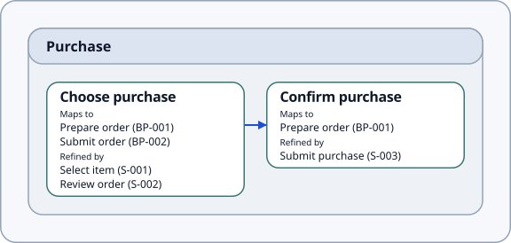
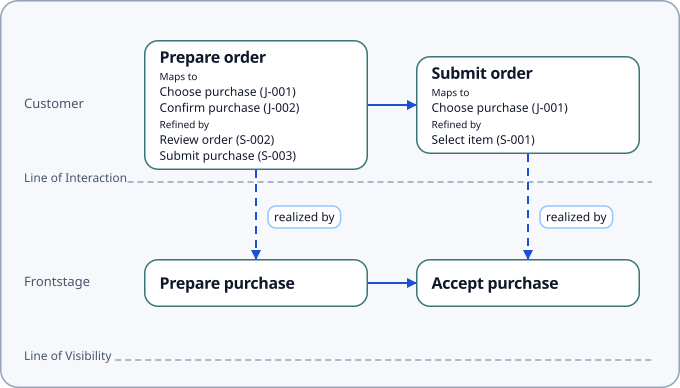
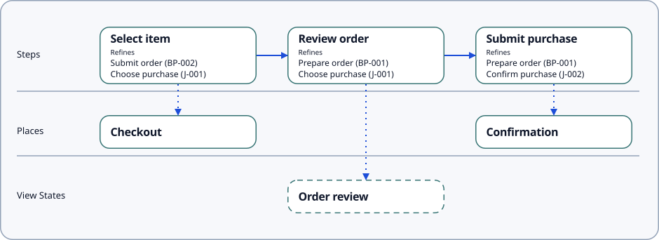

# Step Differentiation in v0.2

v0.2 distinguishes three kinds of authored step behavior:

| Type | Primary view | ID Format |
| --- | --- | --- |
| `JourneyStep` | Journey Map | `J-001` |
| `BlueprintStep` | Service Blueprint | `BP-001` |
| `ScenarioStep` | Scenario Flow | `S-001` |

`Stage CONTAINS JourneyStep` defines journey structure. 

Each step type has its own `PRECEDES` sequence and direct `REALIZED_BY` relationships to Place, ViewState, or Process. Metrics can instrument all three types. The former Step properties and validation-profile severities carry forward.

`JourneyStep MAPS_TO BlueprintStep` and `BlueprintStep MAPS_TO JourneyStep` (which works in either direction) expresses optional many-to-many correspondence. Reciprocal declarations remain in the compiled graph and yield one semantic correspondence. Mapping does not imply identity, inheritance, or equal refinements.

`JourneyStep REFINED_BY ScenarioStep` and `BlueprintStep REFINED_BY ScenarioStep` express partial elaboration. A ScenarioStep can refine several parents. Refinement does not imply containment, ownership, order, or inherited realization. Each node meets its own realization requirements, and ScenarioStep order comes from explicit `PRECEDES` relationships.

Detailed output shows **Maps to** and **Refined by** on journey and blueprint nodes, and **Refines** on scenario nodes. Targets display their names and IDs in ID order. Compact output hides these reference groups. Validation profile does not select render detail; counterpart nodes remain outside the primary view.

These annotations do not import other Step types, infer inverse edges, or inherit refinements or realizations. 

The mixed canonical proof shows mapped parents with different refinement sets and a shared ScenarioStep:

::: tabs
== Journey Map

== Service Blueprint

== Scenario Flow

== Source
showRepoLink /bundle/v0.2/examples/step_differentiation.sdd
showSource ../../../bundle/v0.2/examples/step_differentiation.sdd
:::

Render the example with the selected bundle:

```bash
TMPDIR=/tmp pnpm sdd show bundle/v0.2/examples/step_differentiation.sdd --bundle bundle/v0.2/manifest.yaml --view journey_map --profile strict --detail detailed
```

Replace the view with `service_blueprint` or `scenario_flow` for the other projections, and use `--detail compact` to hide the new reference groups.


The [v0.2 bundle](https://github.com/knutopia/Structured-Design-Documents/tree/main/bundle/v0.2) governs machine behavior. The [focused definition](https://github.com/knutopia/Structured-Design-Documents/blob/main/definitions/v0.2/step_differentiation.md) links each governing artifact, and the [canonical inventory](https://github.com/knutopia/Structured-Design-Documents/blob/main/bundle/v0.2/examples/README.md) records the migrated examples.
