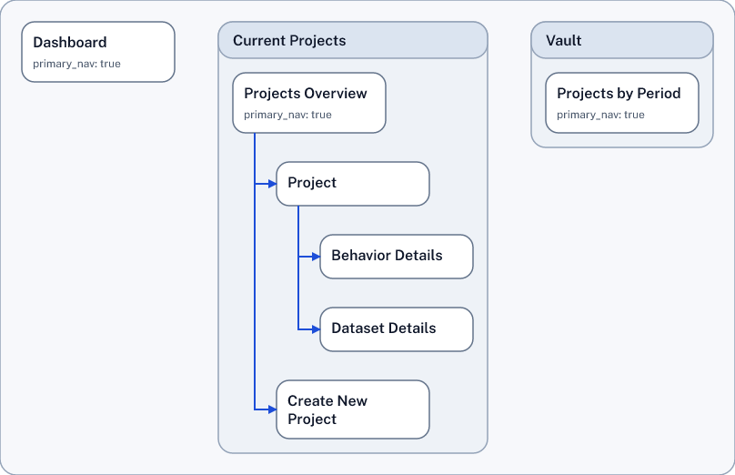
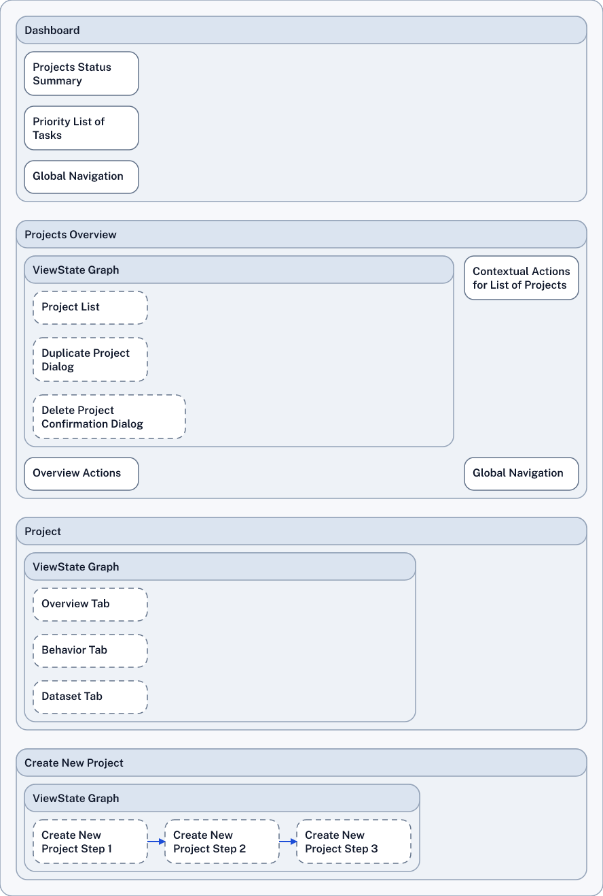

---
# https://vitepress.dev/reference/default-theme-home-page
layout: home

hero:
  name: "SDD"
  text: "Structured Design Documents"
  tagline: Semantically Defined Structural Design for Better Products
  actions:
    - theme: brand
      text:  Example
      link:  '#example-small-app'
    - theme: brand
      text: Repo
      link: https://github.com/knutopia/Structured-Design-Documents/tree/main

features:
  - title: Product Design Graph
    details: Nodes and edges, from high-level opportunities to low-level details, prepared to evolve
  - title: Simple Markup, Rendered Diagrams
    details: Easy to read, easy to write, validated and rendered to diagrams as output
  - title: For Us and for Our Machines
    details: Use SDD to talk to an LLM about structural design
---

SDD *(Structured Design Documents)* is a compact language for describing software product design as a structured map. SDD is easy to read and write, for people and for LLMs.

SDD makes design elements and their relationships explicit, in a unified "Product Design Graph", which captures a variety of product design perspectives as a single, interconnected set of nodes. In technical terms, it is a DSL (Domain Specific Language) for authoring a structured graph of design information.

Different aspects of the unified graph can be shown (rendered) as diagrams. Usable staged SVG/PNG renderers are currently available for IA / Place Map, UI Contract, Service Blueprint, and Scenario Flow views. See [Diagram Types](./diagram_types/).

## Why It Exists

- To provide a structured source of truth for product design instead of fragmented diagrams and documents.
- To make design structure machine-readable for validation, tooling, and deterministic rendering.
- To create design artifacts that AI and LLM workflows can consume without relying on image interpretation.
- To provide a means to AI and LLM workflows to "speak design", so they can create structural design information outside blobs of code.
- To give "traditional" product, design, and diagramming tools a shared semantic layer they can integrate with.

## Example: Small App

Here is a small SDD example showing a dashboard, a project area, and a few linked places and view states. From this source file, an Information Architecture / Place Map and a UI Contracts diagram are generated.

::::tabs
=== Information Architecture
:::tabs key:ab
== Diagram

== SDD Source
Information architecture content
showRepoLink docs/doc_site/small_app_example {pos: up}
showSource ./small_app_example/small_app.sdd {10, 12, 25, 27-30, 32, 39, 40, 54, 56, 57, 61-64, 66, 67, 76, 81, 93, 95, 96}
=== UI Contracts Diagram
:::tabs key:ab
== Diagram

== SDD Source
Highlights on UI contracts content
showRepoLink docs/doc_site/small_app_example {pos: up}
showSource ./small_app_example/small_app.sdd {10, 13-15, 17, 20, 30, 33-38, 41, 44, 47, 49, 51, 54, 58-60, 69, 71, 73, 76, 78-80, 82, 85, 88, 102}
:::
::::

See also: [Service Blueprint Slice example](service_blueprint_slice_example/) for a service blueprint diagram,  that connects customer steps to frontstage, backstage, support, system, and policy lanes. This example also shows how to create the diagram using SDD on the command line.

## Using SDD

The SDD Skill helps when using SDD with an LLM: [SDD Skill Guide](sdd-skill/)

Using SDD command line tools manually ("sdd show" etc): [SDD CLI User Guide](./sdd_cli_tools/)

## Technical Core

Two folders define the language:

- The *bundle/v0.1/* folder houses the tight, machine-readable specifications for version 0.1. These specifications are the source of truth for tooling. <IconGitHub/>[bundle/v0.1/ repo folder](https://github.com/knutopia/Structured-Design-Documents/tree/main/bundle/v0.1)

- The *definitions/v0.1/* houses explanatory definitions and rationale for version 0.1 and should stay consistent with the bundle. <IconGitHub/>[definitions/v0.1/ repo folder](https://github.com/knutopia/Structured-Design-Documents/tree/main/definitions/v0.1)

The *Authoring Spec* guides changes to the language: <IconFile/>[SDD-Text v0.1 — Authoring Spec (Type-first DSL)](../../definitions/v0.1/authoring_spec_type_first_dsl_sdd_text_v_0_dot_1.md){target="_blank"}

The *SDD Helper Guide* describes how the sdd-helper supports the sdd-skill behind the scenes: [SDD Helper Guide](./sdd-helper/)

## Background / Origins

- [Initial Concepts 1: a 6-Diagram Suite v0.1](initial_concepts/Initial%20Concepts1%20a%206-Diagram%20Suite%20v0dot1.md)

- [Initial Concepts 2: One-page Schema v0.1](initial_concepts/Initial%20Concepts2%20One-page%20Schema%20v0dot1.md)

- Original document outlining the idea: [Structured Design Artifacts to Advance the Software Product Design Practice](../../initial_concepts/Structured%20Design%20Artifacts%20to%20Advance%20the%20Software%20Product%20Design%20Practice.md)

- [Strategic Potential of SDD in the Product Lifecycle](<strategic_potential/README.md>)

