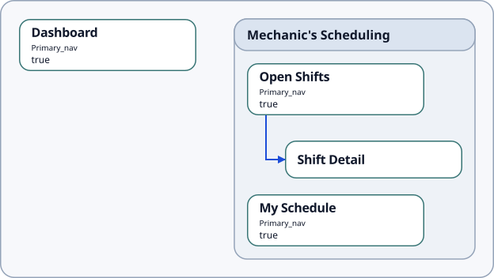
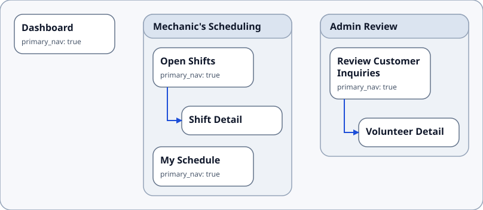
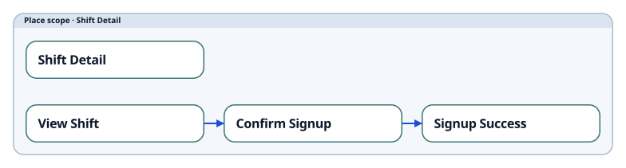
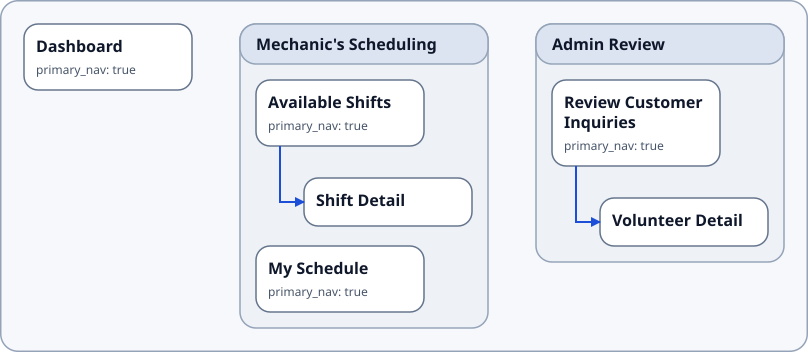
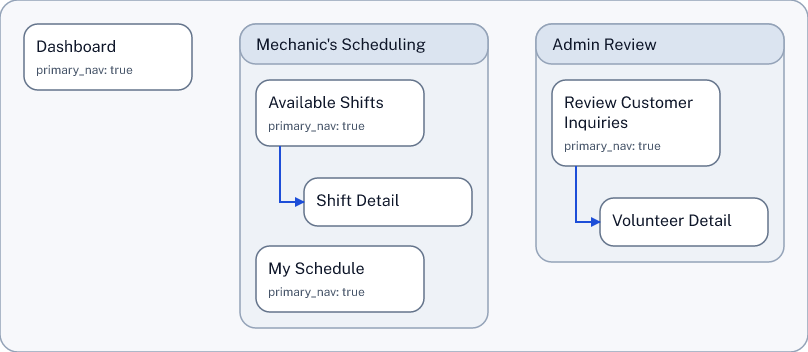

# SDD Skill Guide

The SDD Skill provides a simple way for an LLM to work with structured design documents. It gives the agent workflow guidance, helper commands, and SDD grammar context for producing valid, consistent output. The SDD Skill is an alternative to manually authoring and editing SDD documents, which is also possible.

The current SDD Skill is written for Codex. It has successfully been used with Claude. It likely works in other compatible hosts. 

## Install

For Codex, install it by copying [skills/sdd-skill](../../../skills/sdd-skill/) to `$CODEX_HOME/skills/sdd-skill`. A typical Codex location is `~/.codex/skills/sdd-skill`.

After copying the folder, restart Codex so it discovers the skill. Then continue with the example prompts below.

## Use Case: Start With An App Idea

If you have an app idea in mind, you can start by describing the app in plain language.

An agent using the SDD Skill can turn that description into a structured design document.

Here is an example prompt:

```text
Use $sdd skill to design a mechanic's scheduling app for a communal automotive shop.         

Create a new SDD ("shop_sched_exploration") for it and create a simple information architecture diagram. Include:    
- Dashboard
- a Mechanic's Scheduling area with Open Shifts, Shift Detail, My Schedule
```
That is enough to get started. You do not need to know SDD syntax first (although the syntax is quite simple.) You could omit the filename. The agent can choose a name then.

### Output

The prompt generates the SDD file (Structured Design Document) and the information architecture diagram.

:::tabs
== Information Architecture Diagram
Information architecture from that first prompt:

== Source
showSource examples/shop_sched_exploration.sdd
:::

### What This Creates

Instead of a vague app idea, you now have a structured design starting point, before anything is baked into code.

- A named structure for the app, with places and relationships the model can reason about.
- A visible app map that makes the overall shape easier to review.
- A concrete starting point for follow-up refinement before you move into implementation.

Behind the scenes, the agent follows the skill workflow and uses editing tools that read, write, and check SDD documents quickly and reliably.

## Follow-Up Requests

Once the first structure exists, the next steps can stay conversational. For example:

### Add An Admin Review Area

```text
Using $sdd skill, add an Admin Review area for coordinators who approve volunteer signups. Include "Review Customer Inquiries" and "Volunteer Detail".
Connect to it from the Dashboard.

Also add descriptions. Update the IA.
```
#### Output

:::tabs
== Information Architecture Diagram
Rendered output from the admin-area follow-up:

== Source
showSource examples/shop_sched_exploration_2.sdd {35-51}
== Source Detail
New "Admin Review" area:
```sdd
Area A-020 "Admin Review"
  description="Coordinator workspace for reviewing customer inquiries and approving volunteer signups."
  CONTAINS P-050
  CONTAINS P-060
  + Place P-050 "Review Customer Inquiries"
    route_or_key="/admin/inquiries"
    access="role:coordinator"
    primary_nav="true"
    description="Queue for customer inquiries and volunteer signup requests awaiting coordinator review."
    NAVIGATES_TO P-060
  END
  + Place P-060 "Volunteer Detail"
    route_or_key="/admin/volunteers/:volunteerId"
    access="role:coordinator"
    description="Approval workspace for reviewing a volunteer's profile, availability, and signup decision."
  END
END
```
:::

### Add A Signup Flow And Show a UI Contracts Diagram

SDDs can capture states and view states to express progressions. Let's add a sign-up flow.

```text
Using $sdd skill, add a simple signup flow in Shift Detail, with these view states:
- View Shift
- Confirm Signup
- Signup Success

Show the UI contracts.
```

#### Output
:::tabs
== UI Contracts Diagram
Rendered output from the UI-contracts follow-up, showing the viewState sequence:

== Source
showSource examples/shop_sched_exploration_3.sdd {26-39}
== Source Detail
Added viewStates within Shift Detail:
```sdd {5-18}
  + Place P-030 "Shift Detail"
    route_or_key="/mechanic/shifts/:shiftId"
    access="role:mechanic"
    description="Inspect a shift's bay, time window, vehicle context, and signup status."
    CONTAINS VS-010
    CONTAINS VS-020
    CONTAINS VS-030
    + ViewState VS-010 "View Shift"
      description="Default shift-detail state for reviewing shift requirements and starting signup."
      TRANSITIONS_TO VS-020
    END
    + ViewState VS-020 "Confirm Signup"
      description="Confirmation state for reviewing commitment details before signing up."
      TRANSITIONS_TO VS-030
    END
    + ViewState VS-030 "Signup Success"
      description="Success state confirming the mechanic has signed up for the shift."
    END
  END
```
:::

### Simple Follow-Up Edit

The same style also works for smaller follow-ups:


#### Output

:::tabs
== Information Architecture Diagram
Renamed "Open Shifts" in "Mechanic's Scheduling" to "Available Shifts":

== Source
showSource examples/shop_sched_exploration_4.sdd {15}
== Source Detail
P-020 "Available Shifts" inside A-010 "Mechanic's Scheduling":
```sdd {6}
Area A-010 "Mechanic's Scheduling"
  description="Mechanic workspace for finding open shop shifts and managing accepted shifts."
  CONTAINS P-020
  CONTAINS P-030
  CONTAINS P-040
  + Place P-020 "Available Shifts"
    route_or_key="/mechanic/shifts/open"
    access="role:mechanic"
    primary_nav="true"
    description="Browse available volunteer mechanic shifts and choose a shift to inspect."
    NAVIGATES_TO P-030
  END
```
:::

### Creating a Diagram from an Existing SDD File

When you want to see a current diagram for an existing SDD file, you can ask the agent for it:

```text
Using $sdd-skill, show the information architecture.
```

The agent, guided by the skill, then calls the `sdd show` command. You could also call the show command directly in a terminal, without using the skill:

```console
bash:$ pnpm sdd show shop_sched_exploration.sdd --view ia_place_map --profile simple --detail compact --format png --out "shop_sched_exploration_IA_as_a.png"

Wrote /home/knut/projects/sdd/shop_sched_exploration_IA_as_a.png
```


This works when the SDD contains the type of content that appears in the type of diagram that you ask for: to render an information architecture, the SDD must contain places (and optionally areas) - otherwise, there is nothing to `show`.

## SDD During the Product Lifecycle

These examples focus on simple information architecture and a bit of state handling. SDD provides means to go into greater detail, with flows, nested components and service blueprints. SDD also provides means to capture more abstract *drivers* of design, with journeys and opportunity maps. The goal is to create an opportunity to create a full picture of structural design - which is helpful for delivering on the design promise.

The example shown here shows a from-scratch workflow. It is exciting to envision, design and build a product from scratch. It is also, in practical terms, rare. Most actual work in a product business is concerned with changing, improving, and growing an existing product over a long period of time. In that situation, [SDD can make a strategic difference](../strategic_potential/).

## Go Beyond the Skill

The skill gives an LLM enough workflow guidance to respond to users' natural-language prompts, allowing a user to work with SDD without knowing the syntax. 

The syntax is fairly straightforward, though: about as complex as basic HTML. With not much learning effort, anyone can simply edit SDD files manually. That can be the quickest way from idea to document.

## What Happens Behind The Scenes When Using the Skill

*The skill provides a set of capabilites to the agent. The agent interprets the prompt in light of these capabilities. The agent probes the capabilities, uses them, interprets the results and takes the next step.*

Looking at the examples above,

- The agent recognizes the initial prompt as a *create new document* request. It creates the new, empty `.sdd` document, using the filename in the prompt. It translates the prompt's ask into an app structure (this is the core of the LLM work) and then follows SDD rules to create nodes and connections. It then writes this content into the document. The agent also recognizes the request for the IA diagram as a *read, validate, or preview an existing document* request and executes it.
- The agent recognizes the follow-up prompts as *edit an existing document* requests. For each request, it looks at the current structure before making changes, so each follow-up builds on the actual document. The follow-up requests for diagrams are recognized as *read, validate, or preview an existing document* again.
- All the edits are made through a structured workflow provided by the sdd-helper tool, instead of brittle free-form rewriting. The agent queries helper capabilities and request contracts when it needs them. The agent and helper speak JSON to one another, which is easy for automation to use.

### Helper Request Contracts

When an agent is using the skill and needs to understand helper request details, it can ask `sdd-helper` for a request-purpose contract to learn those details, instead of loading the full helper contract. This is useful when the agent only needs to compose the next helper request and does not need the full result schema.

```bash
pnpm sdd-helper contract helper.command.create --purpose request
pnpm sdd-helper contract helper.command.author --purpose request --resolve bundle
pnpm sdd-helper contract helper.command.apply --purpose request --resolve bundle
pnpm sdd-helper contract helper.command.undo --purpose request --resolve bundle
```

The supported request-purpose subjects are `helper.command.create`, `helper.command.author`, `helper.command.apply`, and `helper.command.undo`. For first-pass `author` JSON, the agent should prefer the bundle-resolved request-purpose contract and read its `authoring_format_card`, which gives compact bundle-derived guidance for IDs, relationship tokens, events, effects, and raw SDD values.

For the technical workflow behind the examples, see the canonical repo skill bundle in [sdd-skill](../../../skills/sdd-skill/): the core [SKILL.md](../../../skills/sdd-skill/SKILL.md), [workflow.md](../../../skills/sdd-skill/references/workflow.md), [change-set-recipes.md](../../../skills/sdd-skill/references/change-set-recipes.md), and [current-helper-gaps.md](../../../skills/sdd-skill/references/current-helper-gaps.md). See the [SDD Helper Guide](../sdd-helper/) about the helper used by the skill.
