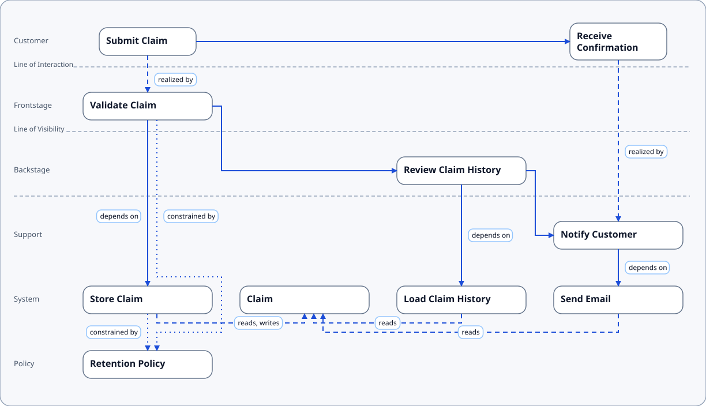

# Example: Service Blueprint Slice

This example shows how SDD-Text expresses a service blueprint slice for a simple claim flow.

:::tabs
== Diagram

== Source
showSource claim_flow_slice.sdd{ts}
:::

## What To Look For in a Service Blueprint

- customer journey steps occupy the top row and connect left-to-right through the flow
- process nodes are distributed into frontstage, backstage, and support lanes according to `visibility`
- system, data, and policy elements below the journey show operational dependencies and constraints

## How To Create the Diagram Using the Command Line

From the project root folder, go to the folder containing the source SDD:

```bash
cd docs/doc_site/service_blueprint_slice_example
ls
```

Generate the diagram with the `show` command:
```bash
pnpm sdd show $PWD/claim_flow_slice.sdd --view service_blueprint --out $PWD/my_service_blueprint.svg
```
Notes:
- $PWD points the command to the current directory. Without $PWD the command looks for the input file in the project root.
- Output is an SVG, by default. Be sure to include .svg in the output filename
- The diagram uses the default `strict` profile

To create a PNG as output, add *--format png* to the call and change the output filename to use .png:
```bash
pnpm sdd show $PWD/claim_flow_slice.sdd --view service_blueprint --out $PWD/my_service_blueprint.png --format png
```

To see all the details about a command, use the `help`:
```bash
pnpm sdd help show
```

Read [SDD Command Line Tools](../sdd_cli_tools/) to learn more.
