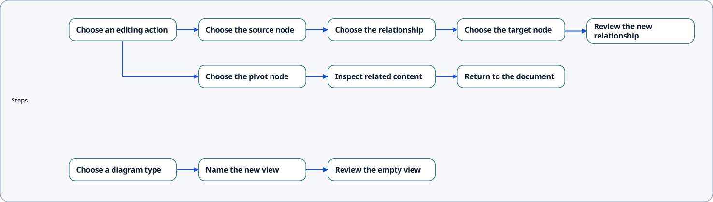

---
prev:
  text: Named Diagrams
  link: ../named_diagrams

next:
  text: Diagram Node- and Edge Reference
  link: ../node_edge_reference
---
# View and Diagram Options for Sdd-Show

For `sdd show`, the options `--view` and `diagram ` determine what content gets shown.

:::: sideBySide
::: info {h4} View
`--view` selects a **diagram type**, such as `scenario_flow` or `journey_map`.  

Used alone, it renders that type's **combined view**: all eligible content for the type, regardless of named diagrams.  
Use `--view` when there is only a single diagram of a given type.
:::
==
::: info {h4} Diagram
`--diagram` selects a **named diagram by its ID**, such as `DG-001`.  

No `--view` option is needed in that case. This is a way of working with multiple diagrams of the same type. (For example, there may be many journey maps and scenario flows.)
:::
::::

| Options | Result |
| --- | --- |
| `--view scenario_flow` | One combined scenario-flow diagram. |
| `--view all` | One combined diagram per available diagram type. No separate outputs for named diagrams. |
| `--diagram DG-001` | One named diagram, with its type inferred. |
| `--diagram DG-001 --view scenario_flow` | The same named diagram, provided its declared type is `scenario_flow`; a mismatch fails. |
| `--diagram all` | Separate named diagram outputs, in ID order, across available types. Does not add combined views. |
| `--diagram all --view scenario_flow` | Render all named diagrams of this type. |
| `--view all --diagram DG-001` | Invalid: a combined-view batch cannot be scoped to one named diagram. |
| `--view all --diagram all` | Invalid: the two batch selectors cannot be combined. |
| Neither option | Invalid: a target selector is required. |

For example, `scenario_separation.sdd` declares three named diagrams, all of type `scenario_flow`:

:::tabs
== Combined Output
```bash
# One combined output: flows.scenario_flow.svg
pnpm sdd show bundle/v0.2/examples/scenario_separation.sdd --view all
```


== Specific Diagram
```bash
# Specific diagram by ID
pnpm sdd show bundle/v0.2/examples/scenario_separation.sdd --diagram DG-001
```

== All Named Diagrams
```bash
# All named diagrams
pnpm sdd show bundle/v0.2/examples/scenario_separation.sdd --diagram all
```


== Source
Separate named scenario flows in a single source file: 
showRepoLink examples/rendered/v0.2/scenario_flow_diagram_type/scenario_separation_example {pos: up}
showSource ../../../../examples/rendered/v0.2/scenario_flow_diagram_type/scenario_separation_example/scenario_separation.sdd {3, 7, 11}
:::

If you want to deep-dive on diagram structure, use `pnpm sdd diagrams <input> --json --details` to inspect declared IDs, types, semantic membership counts, exact edge references, and node inclusion reasons. See [Named Diagrams](../syntax/named_diagrams/index.md) for declaration and assignment syntax.