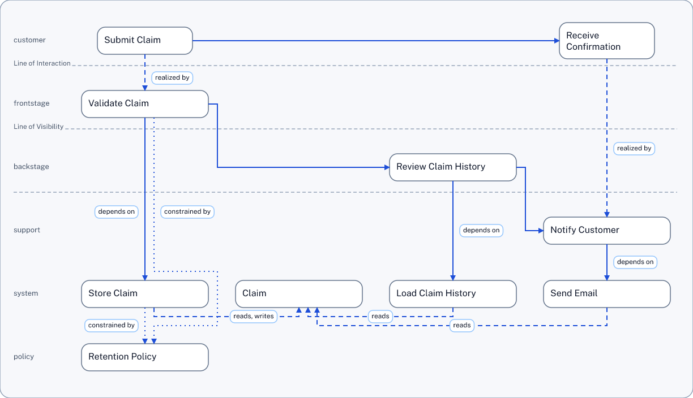

# Example: Service Blueprint Slice

This example shows how SDD-Text expresses a service blueprint slice for a simple claim flow. The diagram connects customer-visible steps to frontstage, backstage, support, system, and policy elements in one structured graph. The image below is the `recommended_profile` render from the code-driven example set.

Full source: [service_blueprint_slice.sdd](service_blueprint_slice.sdd)

## Source Excerpt

Trimmed excerpt for this page:

```text
SDD-TEXT 0.1

Step J-020 "Submit Claim"
  owner=Design
  description="User submits support claim"
  actor=User
  intent="Start claim process"
  success_criteria="Claim accepted"
  PRECEDES J-021 "Receive Confirmation"
  REALIZED_BY PR-020 "Validate Claim"
END

Step J-021 "Receive Confirmation"
  owner=Design
  description="User receives claim confirmation"
  actor=User
  intent="Confirm claim was received"
  success_criteria="Confirmation shown"
  REALIZED_BY PR-022 "Notify Customer"
END

Process PR-020 "Validate Claim"
  owner=Ops
  description="Validate submitted claim"
  visibility=frontstage
  sla=30s
  PRECEDES PR-021 "Review Claim History"
  DEPENDS_ON SA-020 "Store Claim"
  CONSTRAINED_BY PL-020 "Retention Policy"
END

Process PR-021 "Review Claim History"
  owner=Ops
  description="Assess prior claim context"
  visibility=backstage
  sla=45s
  PRECEDES PR-022 "Notify Customer"
  DEPENDS_ON SA-021 "Load Claim History"
END

Process PR-022 "Notify Customer"
  owner=Ops
  description="Send claim confirmation"
  visibility=support
  sla=60s
  DEPENDS_ON SA-022 "Send Email"
  EMITS E-020 "Claim Confirmed"
END

SystemAction SA-020 "Store Claim"
  owner=Eng
  description="Persist claim"
  system_name=ClaimsAPI
  action=createClaim
  failure_modes=validationError
  READS D-020 "Claim"
  WRITES D-020 "Claim"
  CONSTRAINED_BY PL-020 "Retention Policy"
END

DataEntity D-020 "Claim"
  owner=Data
  description="Customer claim entity"
  fields="claim_id,status"
  system_of_record=ClaimsDB
END

Policy PL-020 "Retention Policy"
  owner=Risk
  description="Retention constraints"
  policy_owner=Legal
  enforcement_point=ClaimsAPI
END
```

## Rendered Output

<a href="service_blueprint_slice.service_blueprint.png">
  
</a>

## What To Look For

- customer journey steps occupy the top row and connect left-to-right through the flow
- process nodes are distributed into frontstage, backstage, and support lanes according to `visibility`
- system, data, and policy elements below the journey show operational dependencies and constraints
