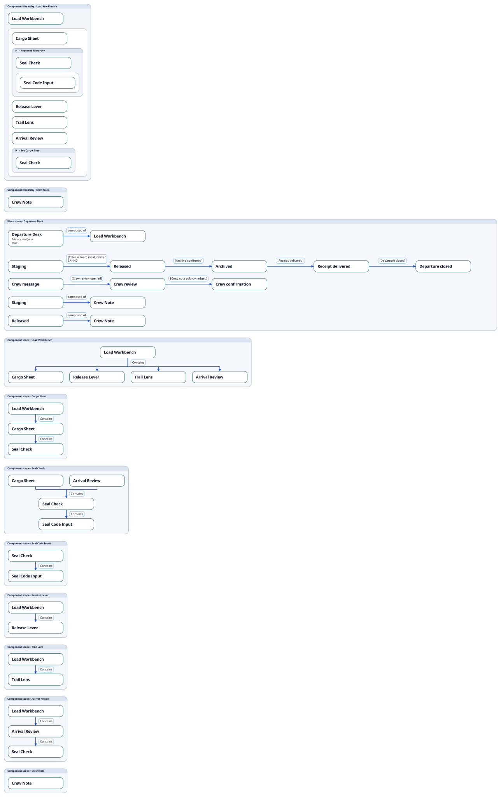
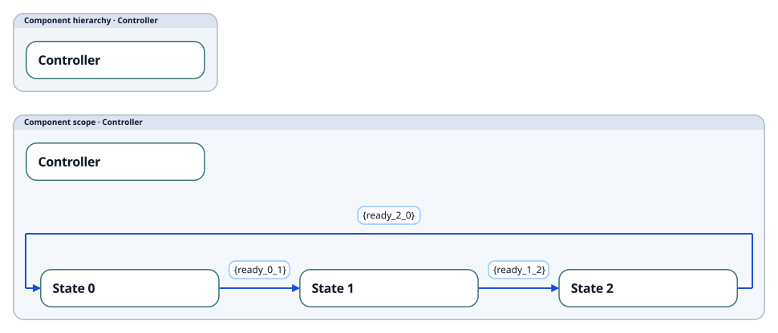
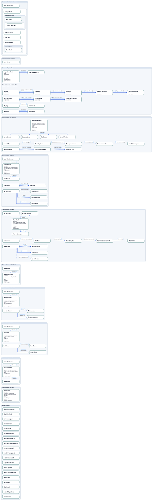

# Understanding the hierarchical UI Contracts renderer

This guide describes the implemented **staged `ui_contracts` SVG/PNG renderer**, as accepted on 8 September 2026. It explains how to read a diagram and where its composition is implemented. It covers the current B5 implementation, including the later transition and sibling-enclosure corrections, rather than the earlier design studies.

The diagram combines a Component hierarchy overview with local Place and Component scopes. Each scope brings nearby relationships together so readers can follow containment, transitions, composition, and outgoing contracts without tracing connectors across the whole sheet. Repeated cards can represent the same semantic node.

## Authority and reading rules

The following invariants anchor this guide:

- **The bundle governs presentation policy.** Roles, relationship selectors, captions, attribute selection, and detail switches live in [`core/views.yaml`](../../bundle/v0.1/core/views.yaml), under the `ui_contracts` view's `renderer_defaults.ui_contracts_presentation` and `detail_display`.
- **Visual repetition preserves identity.** The [presentation model](../../src/renderer/uiContractsPresentationModel.ts) distinguishes semantic nodes from their visual occurrences and retains authored relationship multiplicity and provenance.
- **Projection remains the semantic boundary.** View-owned scene construction supplies groups, ports, and reservations to the shared staged pipeline; it does not replace shared placement or routing. See the [renderer architecture](../toolchain/architecture.md) and [acceptance report](b5_implementation_acceptance.md).
- **Detail and decorators are independent.** Both details preserve Component hierarchy and primary ViewState transitions. Compact's State fallback is decided across the projection, not separately in each scope.

The illustrations below reuse implemented output from before redundant Component scope suppression; they may show local scopes that current rendering omits. The Stage 7 images are public-preview artifacts from the unchanged [Departure Desk source](departure_desk.sdd); focused Stage 6 resumed images show accepted topology corrections. The `b2_*` through `b5_*` exploration files remain historical visual references and should not be mistaken for current public output.

## The complete sheet

Sections appear vertically: Component hierarchy roots first, then Place scopes, Component scopes, any additional standalone contract/transition scopes, and finally the referenced-target register when supporting targets are visible. Within these groups the model preserves authored ordering rather than sorting everything alphabetically.

Each section takes the width its contents require. A long transition sequence can therefore make one section much wider than the hierarchy overview. The sheet has no outer frame; the visible frames belong to individual scopes and hierarchy enclosures. Large diagrams are intended for zooming and scrolling.



[Open the compact SVG at full size](implementation_evidence/stage7/departure_desk/compact.none.svg). With ViewStates present, this compact sheet omits secondary State sequences and supporting contracts, but retains the hierarchy and local parent/child neighborhoods.

## Component hierarchy overview

A titled `Component hierarchy · <name>` enclosure starts each root. The Component card identifies the root; nested enclosures express its descendants. Sibling leaves share an enclosure, and alternating pale fills help distinguish nesting depth. Enclosures are structural graphics, not additional semantic nodes or oversized Component cards.

Read the nesting together with the local scopes: a retained Component scope explicitly shows its immediate parents above it and immediate children below it. This provides a direct check on parentage in a large overview.

### Reuse and H locators

A Component with descendants may occur under more than one parent. Its subtree expands at its first depth-first occurrence in authored order. A later occurrence refers back to that expansion instead of duplicating the entire subtree.

The expanded enclosure receives a locator such as `H1 · Repeated hierarchy`; the later enclosure says `H1 · See Cargo Sheet`. In Departure Desk, Seal Check appears beneath Cargo Sheet and Arrival Review, while Seal Code Input is expanded once beneath Seal Check. Seal Check's local scope still shows **both** parents and its child.

An H locator is a diagram navigation aid, not an SDD ID, new node, or containment edge. It remains visible with decorators disabled. It is deterministic for the same input, but changing authored order can change first-expansion placement and locator numbering. Repeated leaves do not need a subtree locator.

## Local scopes

### Place scope

A `Place scope · <name>` frame brings together:

1. The focal Place and any directly authored `COMPOSED_OF` Component references.
2. Its owned ViewStates and their transition sequences.
3. Separate composition rows for individual ViewStates that have their own `COMPOSED_OF` relationships.
4. Visible outgoing contracts, grouped by their actual source.

Detailed mode also includes the selected Place attributes and its description. ViewState ownership is resolved from the selected Place-to-ViewState ownership relationship, with `place_id` as the property fallback. Ownership is expressed by grouping, rather than an extra `Contains` arrow for every ViewState.

Composition is explicit: Departure Desk's Staging and Released ViewStates each reference Crew Note. This does not imply that every other ViewState uses Crew Note. A composition target is a reference, not a Component-containment child of the source.

### Component scope

A `Component scope · <name>` frame starts with the focal Component's immediate neighborhood:

- All immediate parents above the focal card.
- The focal Component in the middle.
- All immediate children below it.

`Contains` arrows point from parent to child. Multiple parents or children use connecting bars with a common labelled stem. Junction anchors are invisible; connector turns have no circular junction markers.

Redundant Component scopes are suppressed **after detail selection** when they have no visible sequences or outgoing contracts, the focal card adds no attributes beyond its overview card, they have at most one immediate parent, and their immediate children are already shown together in an expanded overview occurrence. Visible compositions also retain a scope. A leaf has no children to add; an isolated Component can appear only in the overview. Scopes remain when the overview cannot preserve their content. Components with multiple parents always retain their scopes because bringing those parents together provides useful local context.

This is a renderer composition decision based on selected visible content, not a change to bundle policy. A scope can disappear in compact and remain in detailed when attributes or contracts become visible. Suppression removes repeated occurrences only: every visible identity and relationship remains represented, with overview nesting preserving containment.

Visible State sequences and outgoing contract groups follow this neighborhood. States belong to the scope named by `scope_id`; Component containment does not cause a parent's states or contracts to be inherited by its children.

## Transitions

Primary ViewState sequences read horizontally. Multiple disconnected sequences may occupy separate rows, but the renderer does not invent transitions between them. Their placement does not assert parallel execution or simultaneous UI visibility.

Transition labels preserve the available annotations in this order:

```text
[Event name] {guard} / effect
```

Absent parts are omitted. The event reference is resolved to its node name when available; the effect is displayed as its authored value.

Forks and merges use distinct routed segments. Cycles reserve a return channel above the forward sequence, and self-loops also route above their node. These are layout treatments of authored transitions, not extra relationships.



[Cycle SVG](implementation_evidence/stage6_resumed/cycle.compact.none.svg) · [Self-loop SVG](implementation_evidence/stage6_resumed/self_loop.compact.none.svg) · [Branch SVG](implementation_evidence/stage6_resumed/branch.compact.none.svg) · [Merge SVG](implementation_evidence/stage6_resumed/merge.compact.none.svg)

## Outgoing contracts and referenced targets

Each outgoing contract group shows **one source card with its target references**. Multiple outgoing relationships share that source occurrence. The source is the node that actually authored the relationship: for example, an emission from a ViewState or SystemAction is not reassigned to a nearby Component.

| Relationship | Current visual treatment | Meaning |
| --- | --- | --- |
| Component `CONTAINS` Component | Solid, `Contains` | Component parentage |
| Place/ViewState `COMPOSED_OF` Component | Solid, `composed of` | Explicit composition reference |
| ViewState `TRANSITIONS_TO` ViewState | Solid, annotation label | Primary UI transition |
| State `TRANSITIONS_TO` State | Dashed alongside primary ViewStates; solid in State fallback | Secondary or fallback transition |
| `EMITS` Event | Dashed, `emits` | Source emits the Event |
| `DEPENDS_ON` SystemAction | Solid, `depends on` | Source depends on the action |
| Component `BINDS_TO` DataEntity | Dotted, `binds to` or `binds field <value>` | Data binding, including an authored field when present |

The final `Referenced targets` section lists visible Event, DataEntity, and SystemAction identities once each. Local references keep contracts readable; the register makes shared targets discoverable. A target can appear in several local groups and in the register without becoming several semantic nodes. Parallel bindings retain their separate relationship occurrences.

Supporting nodes with outgoing contracts can receive their own `Contract scope · <name>` section. Unowned nodes and cross-scope transitions also receive explicit standalone context when needed, so they are not silently lost merely because they do not fit a normal Place or Component scope.



[Open the detailed SVG at full size](implementation_evidence/stage7/departure_desk/detailed.none.svg). Compare Seal Check's local parents with its two overview occurrences, then follow its own bindings and emissions to their local target references.

## Detail and decorators

`--detail` selects content. `--decorators` selects the type/ID header on semantic cards. Detailed content does not automatically enable those headers.

| Content | `compact` | `detailed` |
| --- | --- | --- |
| Component hierarchy relationships | Preserved in overview and retained scopes | Preserved in overview and retained scopes |
| Redundant Component scopes | Omitted after detail selection | Omitted after detail selection |
| ViewState sequences and explicit composition | Shown | Shown |
| Component description, inputs, outputs | Omitted | Shown when authored on the focal Component |
| Place primary navigation | Shown when authored | Shown when authored |
| Place route/key, access, entry points, description | Omitted | Shown when authored |
| ViewState data required | Omitted | Shown when authored in sequence cards |
| State sequences and supporting contracts when any ViewState is present | Omitted | Shown |
| State sequences and supporting contracts when States exist and no ViewState is present | Shown through fallback | Shown |
| Empty Place scopes | Omitted, with an omission note | Retained |

The fallback test is **projection-wide**. A Component with States but no local ViewStates does not receive its own compact fallback if a ViewState exists elsewhere in the projection. Compact is therefore a selected-content view, not evidence that omitted contracts are absent from the source. An empty Place is assessed against the content visible for the selected detail.

[Existing compact State-fallback SVG](../../examples/rendered/v0.1/ui_contracts_diagram_type/ui_state_fallback_example/compact_detail/ui_state_fallback.ui_contracts.svg) illustrates the fallback without primary ViewStates.

Decorator choices are `none`, `type`, `id`, and `type,id`. Container titles and H locators remain visible in every case. ID decorators display the original semantic ID, never the internal visual-occurrence ID. When decorators are omitted, the independent user preference and bundle fallback resolve the setting.

| Detail | No decorators | Type | ID | Type and ID |
| --- | --- | --- | --- | --- |
| Compact | [SVG](implementation_evidence/stage7/departure_desk/compact.none.svg) | [SVG](implementation_evidence/stage7/departure_desk/compact.type.svg) | [SVG](implementation_evidence/stage7/departure_desk/compact.id.svg) | [SVG](implementation_evidence/stage7/departure_desk/compact.type-id.svg) |
| Detailed | [SVG](implementation_evidence/stage7/departure_desk/detailed.none.svg) | [SVG](implementation_evidence/stage7/departure_desk/detailed.type.svg) | [SVG](implementation_evidence/stage7/departure_desk/detailed.id.svg) | [SVG](implementation_evidence/stage7/departure_desk/detailed.type-id.svg) |

## Visual sizing and container treatment

Semantic cards use shared-node measurement, Public Sans typography, standard 224px width, and content-driven height. Context and target references stay lean; selected richer attributes belong to focal or sequence occurrences. Repetition therefore need not repeat every attribute.

Scope titles have a measured, single-line 19px title band. Long titles expand their enclosure instead of stretching semantic cards. The band has a flat lower edge and follows the enclosure's rounded top interior; the 1.5px outline is painted after the fill so it stays intact. Enclosure corner radius is 14px.

Local groups use their intrinsic measured widths. Shared measurement can retain excess space on the right of some sequence groups; the implementation does not crop or shrink those positioned frames afterward. Longer sequences grow the diagram horizontally rather than shrinking its cards and text.

## Implementation map for maintainers

The staged path is:

```text
Projection + compiled graph + loaded view policy
  → UI Contracts presentation model
  → RendererScene
  → MeasuredScene
  → PositionedScene
  → SVG
  → PNG rasterization
```

The compiled graph supplies authored ordering, properties, and transition annotations; the presentation model matches these against projected identities and relationship multiplicity. Rendering does not mutate the projection.

| Responsibility | Source |
| --- | --- |
| Machine-owned roles, labels, relationship styles, content and visibility | [`bundle/v0.1/core/views.yaml`](../../bundle/v0.1/core/views.yaml) |
| Bundle presentation validation and resolution, reached through `loadBundle(...)` | [`src/bundle/uiContractsPresentation.ts`](../../src/bundle/uiContractsPresentation.ts) |
| Identity/occurrence separation, reuse, ownership, fallback, local groups, omissions and provenance | [`src/renderer/uiContractsPresentationModel.ts`](../../src/renderer/uiContractsPresentationModel.ts) |
| Public scene builder and SVG/PNG entrypoints | [`src/renderer/staged/uiContracts.ts`](../../src/renderer/staged/uiContracts.ts) |
| Sheet assembly, enclosures, neighborhoods, composition, ports and coverage checks | [`uiContractsPresentationScene.ts`](../../src/renderer/staged/uiContractsPresentationScene.ts) |
| Single-source outgoing groups | [`uiContractsFanout.ts`](../../src/renderer/staged/uiContractsFanout.ts) |
| Transition-region inputs and return-channel reservations | [`uiContractsTransitions.ts`](../../src/renderer/staged/uiContractsTransitions.ts) |
| Native title measurement and enclosure painting | [`uiContractsContainer.ts`](../../src/renderer/staged/uiContractsContainer.ts) |
| Ordinary SVG arrow paths for import compatibility | [`uiContractsArrowheads.ts`](../../src/renderer/staged/uiContractsArrowheads.ts) |
| Shared staged execution and artifact output | [`pipeline.ts`](../../src/renderer/staged/pipeline.ts), [`svgBackend.ts`](../../src/renderer/staged/svgBackend.ts) |
| Backend-aware preparation and public preview integration | [`prepareProjectionForRender.ts`](../../src/renderer/prepareProjectionForRender.ts), [`previewWorkflow.ts`](../../src/renderer/previewWorkflow.ts) |

Scene occurrence IDs identify a card's role and context separately from its semantic ID. Routed connector segments retain mappings to authored relationship IDs. Ownership is accounted for structurally; the final builder checks other visible relationships for scene representation and checks visible identities for occurrences. Containment cycles produce an explicit renderer error instead of recursive expansion.

Policy changes belong in the bundle and must affect runtime through the loaded policy. Do not add hidden lists of node types, relationship names, or detail rules to the scene builder. Preserve the staged boundary: shared placement, routing, repair, and validation were unchanged by this implementation. The view provides their inputs rather than final coordinates or routes.

Relevant tests include [presentation-model policy and identity tests](../../tests/uiContractsPresentationModel.spec.ts), [scope tests](../../tests/uiContractsB5Scopes.spec.ts), [complete-sheet tests](../../tests/uiContractsComplete.spec.ts), [topology tests](../../tests/uiContractsTopology.spec.ts), [container tests](../../tests/uiContractsContainer.spec.ts), and [public staged renderer tests](../../tests/stagedUiContracts.spec.ts). Acceptance must precede snapshot refresh; a snapshot is evidence of output, not the presentation contract.

## Producing a diagram and known limits

Run from the repository root:

```bash
TMPDIR=/tmp pnpm sdd show docs/hierarchical_ui_contracts/departure_desk.sdd --view ui_contracts --detail detailed --decorators type,id --out /tmp/departure.svg
TMPDIR=/tmp pnpm sdd show docs/hierarchical_ui_contracts/departure_desk.sdd --view ui_contracts --detail compact --decorators none --format png --out /tmp/departure.png
```

Validation profiles govern validation; render detail governs displayed content. The hierarchical design applies to the staged SVG/PNG path. Legacy DOT, Mermaid, and Graphviz preview paths retain their previous model and appearance.

The accepted implementation retains long-ID overflow in shared-node decorators. A proposed `(long ID)` substitution is not implemented. Native overflow diagnostics remain available. SVG arrowheads are ordinary filled paths, but live Figma import was not verified during acceptance. The documented right-edge excess width also remains.

The [final acceptance report](b5_implementation_acceptance.md) records the implementation's 1,216 passing tests, documentation build, option matrix, artifact refresh, and unchanged shared-source audit. Those are recorded implementation results, not new test runs performed for this guide.
