# Journey Map Visual Remediation — Comparison Record

Status: immutable visual history captured on 2026-07-22

Remediation date: 2026-07-18

Before revision: `8dfd883`

After revision: `6201995`

This record preserves the visual evidence used to close the accepted Journey Map remediation issues and the rejected dense-routing experiment used to keep `JM-VIS-002` open. The [current-state visual review](staged_journey_map_renderer_current_state_visual_review.md) remains the canonical review of accepted current output. The [visual-issues brief](visual_issues_in_journey_map.md) remains the historical statement of the problems and desired outcomes.

The files under [`assets/visual-remediation-2026-07-18/full/`](assets/visual-remediation-2026-07-18/full/) are immutable provenance copies. The files under [`focus/`](assets/visual-remediation-2026-07-18/focus/) change only the outer SVG `width`, `height`, and `viewBox`; all rendered elements remain present. Every non-full focus view uses 24px padding around its named proof geometry.

## Accepted comparison plates

### `JM-RM-01` — opportunity references become plain metadata

Issue: `JM-VIS-008` — closed.

| Before | After |
| --- | --- |
| 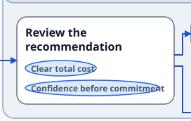 | 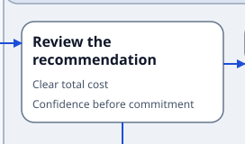 |

- **Proof geometry:** `J-201`; reference order remains “Clear total cost”, then “Confidence before commitment”.
- **Visible change:** oval badge chrome is removed; the same profile-controlled values render as unboxed secondary text.
- **Full SVGs:** [before](assets/visual-remediation-2026-07-18/full/metadata-permissive.before.svg), [after](assets/visual-remediation-2026-07-18/full/metadata-permissive.after.svg).
- **Source and intrinsic dimensions:** `8dfd883`, `3039.576×268`; `6201995`, `2775.576×344`. Focus viewBoxes are `272×172` and `272×160`.
- **Reviewer result:** accepted at intrinsic 100% size. Text remains readable and ordered; permissive visibility is retained without badge chrome.

### `JM-RM-02` — adjacent Steps use direct horizontal routes

Issue: `JM-VIS-001` — closed for the named primary proof.

| Before | After |
| --- | --- |
| 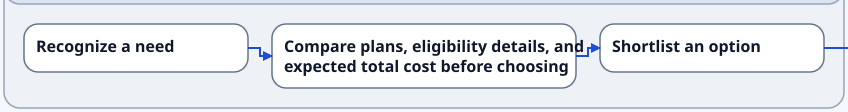 |  |

- **Proof edges:** `J-101→J-102` and `J-102→J-103`.
- **Visible change:** both unobstructed adjacent connections are one horizontal segment; differing Step heights no longer force a dogleg.
- **Full SVGs:** [before](assets/visual-remediation-2026-07-18/full/primary.before.svg), [after](assets/visual-remediation-2026-07-18/full/primary.after.svg).
- **Source and intrinsic dimensions:** `8dfd883`, `3039.576×268`; `6201995`, `2775.576×344`. Both focus viewBoxes are `848×112`.
- **Reviewer result:** accepted at intrinsic 100% size. Both arrows remain distinct and the authored left-to-right sequence is unchanged.

### `JM-RM-03` — simple diamond stacks options and minimizes turns

Issues: `JM-VIS-003` — closed for the stacked-diamond proof; `JM-VIS-005` — superseded.

| Before | After |
| --- | --- |
| 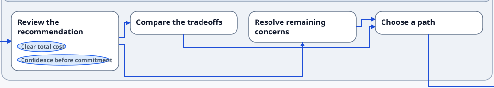 | 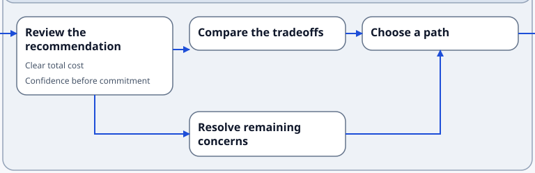 |

- **Proof edges:** `J-201→J-202`, `J-201→J-203`, `J-202→J-204`, and `J-203→J-204`.
- **Visible change:** `J-202` and `J-203` occupy separate lanes in one progression column. The clear branch and join legs use direct or minimal-L candidates without ambiguous shared trunks.
- **Full SVGs:** [before](assets/visual-remediation-2026-07-18/full/primary.before.svg), [after](assets/visual-remediation-2026-07-18/full/primary.after.svg).
- **Source and intrinsic dimensions:** `8dfd883`, `3039.576×268`; `6201995`, `2775.576×344`. Focus viewBoxes are `1032×184` and `768×248`.
- **Reviewer result:** accepted at intrinsic 100% size. Each route can be followed from source to arrowhead, and the authored child array remains unchanged.

### `JM-RM-04` — long forward route leaves through the right edge

Issue: `JM-VIS-006` — closed.

| Before | After |
| --- | --- |
| 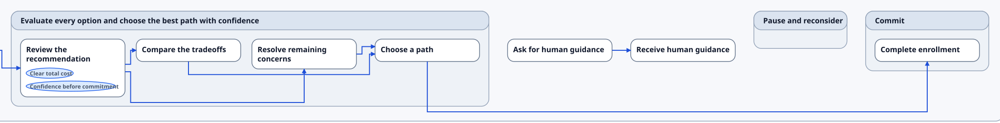 | 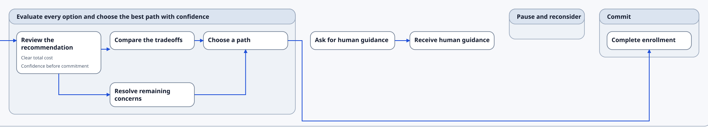 |

- **Proof edge:** `J-204→J-401`; proof bounds include `G-200` and `G-400` so both Stage gates remain visible.
- **Visible change:** the route uses source-east egress, descends outside `G-200`, and approaches `G-400` on a root-owned lower track. `G-200` does not grow to fund the route.
- **Full SVGs:** [before](assets/visual-remediation-2026-07-18/full/primary.before.svg), [after](assets/visual-remediation-2026-07-18/full/primary.after.svg).
- **Source and intrinsic dimensions:** `8dfd883`, `3039.576×268`; `6201995`, `2775.576×344`. Focus viewBoxes are `2143.576×264` and `1879.576×346`.
- **Reviewer result:** accepted at intrinsic 100% size. The source Stage boundary crossing, exterior descent, target approach, and arrow direction are unambiguous.

### `JM-RM-05` — terminal spacing, reciprocal routes, and self-loop regression proof

Issues: `JM-VIS-004` — resolved; `JM-VIS-007` — closed for nominal proofs.

#### Reciprocal and self-loop topology

| Before | After |
| --- | --- |
| 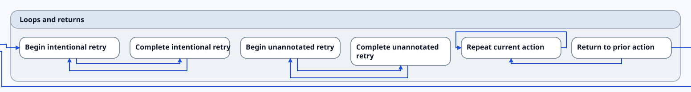 | 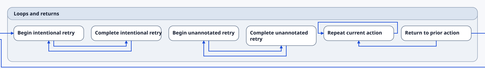 |

#### Duplicate occurrences

| Before | After |
| --- | --- |
|  |  |

- **Proof edges:** reciprocal pairs `J-701↔J-702` and `J-711↔J-712`; self-loop `J-713→J-713`; all three `J-801→J-802` occurrences.
- **Visible change:** reciprocal terminal approaches gain the accepted spacing while their nested arcs remain separate. The self-loop collar stays distinct from the nearby backward route. Duplicate occurrence bytes are identical across revisions, recording intentional regression preservation rather than a claimed visual change.
- **Full SVGs:** topology [before](assets/visual-remediation-2026-07-18/full/topology.before.svg), [after](assets/visual-remediation-2026-07-18/full/topology.after.svg); duplicate [before](assets/visual-remediation-2026-07-18/full/duplicate.before.svg), [after](assets/visual-remediation-2026-07-18/full/duplicate.after.svg).
- **Source and intrinsic dimensions:** topology `8dfd883`, `2096×224`; topology `6201995`, `2096×240`; duplicate `8dfd883` and `6201995`, `552×112`. Topology focus viewBoxes are `1552×208` and `1552×224`; both duplicate focus viewBoxes are `536×96`.
- **Reviewer result:** accepted at intrinsic 100% size. Nominal final legs, arrowheads, reciprocal identity, the self-loop, and three duplicate tracks remain individually countable.

### `JM-RM-06` — public adjacent route uses one segment

Issue: `JM-VIS-001` — closed for the public proof.

| Before | Current-runtime after |
| --- | --- |
|  |  |

- **Proof edge:** `J-001→J-002`.
- **Visible change:** the former short dogleg is replaced by one horizontal segment; opportunity-reference presentation also reflects the accepted unboxed metadata treatment.
- **Full SVGs:** [before](assets/visual-remediation-2026-07-18/full/public-outcome-to-ia.before.svg), [current-runtime after](assets/visual-remediation-2026-07-18/full/public-outcome-to-ia.after.svg).
- **Source and intrinsic dimensions:** committed before at `8dfd883`, `576×220`; current runtime at `6201995`, `576×214`. The overview uses the complete intrinsic view in both states.
- **Reviewer result:** accepted at intrinsic 100% size. The current-runtime after was generated twice with identical bytes. It is documentation evidence, not a rendered-corpus promotion.

## `JM-RM-X01` — **Rejected experiment — not accepted renderer evidence**

Issue: `JM-VIS-002` — open.

This is the failed Gate 8 dense evaluation. The left column is the accepted compressed baseline retained in test goldens. The right column is the abandoned same-run experiment. It is preserved only to explain the stop decision.

| Stage | Accepted dense baseline | Rejected Gate 8 result |
| --- | --- | --- |
| Step 3 | 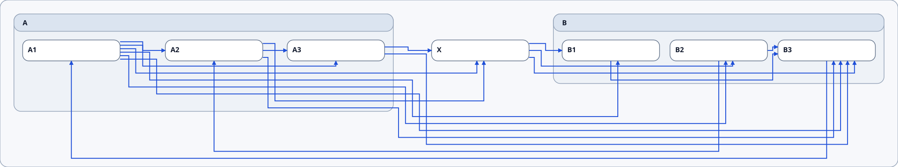 | 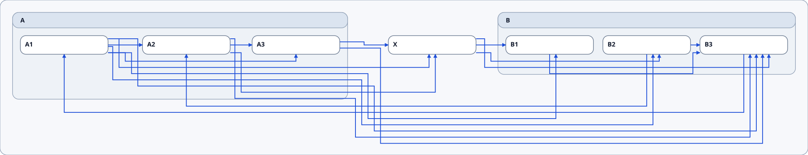 |
| Final | 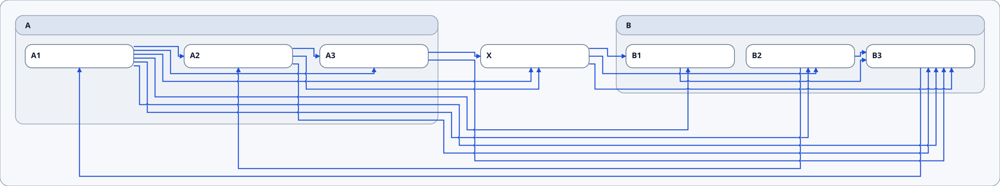 | 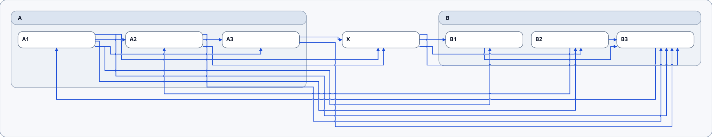 |

- **Proof:** all 18 dense edges, with separate tracing attention on C04, C05, C06, C09, and C11.
- **Measured rejected result:** 18 edges, 58 residual crossings, 56 continuity marks, root `2064×400`, `G-900` `856×224`, and `G-910` `760×160`.
- **Diagnostics:** no hard errors; one `renderer.routing.journey_map_preferred_terminal_leg_unmet` warning for `J-903→J-950`, achieved 12px, desired 18px, hard minimum 12px.
- **Route-family decision:** `early_south_egress` was withdrawn and is not selected in this result. These artifacts must not be described as proof that early south egress succeeded.
- **Full SVGs:** accepted [step 3](assets/visual-remediation-2026-07-18/full/dense-baseline.step-3.svg), [final](assets/visual-remediation-2026-07-18/full/dense-baseline.final.svg); rejected [step 3](assets/visual-remediation-2026-07-18/full/dense-rejected.step-3.svg), [final](assets/visual-remediation-2026-07-18/full/dense-rejected.final.svg).
- **Source and intrinsic dimensions:** accepted baseline copied from `6201995`, `2064×384`; rejected runtime generated at `6201995`, `2064×400`.
- **Reviewer result:** rejected. It fails the `≤31` crossing gate and the `≤2064×384` root-size gate. No compressed golden or rendered-corpus byte was promoted.

## Provenance and hash record

Historical and accepted focused full SVGs were copied directly from the named commits. Generated artifacts were retained only after two renders produced identical sorted SHA-256 inventories. The rejected dense dimensions, crossing count, continuity marks, route-family selection, and diagnostics were recomputed from the same render that produced the archived rejected SVGs.

| Archived full SVG | Provenance | Intrinsic size | SHA-256 |
| --- | --- | --- | --- |
| `primary.before.svg` | `8dfd883:tests/goldens/renderer-stages/journey-map.primary.svg` | `3039.576×268` | `dc418fd773191719ad7a168e8a559e75b68fcf3807678991cb83550ed41a8a27` |
| `primary.after.svg` | `6201995:tests/goldens/renderer-stages/journey-map.primary.svg` | `2775.576×344` | `62034aa1c6740faa17316818fe79c691f4972dd9af4cad31f00238e640d036ea` |
| `metadata-permissive.before.svg` | `8dfd883:tests/goldens/renderer-stages/journey-map.badges.permissive.svg` | `3039.576×268` | `03e07dabee8ca084b19bd18d79e9f2b667f3d96520e4dbca40094fa2ba5f9f4d` |
| `metadata-permissive.after.svg` | `6201995:tests/goldens/renderer-stages/journey-map.badges.permissive.svg` | `2775.576×344` | `44fef4cde929d908de585a0307fd0a77d27b148ae21a43247f36e851fdec3984` |
| `topology.before.svg` | `8dfd883:tests/goldens/renderer-stages/journey-map.topology.svg` | `2096×224` | `63b0b685b1196312b08829f7ce1768647157ad9c5dbde8bd020e8c8341e4f621` |
| `topology.after.svg` | `6201995:tests/goldens/renderer-stages/journey-map.topology.svg` | `2096×240` | `00a5a49a37479ffd9059c140d630b1462bae49c4a9c76cff288c67dbf24ebab8` |
| `duplicate.before.svg` | `8dfd883:tests/goldens/renderer-stages/journey-map.duplicate.svg` | `552×112` | `28563da24673174178a0cd8965272999dc28fa0749223cbf0a8cbfbff8bdc07b` |
| `duplicate.after.svg` | `6201995:tests/goldens/renderer-stages/journey-map.duplicate.svg` | `552×112` | `28563da24673174178a0cd8965272999dc28fa0749223cbf0a8cbfbff8bdc07b` |
| `public-outcome-to-ia.before.svg` | `8dfd883:examples/rendered/v0.1/journey_map_diagram_type/outcome_to_ia_trace_example/strict_profile/outcome_to_ia_trace.journey_map.svg` | `576×220` | `49787babe3289e13a42e99549c81569d9da21aca9c667de2a13f931072e74701` |
| `public-outcome-to-ia.after.svg` | twice generated from `bundle/v0.1/examples/outcome_to_ia_trace.sdd` at runtime `6201995` | `576×214` | `58875a5db0a29a5f73659a62096b54ce2ce9b05472775f8ac621a86f1b7a4b11` |
| `dense-baseline.step-3.svg` | `6201995:tests/goldens/renderer-stages/journey-map.compressed.step-3.svg` | `2064×384` | `463a10ea9554084a7e6748a36761958a80b2960398458f2579ca15fb4d173085` |
| `dense-baseline.final.svg` | `6201995:tests/goldens/renderer-stages/journey-map.compressed.svg` | `2064×384` | `20983f3868d9fd5742fd0d4a440557236521c109672804a212aa6dc04943bb25` |
| `dense-rejected.step-3.svg` | twice generated from `journey_map_staged_compressed.sdd` at runtime `6201995` | `2064×400` | `a6ccebc85a2fccfe3a0a0e5a2741a10cfb0aea18202d51302f16c613ce7c0104` |
| `dense-rejected.final.svg` | twice generated from `journey_map_staged_compressed.sdd` at runtime `6201995` | `2064×400` | `238c7ddca8188c75bfb9671d6e4f4ff6bf7e10e3d7db062ea03a0d53590f4648` |

All archived SVGs use canonical LF newlines, retain `view-journey_map`, and retain their strict or permissive profile metadata. The focused copies preserve every rendered element. Full-size files are the provenance record; focus files are navigation aids only.
