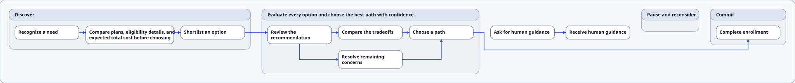
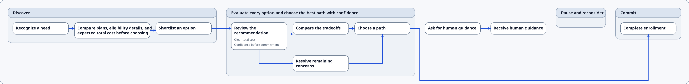
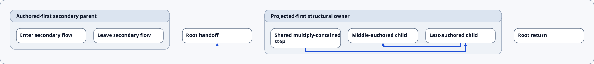
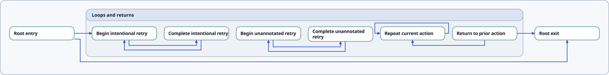
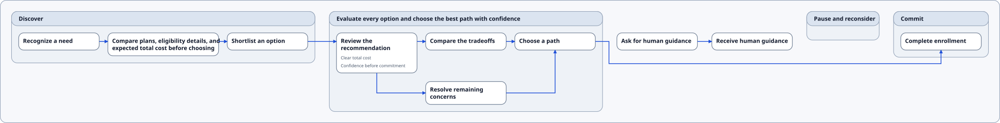
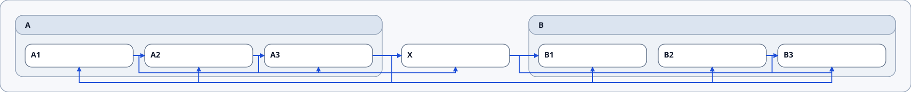
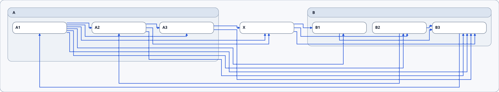
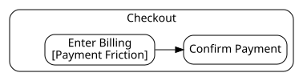

# Staged Journey Map Renderer — Current-State Visual Review

Status: remediation closeout recorded on 2026-07-18; dense readability remains open

Visual baseline: accepted focused primary, ordering, topology, and duplicate Journey evidence reflects the 2026-07-18 remediation. Compressed and rendered-corpus evidence remains at the pre-remediation baseline because the dense experiment failed its numeric gate and corpus promotion was consequently withheld.

The immutable before/after history, current-runtime public proof, and rejected dense experiment are archived in the [Journey Map visual remediation comparison record](journey_map_visual_remediation_comparison_record.md). This document keeps the accepted current plates as the canonical present-state review.

Purpose: review the cumulative final renderer by the gate criteria that introduced each behavior, identify visual defects precisely, and track fixes without treating earlier gate acceptance as a claim that the current output is visually finished.

Authority: this is a review and remediation aid. The bundle, repository policy, [completed renderer architecture](<[Done] staged_journey_map_renderer_architecture.md>), [verification and acceptance contract](staged_journey_map_renderer_verification_contract.md), and [completed gated implementation plan](<[Done] staged_journey_map_renderer_gated_implementation_plan.md>) remain authoritative. The active execution document is the [visual remediation implementation plan](journey_map_visual_remediation_implementation_plan.md).

## How to use this document

All embedded diagrams are generated by the final cumulative renderer. Gate labels describe the behavior under review; they do not reconstruct historical output from that gate's checkpoint.

Use the plate ID when reporting a problem. Reuse an existing issue ID when the problem matches the issue register; otherwise add a new `JM-VIS-NNN` row. A fix is complete only after its focused automated checks pass, the affected plates are regenerated, and the updated visuals receive explicit review.

The implementation gate and visual-remediation status are intentionally separate:

- Every implementation gate is accepted and closed.
- A plate can still have open visual issues.
- Historical acceptance does not waive current readability concerns.
- Existing goldens are evidence, not permission to normalize a regression by refreshing them.

Unless a plate says otherwise, it uses the strict profile, default theme, final routing stage, intrinsic SVG dimensions, and the staged journey preview backend.

## Current issue register

Comparison plates for every accepted disposition and the rejected dense experiment are indexed in the [visual remediation comparison record](journey_map_visual_remediation_comparison_record.md).

### `JM-VIS-001` — adjacent horizontal connector doglegs

- **Status:** closed; accepted direct-horizontal proofs pass
- **Severity:** high
- **First visible:** Gates 5–6
- **Problem:** unobstructed horizontally adjacent nodes can be connected by multi-segment doglegs with distracting vertical offsets.
- **Desired outcome:** prefer one straight horizontal segment whenever legal Journey side intervals overlap and the unobstructed corridor is clear. The selection policy is Journey-owned; its contract must remain suitable for later shared extraction.
- **Affected plates:** `JM-G05-01`; `JM-G06-01` through `JM-G06-08`; `JM-G08-01`; `JM-G09-01`; `JM-G10-01`.

### `JM-VIS-002` — dense compressed proof readability

- **Status:** open; the 2026-07-18 early-egress experiment was rejected
- **Severity:** high
- **First visible:** Gates 7–8
- **Problem:** the retained compressed evidence contains 42 diagnosed residual crossings. The rejected same-run experiment produced all 18 edges but regressed to 58 crossings, 56 continuity marks, root `2064×400`, `G-900` `856×224`, and `G-910` `760×160`; it therefore produced no new compressed golden or corpus evidence.
- **Desired outcome:** materially reduce crossings and improve edge identity without source reordering, hidden semantic changes, or an external routing engine.
- **Affected plates:** `JM-G07-02`; `JM-G08-01`.

### `JM-VIS-003` — branch and join traceability

- **Status:** closed for the accepted stacked-diamond proofs; retain as a regression watch
- **Severity:** medium
- **First visible:** Gate 6 join family
- **Problem:** branch and join convergence can make individual connectors difficult to follow, especially where stems and corridors are shared.
- **Desired outcome:** preserve clear connector identity from source through arrowhead, with visibly distinct departures and arrivals.
- **Affected plates:** `JM-G06-03`; `JM-G06-04`; `JM-G07-01`; `JM-G08-01`.

### `JM-VIS-004` — self-loop and backward-route blending

- **Status:** resolved; regression watch passing
- **Severity:** high
- **First visible:** Gate 6 self-loop family
- **Problem:** the self-loop around “Repeat current action” previously blended with the backward connector from “Return to prior action.”
- **Desired outcome:** keep the upper self-loop collar distinct from the backward track with no overlap or ambiguous T-junction.
- **Affected plate:** `JM-G06-07`.

### `JM-VIS-005` — avoidable multi-turn routes

- **Status:** superseded by stacked placement and common minimal-candidate selection
- **Severity:** medium
- **Proof edge:** `J-201→J-203`
- **Problem:** a route may retain more bends than the minimum legal candidate because endpoint offsets are chosen before route-family comparison.
- **Desired outcome:** select the minimum-turn legal Journey candidate after higher-priority ownership, obstacle, separation, and terminal-leg constraints pass.
- **Affected plate:** `JM-G07-01`.

### `JM-VIS-006` — long forward source-Stage egress

- **Status:** closed; `J-204→J-401` uses right-edge egress without source-Stage growth
- **Severity:** medium
- **Proof edge:** `J-204→J-401`
- **Problem:** the route exits through the source Stage bottom and adds avoidable local vertical distortion.
- **Desired outcome:** leave `G-200` through its right boundary before descending onto a root-owned track, without funding source-Stage growth.
- **Affected plate:** `JM-G06-02`.

### `JM-VIS-007` — last-bend arrow crowding

- **Status:** closed for nominal proofs; one dense degraded route retains the specified 12px warning after bounded expansion
- **Severity:** medium
- **Proof:** every bent nominal Journey route; self-loop/backward, duplicate, and dense plates own visual review
- **Problem:** the hard 12px marker-leg minimum is visually cramped when it is also the final bend-to-arrow distance.
- **Desired outcome:** prefer an 18px final leg; permit 12–17px only with the exact degraded-output warning.
- **Affected plates:** `JM-G06-07`; `JM-G06-08`; `JM-G07-02`.

### `JM-VIS-008` — boxed opportunity-reference presentation

- **Status:** closed; permissive and strict staged Journey references are unboxed metadata and simple remains unchanged
- **Severity:** medium
- **Problem:** opportunity references use badge chrome even though they are secondary Step metadata.
- **Desired outcome:** preserve bundle-controlled values, ordering, and visibility while rendering unboxed secondary text in the staged Journey backend.
- **Affected plates:** `JM-G02-01`; `JM-G03-01`; `JM-G06-04`.

### Connector labels — deferred

- **Status:** explicitly out of scope
- **Decision:** do not add label semantics, measurement, placement, SVG groups, or bundle behavior in this remediation.

## Coverage index

### Gates 0–1 — contracts without renderer visuals

- **Gate 0 concern:** authority and protected baselines.
- **Gate 1 concern:** fixtures, evidence ownership, and the review contract.
- **Plates:** none. The Gate 1 fixtures become the visual plates in later sections.
- **Visual-remediation state:** not applicable.

### Gate 2 — typed render inputs

- **Concern:** typed badges and stable semantic edge identity.
- **Plate:** `JM-G02-01`.
- **Visual-remediation state:** reviewable.

### Gate 3 — backend-neutral scene

- **Concern:** backend-neutral `RendererScene`.
- **Plate:** `JM-G03-01`.
- **Visual-remediation state:** reviewable through its final rendering.

### Gate 4 — measurement and placement

- **Concern:** measurement, Stage chrome, and source-ordered placement.
- **Plates:** `JM-G04-01`; `JM-G04-02`.
- **Visual-remediation state:** reviewable.

### Gate 5 — basic routing

- **Concern:** adjacent same-Stage and adjacent cross-Stage routing.
- **Plate:** `JM-G05-01`.
- **Visual-remediation state:** `JM-VIS-001` closed for the named adjacent-route proofs.

### Gate 6 — dedicated route families

- **Concern:** eight dedicated routing families.
- **Plates:** `JM-G06-01` through `JM-G06-08`.
- **Visual-remediation state:** `JM-VIS-001` and `JM-VIS-003` closed for the named proofs; `JM-VIS-004` regression watch passing.

### Gate 7 — occupancy and expansion

- **Concern:** occupancy, endpoint ordering, and bounded expansion.
- **Plates:** `JM-G07-01`; `JM-G07-02`.
- **Visual-remediation state:** open issue `JM-VIS-002`.

### Gate 8 — diagnostics and final acceptance

- **Concern:** final diagnostics and focused visual acceptance.
- **Plates:** `JM-G08-01`; `JM-G08-02`.
- **Visual-remediation state:** open issue `JM-VIS-002`.

### Gate 9 — public preview integration

- **Concern:** public staged preview and explicit legacy fallback.
- **Plates:** `JM-G09-01`; `JM-G09-02`.
- **Visual-remediation state:** current-runtime staged output accepted for `JM-VIS-001`; rendered-corpus promotion remains withheld by the dense stop.

### Gate 10 — accepted evidence baseline

- **Concern:** accepted goldens and promoted corpus.
- **Plates:** `JM-G10-01`; `JM-G10-02`.
- **Visual-remediation state:** accepted baseline retained; only dense `JM-VIS-002` remains open.

## Gates 0–1 — non-visual contracts

Gates 0 and 1 deliberately produced no renderer visual. Gate 0 locked authority and protected baselines. Gate 1 fixed the five canonical proof fixtures, route ownership, profile expectations, review dimensions, evidence names, diagnostics, and amendment rules used by all plates below.

Current fixture sources:

- `tests/fixtures/render/journey_map_staged_primary.sdd`
- `tests/fixtures/render/journey_map_staged_ordering_ownership.sdd`
- `tests/fixtures/render/journey_map_staged_topology.sdd`
- `tests/fixtures/render/journey_map_staged_duplicate.sdd`
- `tests/fixtures/render/journey_map_staged_compressed.sdd`

## Gate 2 — typed render inputs

### Plate `JM-G02-01` — profile-controlled opportunity badges

- **Source SDD:** [`journey_map_staged_primary.sdd`](../../tests/fixtures/render/journey_map_staged_primary.sdd)

#### Simple profile — badges hidden

#### Permissive profile — ordered badges visible

**Fixture:** primary. **Focus:** one typed reference per resolved target, bundle-controlled ordering, stable content across profiles, and no metadata/connector collision. **Expected difference:** simple hides references; permissive shows unboxed `OP-100` followed by `OP-200`. **Remediation result:** accepted under `JM-VIS-008`; profile width differences are not routing defects.

## Gate 3 — backend-neutral scene

### Plate `JM-G03-01` — complete scene expressed by the final backend

- **Source SDD:** [`journey_map_staged_primary.sdd`](../../tests/fixtures/render/journey_map_staged_primary.sdd)

**Fixture:** primary. **Focus:** every Stage, Step, root Step, badge, and semantic edge occurrence represented once; stable source order and identity; empty and single-Step Stages retained. The visual is the final expression of the backend-neutral scene, not a historical Gate 3 coordinate snapshot. For structural inspection, use `tests/goldens/renderer-stages/journey-map.primary.renderer-scene.json`.

## Gate 4 — measurement and source-ordered placement

### Plate `JM-G04-01` — Stage chrome, width bands, roots, and whitespace

- **Source SDD:** [`journey_map_staged_primary.sdd`](../../tests/fixtures/render/journey_map_staged_primary.sdd)

**Fixture:** primary. **Focus:** Stage headers, natural widths, gutters, long-label wrapping, baseline alignment, the empty “Pause and reconsider” Stage, the single-Step “Commit” Stage, and the Step-only guidance chain. Review placement independently from connector quality where possible.

### Plate `JM-G04-02` — first-parent ownership and authored order

- **Source SDD:** [`journey_map_staged_ordering_ownership.sdd`](../../tests/fixtures/render/journey_map_staged_ordering_ownership.sdd)

**Fixture:** ordering/ownership. **Focus:** projected-first structural owner, explicit `CONTAINS` order, interleaved root Steps, and no source reordering to make backward edges easier.

## Gate 5 — basic routing

### Plate `JM-G05-01` — adjacent same-Stage and adjacent cross-Stage routes

- **Source SDD:** [`journey_map_staged_primary.sdd`](../../tests/fixtures/render/journey_map_staged_primary.sdd)

**Fixture:** primary. **Focus edges:** `J-101→J-102`, `J-102→J-103`, and `J-103→J-201`. **Review:** directness, arrow direction, east/west approaches, correct Stage boundary gates, and absence of needless bends. **Remediation result:** the named unobstructed adjacent proofs are accepted as single horizontal segments under `JM-VIS-001`.

## Gate 6 — dedicated route families

Gate 6 remains divided into its eight blocking route families so a reviewer can identify a problem by family rather than describing an entire dense diagram.

### Plate `JM-G06-01` — non-adjacent same-Stage skip

- **Source SDD:** [`journey_map_staged_ordering_ownership.sdd`](../../tests/fixtures/render/journey_map_staged_ordering_ownership.sdd)

**Fixture:** ordering/ownership. **Focus edge:** `J-503→J-501`. **Review:** the bypass remains outside intervening Step interiors, uses consistent semantic ports, and does not reorder authored Steps. **Status:** accepted.

### Plate `JM-G06-02` — long cross-Stage and root-Step routing

- **Source SDD:** [`journey_map_staged_primary.sdd`](../../tests/fixtures/render/journey_map_staged_primary.sdd)

**Fixture:** primary. **Focus:** `J-204→J-401` plus the disconnected root chain `J-250→J-260`. **Review:** peripheral ownership, correct Stage gates, readable arrow direction, and avoidance of unrelated Stage interiors. **Remediation result:** right-edge egress and direct root-Step routing are accepted under `JM-VIS-006` and `JM-VIS-001`.

### Plate `JM-G06-03` — branch fan-out

- **Source SDD:** [`journey_map_staged_primary.sdd`](../../tests/fixtures/render/journey_map_staged_primary.sdd)

**Fixture:** primary. **Focus edges:** `J-201→J-202` and `J-201→J-203`. **Review:** common semantic departure, visibly distinct paths, no merged ambiguous trunk, and traceable arrowheads. **Remediation result:** stacked options use accepted direct and minimal-L candidates; `JM-VIS-003` is closed for this proof.

### Plate `JM-G06-04` — join fan-in

- **Source SDD:** [`journey_map_staged_primary.sdd`](../../tests/fixtures/render/journey_map_staged_primary.sdd)

**Fixture:** primary. **Focus edges:** `J-202→J-204` and `J-203→J-204`. **Review:** distinct arrivals, stable endpoint order, no visually merged identity, and no collision with metadata or Stage chrome. **Remediation result:** accepted under `JM-VIS-003`.

### Plate `JM-G06-05` — backward routing

- **Source SDD:** [`journey_map_staged_ordering_ownership.sdd`](../../tests/fixtures/render/journey_map_staged_ordering_ownership.sdd)

**Fixture:** ordering/ownership. **Focus edges:** `J-501→J-502` and root `J-591→J-590`. **Review:** peripheral return shape, correct arrow direction, unambiguous separation from forward routes, and preservation of source order. **Status:** accepted.

### Plate `JM-G06-06` — shape-aware reciprocal cycles

- **Source SDD:** [`journey_map_staged_topology.sdd`](../../tests/fixtures/render/journey_map_staged_topology.sdd)

**Fixture:** topology. **Focus edges:** `J-701↔J-702` and `J-711↔J-712`. **Review:** nested forward/return identities, readable arrowheads, consistent peripheral topology, and no false dependence on authored loop annotations.

### Plate `JM-G06-07` — self-loop and neighboring backward route

- **Source SDD:** [`journey_map_staged_topology.sdd`](../../tests/fixtures/render/journey_map_staged_topology.sdd)

**Fixture:** topology. **Focus:** self-loop `J-713→J-713` and backward `J-714→J-713`. **Review:** the clockwise upper collar must remain separate from the backward track with no overlap, blending, or ambiguous T-junction. **Regression watch:** `JM-VIS-004`.

### Plate `JM-G06-08` — duplicate semantic occurrences

- **Source SDD:** [`journey_map_staged_duplicate.sdd`](../../tests/fixtures/render/journey_map_staged_duplicate.sdd)

**Fixture:** duplicate. **Focus:** all three `J-801→J-802` occurrences. **Review:** three independently traceable routes, stable semantic identities and ordinals, distinct endpoint tracks, and three clear arrowheads. **Status:** accepted; duplicate same-endpoint groups remain excluded from direct-family reassignment.

## Gate 7 — occupancy, endpoint ordering, and bounded expansion

### Plate `JM-G07-01` — primary routing stages

- **Source SDD:** [`journey_map_staged_primary.sdd`](../../tests/fixtures/render/journey_map_staged_primary.sdd)

#### Step 2 — nominal route construction

#### Step 3 — resolved occupancy and endpoints

#### Final

**Fixture:** primary. **Focus:** movement from nominal tracks to separated occupied tracks, crowded endpoint ordering, correct Stage gate order, and deterministic final parity. **Status:** accepted after stacked placement and common candidate selection.

### Plate `JM-G07-02` — compressed expansion proof

- **Source SDD:** [`journey_map_staged_compressed.sdd`](../../tests/fixtures/render/journey_map_staged_compressed.sdd)

#### Step 2 — nominal routes

#### Step 3 — resolved occupancy and expansion

#### Final

**Fixture:** compressed. **Focus:** real occupancy records, 16px competing-track separation where achievable, late endpoint ordering, bounded whole-structure expansion, and preservation of semantic identity. **Known issue:** `JM-VIS-002`; geometry acceptance did not establish human readability.

## Gate 8 — diagnostics and focused final acceptance

### Plate `JM-G08-01` — dense final with deterministic continuity marks

- **Source SDD:** [`journey_map_staged_compressed.sdd`](../../tests/fixtures/render/journey_map_staged_compressed.sdd)

**Fixture:** compressed. **Focus:** final-only continuity bridges, orthogonal routes, hard obstacle clearance, exact warning alignment, and whether individual connectors can be followed. **Known issue:** `JM-VIS-002`. The retained accepted plate records 42 residual crossings; the rejected remediation run was worse at 58, so this plate remains visually open and unchanged.

Diagnostics: [`journey-map.compressed.diagnostics.json`](../../tests/goldens/renderer-stages/journey-map.compressed.diagnostics.json)

### Plate `JM-G08-02` — exceptional topology and informational diagnostics

- **Source SDD:** [`journey_map_staged_topology.sdd`](../../tests/fixtures/render/journey_map_staged_topology.sdd)

**Fixture:** topology. **Focus:** cycles, self-loop, peripheral backward routes, branch exit, diagnostic-to-geometry agreement, and regression of the formerly blended self-loop/backward pair.

Diagnostics: [`journey-map.topology.diagnostics.json`](../../tests/goldens/renderer-stages/journey-map.topology.diagnostics.json)

## Gate 9 — public preview integration

### Plate `JM-G09-01` — staged SVG/PNG default

- **Source SDD:** [`outcome_to_ia_trace.sdd`](../../bundle/v0.1/examples/outcome_to_ia_trace.sdd)

**Source:** canonical `outcome_to_ia_trace` corpus example, strict profile. **Focus:** the unsuffixed public SVG/PNG uses the staged backend, PNG derives from the exact staged SVG, and public selection does not alter internal DOT or Mermaid output. **Evidence state:** runtime selection and exact SVG-derived PNG are covered by focused tests; this corpus plate was not regenerated because dense closeout stopped before corpus promotion.

### Plate `JM-G09-02` — explicit preserved legacy fallback

- **Source SDD:** [`outcome_to_ia_trace.sdd`](../../bundle/v0.1/examples/outcome_to_ia_trace.sdd)

**Source:** same canonical example and profile. **Focus:** comparison only. The legacy artifact remains explicitly selectable and byte-preserved; it is not the target architecture and its removal remains deferred.

## Gate 10 — accepted goldens and corpus baseline

### Plate `JM-G10-01` — canonical outcome-to-IA journey

- **Source SDD:** [`outcome_to_ia_trace.sdd`](../../bundle/v0.1/examples/outcome_to_ia_trace.sdd)

**Source:** `bundle/v0.1/examples/outcome_to_ia_trace.sdd`, strict profile. **Focus:** retained public corpus baseline, deterministic SVG serialization, SVG-derived PNG, and consistency with focused renderer-stage evidence. **Remediation status:** `JM-VIS-001` is closed by the current-runtime public proof in comparison plate `JM-RM-06`; this corpus byte remains unchanged because dense closeout stopped corpus promotion.

### Plate `JM-G10-02` — canonical service-blueprint slice journey

- **Source SDD:** [`service_blueprint_slice.sdd`](../../bundle/v0.1/examples/service_blueprint_slice.sdd)

**Source:** `bundle/v0.1/examples/service_blueprint_slice.sdd`, strict profile. **Focus:** small single-Stage public baseline, directness, Stage chrome, profile behavior, and legacy sibling preservation.

## Fix and re-review log

Add one entry per material visual change. Keep issue history append-only; do not erase the original observation when a fix is accepted.

### 2026-07-18 — visual remediation closeout

- **Issue IDs:** `JM-VIS-001`, `JM-VIS-003` through `JM-VIS-008`; `JM-VIS-002` remains open.
- **Change or decision:** accepted plain opportunity metadata, explicit stacked-diamond placement, direct horizontal routing, right-edge long-route egress, preferred terminal construction, and common minimal-L candidate selection. Rejected the dense early-egress experiment on its numeric acceptance gates and withdrew that family from selection.
- **Commit:** `6201995`.
- **Automated validation:** focused Journey/shared/protected-output suites, build, public backend checks, and full serial Vitest (`161/161` suites, `630/630` tests) passed. The rejected dense run retained 18 edges and no hard errors but measured 58 crossings, 56 continuity marks, and root `2064×400`.
- **Regenerated plates:** accepted focused primary, permissive metadata, topology, and duplicate evidence only. Compressed goldens and rendered corpus were not promoted. Immutable before/after evidence was captured on 2026-07-22 in the [comparison record](journey_map_visual_remediation_comparison_record.md).
- **Reviewer and result:** primary, metadata, topology, duplicate, and public current-runtime proofs accepted at intrinsic 100% size; dense experiment rejected and `JM-VIS-002` left open.

## Review checklist

For each affected plate, review at intrinsic 100% zoom before using fit-to-width as an overview:

- [ ] Source and Stage order remain unchanged.
- [ ] Every connector can be followed from source to arrowhead.
- [ ] Unobstructed aligned neighbors use a straight horizontal segment where possible.
- [ ] Branch departures and join arrivals remain visually distinct.
- [ ] Backward, cyclic, and self-loop routes are distinguishable from nearby connectors.
- [ ] Duplicate occurrences retain separate identities and arrowheads.
- [ ] Routes clear non-endpoint Steps, endpoint interiors, headers, secondary content, and unrelated Stages.
- [ ] Crowded tracks and endpoint stems retain required separation or emit the exact accepted diagnostic.
- [ ] Continuity marks clarify rather than obscure residual crossings.
- [ ] Labels and unboxed reference metadata remain readable without relying on fit-to-width scaling.
- [ ] Whitespace, expansion, and Stage proportions remain intentional.
- [ ] SVG is deterministic and PNG is derived from the exact reviewed SVG.

## Regeneration and validation expectations

The embedded files are committed evidence produced by the normal renderer tests and corpus generator. After a renderer fix, run the focused journey suites first and review newly generated temporary artifacts before updating any committed golden or corpus file. Snapshot refresh is evidence capture only after the cited issue's acceptance criteria pass.

At minimum, a visual remediation should run the affected focused test, the complete journey renderer matrix, build, deterministic artifact comparison, `git diff --check`, and the protected-renderer hash audit required by the completed implementation plan.
