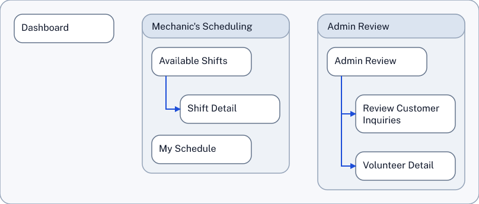

# SDD Skill Guide

The SDD Skill is the simple way to work with structured design documents.

## Use Case: Start With An App Idea

If you have an app idea in mind, you can start by describing the app in plain language.

The SDD Skill helps turn that description into a structured design document.

Here is an example prompt:

```text
Use $Sdd Skill to design a mechanic's scheduling app for a communal automotive shop.      

Create a new SDD ("shop_sched_exploration") for it and show the information architecture as a simple diagram. Include:   
- Dashboard
- a Mechanic's Scheduling area with Open Shifts, Shift Detail, My Schedule
```
That is enough to get started. You do not need to know SDD syntax first (although the syntax is quite simple.) You could omit the filename. The skill would choose a name then.

## Output

The prompt generates the SDD file (Structured Design Document) and the information architecture diagram.

SDD full source: [shop_sched_exploration.sdd](examples/shop_sched_exploration.sdd)

Trimmed excerpt:

```text
Place P-100 "Dashboard"
  NAVIGATES_TO P-110 "Open Shifts"
  NAVIGATES_TO P-130 "My Schedule"
END
Area A-100 "Mechanic's Scheduling"
  CONTAINS P-110 "Open Shifts"
  CONTAINS P-120 "Shift Detail"
  CONTAINS P-130 "My Schedule"
END
Place P-110 "Open Shifts"
  NAVIGATES_TO P-120 "Shift Detail"
END
Place P-120 "Shift Detail"
END
Place P-130 "My Schedule"
  NAVIGATES_TO P-120 "Shift Detail"
END
```

Information architecture from that first prompt:

<a href="examples/shop_sched_exploration.ia_place_map.simple.svg">
  
</a>

## What This Creates

Instead of a vague app idea, you now have a structured design starting point, before anything is baked into code.

- A named structure for the app, with places and relationships the model can reason about.
- A visible app map that makes the overall shape easier to review.
- A concrete starting point for follow-up refinement before you move into implementation.

Behind the scenes, the skill uses editing tools that allow it to read, write and check SDD documents quickly and reliably.

## Follow-Up Request

Once the first structure exists, the next steps can stay conversational. For example:

### Add An Admin Review Area

```text
Using $Sdd Skill , add an Admin Review area for coordinators who approve volunteer signups. Include "Review Customer Inquiries" and "Volunteer Detail". 
Connect it from the Dashboard.

DO Show the IA again.
```

Full source: [shop_sched_exploration_2.sdd](examples/shop_sched_exploration_2.sdd)

Trimmed excerpt:

```text
Area A-300 "Admin Review"
  CONTAINS P-300 "Admin Review"
  CONTAINS P-310 "Review Customer Inquiries"
  CONTAINS P-320 "Volunteer Detail"
END
# (...)
Place P-300 "Admin Review"
  NAVIGATES_TO P-310 "Review Customer Inquiries"
  NAVIGATES_TO P-320 "Volunteer Detail"
END
Place P-310 "Review Customer Inquiries"
END
Place P-320 "Volunteer Detail"
END
```

Rendered output from the admin-area follow-up:

<a href="examples/shop_sched_exploration_2.ia_place_map.simple.svg">
  
</a>

Note: because the prompt asked to use the simple profile for the IA, the diagram shows less detail.

### Add A Signup Flow And Show The UI Contracts

```text
Using $Sdd Skill, add a simple signup flow in Shift Detail, with these view states: 
- View Shift
- Confirm Signup
- Signup Success

Show the UI contracts.
```

Full source: [shop_sched_exploration_3.sdd](examples/shop_sched_exploration_3.sdd)

Trimmed excerpt, showing the added viewStates within Shift Detail:

```text
Place P-120 "Shift Detail"
  CONTAINS VS-220a "View Shift"
  CONTAINS VS-220b "Confirm Signup"
  CONTAINS VS-220c "Signup Success"
  + ViewState VS-220a "View Shift"
    TRANSITIONS_TO VS-220b "Confirm Signup"
  END
  + ViewState VS-220b "Confirm Signup"
    TRANSITIONS_TO VS-220c "Signup Success"
  END
  + ViewState VS-220c "Signup Success"
  END
END
```

Rendered output from the UI-contract follow-up, showing the viewState sequence:

<a href="examples/shop_sched_exploration_3.ui_contracts.simple.svg">
  
</a>

### Preferred Source Style

The walkthrough files in `examples/` record the actual step-by-step skill outcomes that were produced at the time. The preferred steady-state source style is slightly stronger:

- keep explicit semantic edges such as `CONTAINS` and `TRANSITIONS_TO`
- also nest singly-owned child blocks under their clear parent for human readability

That means the recommended source style is not "nesting instead of edges". It is "explicit edges for machine meaning, plus nesting for readable local grouping."

For example, an area/place section is ideally written more like this:

```text
Area A-100 "Mechanic's Scheduling"
  CONTAINS P-110 "Available Shifts"
  CONTAINS P-120 "Shift Detail"
  CONTAINS P-130 "My Schedule"
  + Place P-110 "Available Shifts"
    NAVIGATES_TO P-120 "Shift Detail"
  END
  + Place P-120 "Shift Detail"
    CONTAINS VS-220a "View Shift"
    CONTAINS VS-220b "Confirm Signup"
    CONTAINS VS-220c "Signup Success"
    + ViewState VS-220a "View Shift"
      TRANSITIONS_TO VS-220b "Confirm Signup"
    END
    + ViewState VS-220b "Confirm Signup"
      TRANSITIONS_TO VS-220c "Signup Success"
    END
    + ViewState VS-220c "Signup Success"
    END
  END
  + Place P-130 "My Schedule"
    NAVIGATES_TO P-120 "Shift Detail"
  END
END
```

This style keeps the strong explicit-relationship practice introduced during the helper hardening work, while preserving the source readability that many people want from SDD files.


### Simple Follow-Up Edit

The same style also works for smaller follow-ups:

```text
Using $Sdd Skill, rename "Open Shifts" to "Available Shifts" and show the information architecture again.
```

(Of course a simple edit like this - or technically any edit - could also be done as a manual search-and-replace operation in am IDE text editor.)

### Adding Descriptions

The *description* field is not mandatory when using the *simple* profile, but it helps with making the SDD file scannable.

```text
Using $Sdd Skill please add descriptions.
```

Full source: [shop_sched_exploration_5.sdd](examples/shop_sched_exploration_5.sdd)

Trimmed excerpt:

```text
SDD-TEXT 0.1
Place P-100 "Dashboard"
  description="Home overview with entry points to scheduling and coordinator review workflows."
  NAVIGATES_TO P-110 "Available Shifts"
  NAVIGATES_TO P-130 "My Schedule"
  NAVIGATES_TO P-300 "Admin Review"
END
Area A-100 "Mechanic's Scheduling"
  description="Scheduling area for browsing open work slots, reviewing shift details, and managing commitments."
  CONTAINS P-110 "Available Shifts"
  CONTAINS P-120 "Shift Detail"
  CONTAINS P-130 "My Schedule"
END
Area A-300 "Admin Review"
  description="Coordinator workspace for triaging inquiries and approving volunteer signups."
  CONTAINS P-300 "Admin Review"
  CONTAINS P-310 "Review Customer Inquiries"
  CONTAINS P-320 "Volunteer Detail"
END
```

### Undo

The skill allows undo:

```text
Using $sdd-skill, undo the descriptions.
```

"And, they are gone:" [shop_sched_exploration_6.sdd](examples/shop_sched_exploration_6.sdd)

Trimmed excerpt:

```text
SDD-TEXT 0.1
Place P-100 "Dashboard"
  NAVIGATES_TO P-110 "Available Shifts"
  NAVIGATES_TO P-130 "My Schedule"
  NAVIGATES_TO P-300 "Admin Review"
END
Area A-100 "Mechanic's Scheduling"
  CONTAINS P-110 "Available Shifts"
  CONTAINS P-120 "Shift Detail"
  CONTAINS P-130 "My Schedule"
END
Area A-300 "Admin Review"
  CONTAINS P-300 "Admin Review"
  CONTAINS P-310 "Review Customer Inquiries"
  CONTAINS P-320 "Volunteer Detail"
END
...

(Undo is currently limited to a single step.)

### Manual View Command

When you want to see a current diagram, you can ask the skill for it:

```text
Using $sdd-skill, show the information architecture.
```

The skill then calls the sdd-show command. You could also call the show command directly in a terminal, without using the skill:

```bash
pnpm sdd show shop_sched_exploration.sdd --view ia_place_map --profile simple --format png --out "shop_sched_exploration_IA_as_a.png"

Wrote /home/knut/projects/sdd/shop_sched_exploration_IA_as_a.png
```

<a href="examples/shop_sched_exploration_IA_as_a.png">
  

## What Happens Behind The Scenes

- The skill recognizes the initial prompt as a *create new document* request. It creates the new, empty `.sdd` document, using the filename in the prompt. It translates the prompt's ask into an app structure (this is the core of the LLM work) and then follows SSD rules to create nodes and connections. It then writes this content into the document. The skill also recognizes the request for the IA diagram as a *read, validate, or preview an existing document* request and executes it.
- The skill recognizes the follow-up prompts as *edit an existing document* requests." For each request, it looks at the current structure before making changes, so each follow-up builds on the actual document. The follow-up requests for diagrams are recognized as *read, validate, or preview an existing document* again.
- All the edits are made through a structured workflow provided by the sdd-helper tool, instead of brittle free-form rewriting. The tool explains its capabilities to the skill when the skill asks. The tool and the skill speak json to one another, which is easy to use for the LLM.

For the technical workflow behind the examples, see the canonical repo skill bundle at [SKILL.md](../../../skills/sdd-skill/SKILL.md), especially [workflow.md](../../../skills/sdd-skill/references/workflow.md), [change-set-recipes.md](../../../skills/sdd-skill/references/change-set-recipes.md), and [current-helper-gaps.md](../../../skills/sdd-skill/references/current-helper-gaps.md), plus the [SDD Helper Guide](../sdd-helper/).

## Why Use The Skill Before You Start Coding

By capturing the structural design design first, you create a real structure that a coding model (or a visual design creation model) can work from. That is a much stronger foundation than asking an LLM to "make an app" and hoping it invents a good product shape that meets your structural design ideas. Once code is written, it wants to stay in place. Changes take effort, come with risk and blast radius and token burn.

If you use an LLM to code in a professional context, implementation is often driven by detailed requirements and technical design documents. Those inputs can be weak on structural design and user experience. By bringing an SDD into the mix, design enters the chat.

Once code is written, every structural design refinement is a heavy operation that 

If you begin coding from a one-line request, the model has to invent the product structure at the same time it is generating implementation details. That often leads to avoidable churn.

## Note: SDD During the Product Lifecycle

The examples here focus on simple information architecture and a bit of state handling. SDD provides means to go into greater detail, with flows, nested components and service blueprints. SDD also provides means to capture more abstract *drivers* of design, with journeys and opportunity maps. The goal is to create an opportunity to create a full picture of structural design - which is helpful for delivering on the design promise.

The example shown here shows a from-scratch workflow. It is exciting to envision, design and build a product from scratch. It is also, in practical terms, rare. Most actual work in a product business is concerned with changing, improving, and growing an existing product over a long period of time. In that situation, [SDD can make a strategic difference](../strategic_potential/README.md).
