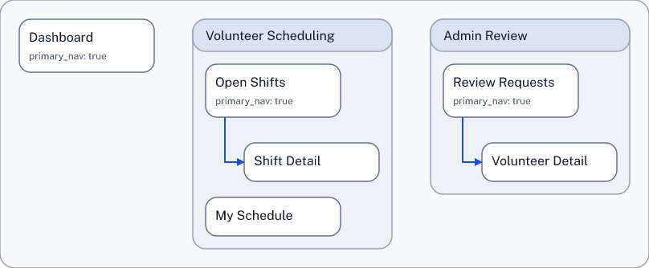
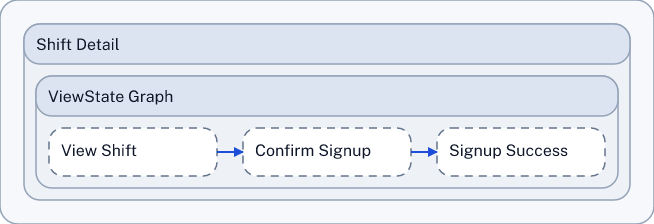

# SDD Skill Guide

The SDD Skill is the simple way to work with structured design documents.

## Use Case: Start With An App Idea

If you have an app idea in mind, you can start by describing the app in plain language.

The SDD Skill helps turn that description into a structured design document.

Here is an example prompt:

```text
Use $Sdd Skill to design a mechanic's scheduling app for a communal automotive shop.     

Create a new SDD for it and show the information architecture as a simple diagram. Include: 
- Dashboard
- a Mechanic's Scheduling area with Open Shifts, Shift Detail, My Schedule
```
That is enough to get started. You do not need to know SDD syntax first (although the syntax is quite simple.)

## Output

The prompt generates the SDD file (Structured Design Document) and the information architecture diagram.

SDD full source: [communal_automotive_shop_mechanic_scheduling.sdd](examples/communal_automotive_shop_mechanic_scheduling.sdd)

Trimmed excerpt:

```text
SDD-TEXT 0.1
Place P-100 "Dashboard"
  owner=Design
  description="Shop-wide overview of today's work, staffing, and bay readiness"
  surface=web
  route_or_key=/dashboard
  access=auth
  primary_nav=true
END
Area A-200 "Mechanic's Scheduling"
  owner=Ops
  description="Mechanic-facing scheduling space for claiming shifts, reviewing shift details, and tracking assigned work"
  scope=mechanic_scheduling
  CONTAINS P-210 "Open Shifts"
  CONTAINS P-220 "Shift Detail"
  CONTAINS P-230 "My Schedule"
  + Place P-210 "Open Shifts"
    owner=Design
    description="Browsable list of unclaimed repair shifts across shared bays and specialties"
    surface=web
    route_or_key=/scheduling/open-shifts
    access=auth
    primary_nav=true
  END
```

Information architecture from that first prompt:

<a href="examples/communal_automotive_shop_mechanic_scheduling.svg">
  
</a>

## What This Gives You

Instead of a vague app idea, you now have a structured design starting point, before anything is baked into code.

- A named structure for the app, with places and relationships the model can reason about.
- A visible app map that makes the overall shape easier to review.
- A concrete starting point for follow-up refinement before you move into implementation.

The skill uses editing tools that allow it to read, write and check SDD documents quickly and reliably.

## Good Follow-Up Requests

Once the first structure exists, the next steps can stay conversational. For example:

### Add An Admin Review Area

```text
Using $sdd-skill, update the volunteer scheduling SDD.

Add an Admin Review area for coordinators who approve volunteer signups. Include "Review Customer Inquiries" and "Volunteer Detail".
Connect it from the Dashboard.

Show the IA again. Use the simple profile for it.
```

Full source: [volunteer_scheduling_v2_admin.sdd](examples/volunteer_scheduling_v2_admin.sdd)

Trimmed excerpt:

```text
Area A-300 "Admin Review"
  description="Coordinator review flow for volunteer signups"
  CONTAINS P-310 "Review Requests"
  CONTAINS P-320 "Volunteer Detail"
  + Place P-310 "Review Requests"
    description="Review new signup requests from volunteers"
    primary_nav=true
    NAVIGATES_TO P-320 "Volunteer Detail"
  END
  + Place P-320 "Volunteer Detail"
    description="See one volunteer's signup history and details"
```

Rendered output from the admin-area follow-up:

<a href="examples/volunteer_scheduling_v2_admin_ia.png">
  
</a>

### Add A Signup Flow And Show The UI Contracts

```text
Using $sdd-skill, update the volunteer scheduling SDD.

In Shift Detail, add a simple signup flow with these view states:
- View Shift
- Confirm Signup
- Signup Success

Show the UI contracts.
```

Full source: [volunteer_scheduling_v3_ui_contracts.sdd](examples/volunteer_scheduling_v3_ui_contracts.sdd)

Trimmed excerpt:

```text
  + Place P-220 "Shift Detail"
    description="Review one shift and decide whether to sign up"
    NAVIGATES_TO P-230 "My Schedule"
    CONTAINS VS-220a "View Shift"
    CONTAINS VS-220b "Confirm Signup"
    CONTAINS VS-220c "Signup Success"
    + ViewState VS-220a "View Shift"
      TRANSITIONS_TO VS-220b "Confirm Signup"
    END
    + ViewState VS-220b "Confirm Signup"
      TRANSITIONS_TO VS-220c "Signup Success"
```

Rendered output from the UI-contract follow-up:

<a href="examples/volunteer_scheduling_v3_ui_contracts.png">
  
</a>

The same style also works for smaller follow-ups:

```text
Using $sdd-skill, update the volunteer scheduling SDD.

Rename "Open Shifts" to "Available Shifts" and show the information architecture again.
```

```text
Using $sdd-skill, undo the last change to the volunteer scheduling SDD and show the information architecture again.
```

## What Happens Behind The Scenes

- The skill creates or opens the `.sdd` document for the app idea.
- It looks at the current structure before making changes, so each follow-up builds on the actual document.
- It updates the design through the repo's structured SDD workflow instead of brittle free-form rewriting.
- It asks for a view like Information Architecture or UI Contracts so you can inspect the result visually.

For the technical workflow behind the examples, see the canonical repo skill bundle at [SKILL.md](../../../skills/sdd-skill/SKILL.md), especially [workflow.md](../../../skills/sdd-skill/references/workflow.md), [change-set-recipes.md](../../../skills/sdd-skill/references/change-set-recipes.md), and [current-helper-gaps.md](../../../skills/sdd-skill/references/current-helper-gaps.md), plus the [SDD Helper Guide](../sdd-helper/).

## Why Use The Skill Before You Start Coding

If you begin coding from a one-line request, the model has to invent the product structure at the same time it is generating implementation details. That often leads to avoidable churn.

With an SDD capturing the app design first, you give the coding model a real structure to work from. That is a much better starting point than asking an LLM to "make an app" and hoping it invents a good product shape on its own.
