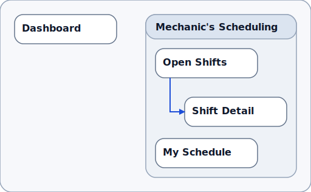
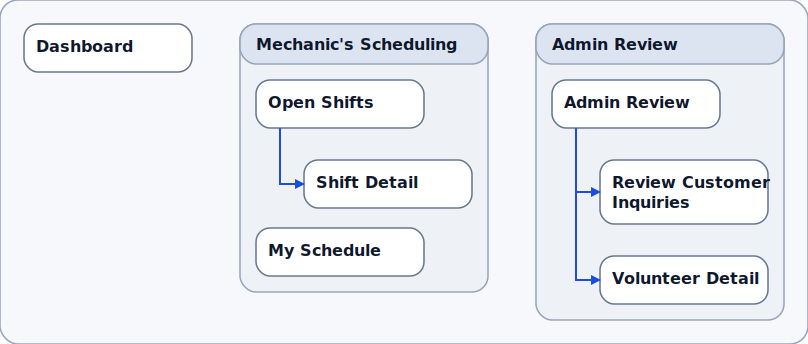
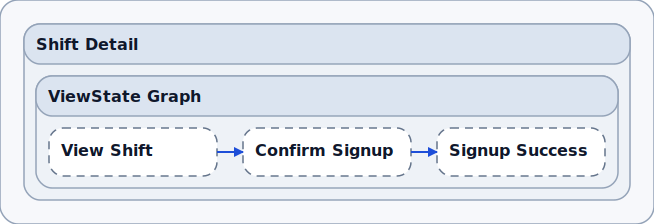
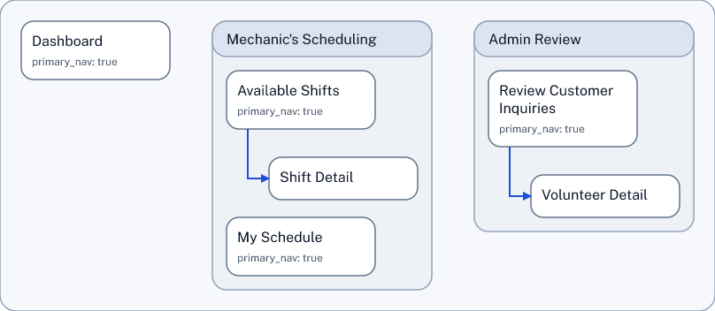

# SDD Skill Guide

The SDD Skill provides a simple way to work with structured design documents. The skill understands the SDD grammar and provides valid, consistent output. The SDD Skill is an alternative to manually authoring and editing SDD documents, which is also possible.

## Use Case: Start With An App Idea

If you have an app idea in mind, you can start by describing the app in plain language.

The SDD Skill helps turn that description into a structured design document.

Here is an example prompt:

```text
Use $sdd skill to design a mechanic's scheduling app for a communal automotive shop.         

Create a new SDD ("shop_sched_exploration") for it and create a simple information architecture diagram. Include:    
- Dashboard
- a Mechanic's Scheduling area with Open Shifts, Shift Detail, My Schedule
```
That is enough to get started. You do not need to know SDD syntax first (although the syntax is quite simple.) You could omit the filename. The skill would choose a name then.

### Output

The prompt generates the SDD file (Structured Design Document) and the information architecture diagram.

SDD full source: [shop_sched_exploration.sdd](examples/shop_sched_exploration.sdd)

Trimmed excerpt:

```text
SDD-TEXT 0.1
Place P-010 "Dashboard"
  route_or_key="/dashboard"
  primary_nav="true"
  NAVIGATES_TO P-020
  NAVIGATES_TO P-040
END
Area A-010 "Mechanic's Scheduling"
  CONTAINS P-020
  CONTAINS P-030
  CONTAINS P-040
  + Place P-020 "Open Shifts"
    route_or_key="/mechanic/shifts/open"
    access="role:mechanic"
    primary_nav="true"
    NAVIGATES_TO P-030
  END
```

Information architecture from that first prompt:

<a href="examples/shop_sched_exploration.ia_place_map.simple.svg">
  
</a>

### What This Creates

Instead of a vague app idea, you now have a structured design starting point, before anything is baked into code.

- A named structure for the app, with places and relationships the model can reason about.
- A visible app map that makes the overall shape easier to review.
- A concrete starting point for follow-up refinement before you move into implementation.

Behind the scenes, the skill uses editing tools that allow it to read, write and check SDD documents quickly and reliably.

## Follow-Up Requests

Once the first structure exists, the next steps can stay conversational. For example:

### Add An Admin Review Area

```text
Using $Sdd Skill , add an Admin Review area for coordinators who approve volunteer signups. Include "Review Customer Inquiries" and "Volunteer Detail".
Connect to it from the Dashboard.

Also add descriptions. Update the IA.
```

Full source: [shop_sched_exploration_2.sdd](examples/shop_sched_exploration_2.sdd)

Trimmed excerpt:

```text
Area A-020 "Admin Review"
  description="Coordinator workspace for reviewing customer inquiries and approving volunteer signups."
  CONTAINS P-050
  CONTAINS P-060
  + Place P-050 "Review Customer Inquiries"
    route_or_key="/admin/inquiries"
    access="role:coordinator"
    primary_nav="true"
    description="Queue for customer inquiries and volunteer signup requests awaiting coordinator review."
    NAVIGATES_TO P-060
  END
  + Place P-060 "Volunteer Detail"
    route_or_key="/admin/volunteers/:volunteerId"
    access="role:coordinator"
    description="Approval workspace for reviewing a volunteer's profile, availability, and signup decision."
  END
END
```

Rendered output from the admin-area follow-up:

<a href="examples/shop_sched_exploration_2.ia_place_map.simple.svg">
  
</a>

### Add A Signup Flow And Show The UI Contracts

SDDs can capture of states and view states to express progressions. Let's add a sign-up flow.

```text
Using $Sdd Skill, add a simple signup flow in Shift Detail, with these view states: 
- View Shift
- Confirm Signup
- Signup Success

Show the UI contracts.
```

Full source: [shop_sched_exploration_3.sdd](examples/shop_sched_exploration_3.sdd)

Trimmed excerpt, showing the added viewStates within Shift Detail:

```text
  + Place P-030 "Shift Detail"
    route_or_key="/mechanic/shifts/:shiftId"
    access="role:mechanic"
    description="Inspect a shift's bay, time window, vehicle context, and signup status."
    CONTAINS VS-010
    CONTAINS VS-020
    CONTAINS VS-030
    + ViewState VS-010 "View Shift"
      description="Default shift-detail state for reviewing shift requirements and starting signup."
      TRANSITIONS_TO VS-020
    END
    + ViewState VS-020 "Confirm Signup"
      description="Confirmation state for reviewing commitment details before signing up."
      TRANSITIONS_TO VS-030
    END
    + ViewState VS-030 "Signup Success"
      description="Success state confirming the mechanic has signed up for the shift."
    END
  END
```

Rendered output from the UI-contract follow-up, showing the viewState sequence:

<a href="examples/shop_sched_exploration_3.ui_contracts.simple.svg">
  
</a>

### Simple Follow-Up Edit

The same style also works for smaller follow-ups:

```text
Using $Sdd Skill, rename "Open Shifts" to "Available Shifts" and update the IA diagram.
```

Trimmed excerpt:

```text
Area A-010 "Mechanic's Scheduling"
  description="Mechanic workspace for finding open shop shifts and managing accepted shifts."
  CONTAINS P-020
  CONTAINS P-030
  CONTAINS P-040
  + Place P-020 "Available Shifts"
    route_or_key="/mechanic/shifts/open"
    access="role:mechanic"
    primary_nav="true"
    description="Browse available volunteer mechanic shifts and choose a shift to inspect."
    NAVIGATES_TO P-030
  END
```

### Manual View Command

When you want to see a current diagram for an existing SDD file, you can ask the skill for it:

```text
Using $sdd-skill, show the information architecture.
```

The skill then calls the sdd-show command. You could also call the show command directly in a terminal, without using the skill:

```bash
pnpm sdd show shop_sched_exploration.sdd --view ia_place_map --profile simple --format png --out "shop_sched_exploration_IA_as_a.png"

Wrote /home/knut/projects/sdd/shop_sched_exploration_IA_as_a.png
```

<a href="examples/shop_sched_exploration_4_IA_as_a.png">
  

## What Happens Behind The Scenes

- The skill recognizes the initial prompt as a *create new document* request. It creates the new, empty `.sdd` document, using the filename in the prompt. It translates the prompt's ask into an app structure (this is the core of the LLM work) and then follows SSD rules to create nodes and connections. It then writes this content into the document. The skill also recognizes the request for the IA diagram as a *read, validate, or preview an existing document* request and executes it.
- The skill recognizes the follow-up prompts as *edit an existing document* requests." For each request, it looks at the current structure before making changes, so each follow-up builds on the actual document. The follow-up requests for diagrams are recognized as *read, validate, or preview an existing document* again.
- All the edits are made through a structured workflow provided by the sdd-helper tool, instead of brittle free-form rewriting. The tool explains its capabilities to the skill when the skill asks. The tool and the skill speak json to one another, which is easy to use for the LLM.

For the technical workflow behind the examples, see the canonical repo skill bundle in [sdd-skill](../../../skills/sdd-skill/): the core [SKILL.md](../../../skills/sdd-skill/SKILL.md), [workflow.md](../../../skills/sdd-skill/references/workflow.md), [change-set-recipes.md](../../../skills/sdd-skill/references/change-set-recipes.md), and [current-helper-gaps.md](../../../skills/sdd-skill/references/current-helper-gaps.md). See the [SDD Helper Guide](../sdd-helper/) about the helper used byt the skill.

## Go Beyond the Skill

The skill empowers an LLM to respond to user's natural-language prompts, allowing a user to work with SSD without knowing the syntax. The syntax is fairly straightforward, though: about as complex as basic HTML. With not much learning effort, anyone can simply edit SDD files manually. That can be the quickest way from idea to document.

## SDD During the Product Lifecycle

The examples above focus on simple information architecture and a bit of state handling. SDD provides means to go into greater detail, with flows, nested components and service blueprints. SDD also provides means to capture more abstract *drivers* of design, with journeys and opportunity maps. The goal is to create an opportunity to create a full picture of structural design - which is helpful for delivering on the design promise.

The example shown here shows a from-scratch workflow. It is exciting to envision, design and build a product from scratch. It is also, in practical terms, rare. Most actual work in a product business is concerned with changing, improving, and growing an existing product over a long period of time. In that situation, [SDD can make a strategic difference](../strategic_potential/README.md).
