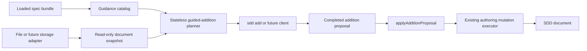

# Guided Addition API Architecture

Status: proposed implementation authority for a later Guided Addition implementation thread

Audience: maintainers implementing the shared authoring core, the initial interactive CLI, and later app or MCP adapters

Purpose: define a decision-complete, client-neutral architecture for guiding a user through adding SDD nodes and relationships without allowing the guidance layer to edit an SDD document

This document specifies intended future behavior. It does not describe an already implemented API.

## 1. Authority And Scope

Authority for this architecture is, in order:

1. [UX Brief for a Guided Addition API](./ux_brief_guided_addition_api.md) for the product interaction and responsibility boundaries.
2. The loaded bundle under [`bundle/v0.1/`](../../bundle/v0.1/) for machine-readable language, relationship, view, profile, and authoring behavior.
3. [Toolchain Architecture](../toolchain/architecture.md) and the existing shared authoring core for repository architecture and mutation behavior.
4. [Hidden Edge Reference](../doc_site/diagram_types/hidden_edge_reference.md) and [Diagram Node and Edge Reference](../doc_site/diagram_types/node_edge_reference.md) as downstream explanations and visual exemplars, not normative inputs.

The architecture covers:

- guided addition with or without a selected starting node;
- incoming and outgoing relationships;
- choosing an existing endpoint or creating a new one;
- bundle-driven node forms, ID suggestions, relationship fields, filtering, and placement advice;
- completed addition proposals;
- explicitly confirmed reparenting;
- a separate authoring executor that applies a proposal;
- an interactive `sdd add` CLI as the first client;
- implementation sequencing, verification, and future performance options.

The architecture does not add persistence, undo/redo orchestration, user preference storage, MRU state, database design, multi-user collaboration, or a new serializer. Existing authoring journaling and undo may record committed proposal applications, but undo/redo is not part of the guided workflow.

## 2. Locked Invariants

The implementation must preserve these invariants:

- `.sdd` remains the authored source of truth.
- Bundle data governs machine behavior; Markdown explains it and code interprets it.
- Guidance is read-only and has no file-write permission.
- The workflow is stateless from the service perspective. The caller carries serializable workflow state.
- Every workflow state and proposal is bound to one document revision and one bundle fingerprint.
- Relationship direction is literal. Incoming guidance never infers or materializes an inverse edge.
- Diagram filtering ranks and annotates choices; it does not silently convert hidden or bridge relationships into invalid relationships.
- Profile completeness is not enforced while browsing choices.
- A completed proposal is semantic content, not SDD text and not a caller-authored `ChangeOperation[]` payload.
- Save and Cancel belong to the client.
- Only the existing shared authoring mutation machinery serializes SDD source.
- Reparenting an existing node requires an explicit, effect-specific confirmation and is never sticky.
- There are no hardcoded fallback node types, relationship types, view IDs, ID prefixes, field lists, or visibility rules when bundle guidance metadata is missing.

## 3. Validity Vocabulary

The API must not use `valid` as an undifferentiated concept.

| Term | Meaning | Authority |
| --- | --- | --- |
| **Semantically allowed** | A literal `from type + relationship type + to type` endpoint triple exists in the relationship contract. | `contracts.yaml` |
| **Currently available** | The choice can be completed against the current document, including endpoint existence, unique IDs, and required relationship fields. | Bundle plus document snapshot |
| **Presentation visibility** | The way the endpoint triple appears in a selected view and display profile. | `views.yaml` |
| **Profile completeness** | Governance properties and severity required by a validation profile. | `profiles/*.yaml` |

The planner prevents choices that are not semantically allowed or currently available. It returns presentation visibility as metadata. Profile completeness remains outside the browsing flow and may be assessed by the authoring dry run after a proposal is complete.

## 4. System Architecture



### 4.1 Code Ownership

The shared code should be organized as follows:

```text
src/authoring/guidedAddition/contracts.ts
src/authoring/guidedAddition/catalog.ts
src/authoring/guidedAddition/snapshot.ts
src/authoring/guidedAddition/planner.ts
src/authoring/guidedAddition/placement.ts
src/authoring/additionProposals.ts
src/authoring/mutations.ts
src/cli/program.ts
```

Responsibilities are strict:

- `guidedAddition/*` is pure, read-only domain logic. It may consume loaded bundle data, compiled graph data, and inspect data. It must not import mutation, workspace-write, journal, or CLI modules.
- `additionProposals.ts` is the write-side adapter. It verifies a completed proposal and translates it into internal authoring operations.
- `mutations.ts` remains the only source-preserving mutation and serialization implementation.
- `program.ts` owns the interactive `sdd add` presentation and Save/Cancel flow only.

The helper and future MCP server may later expose the same shared contracts. They must not reimplement guidance or invoke the interactive CLI.

## 5. Bundle Ownership

### 5.1 Existing Artifact Responsibilities

Bundle behavior remains separated by subject:

| Artifact | Guided Addition responsibility |
| --- | --- |
| `core/vocab.yaml` | Node and relationship tokens, groups, meanings, and descriptions. |
| `core/syntax.yaml` | Node-header, ID, quoted-string, property, edge, and lexical formats. |
| `core/schema.json` | Compiled node/edge shape and core ID/name constraints. |
| `core/contracts.yaml` | Literal relationship direction, allowed endpoint triples, relationship constraints, required edge properties, and structural/ordering authoring semantics. |
| `core/views.yaml` | View node scope and per-view endpoint-triple relevance and display classification. |
| `profiles/*.yaml` | Validation selection, severity, completeness, and profile-specific property rules. |
| `core/authoring.yaml` | Guided forms, canonical ID suggestion configuration, progressive disclosure, and placement-policy parameters. |

Client wording, menu layout, MRU order, remembered filters, and other stickiness do not belong in the bundle.

### 5.2 Narrow `core/authoring.yaml`

The current bundle manifest must add an optional `core.authoring` entry and the current v0.1 bundle must declare it:

```yaml
core:
  vocab: core/vocab.yaml
  syntax: core/syntax.yaml
  schema: core/schema.json
  contracts: core/contracts.yaml
  projection_schema: core/projection_schema.json
  views: core/views.yaml
  authoring: core/authoring.yaml
```

`Bundle.authoring` is optional so older bundles remain loadable for compile, validation, projection, and rendering. Guided Addition must return `guided_addition.unsupported_bundle` when it is absent; it must not substitute code defaults.

The artifact is intentionally narrow. Its required conceptual shape is:

```yaml
version: "0.1"

node_id_suggestions:
  sequence_policy: max_numeric_plus_one
  minimum_digits: 3
  prefix_by_type:
    Place: P
    ViewState: VS
    # Complete for every declared node type.

node_forms:
  common_fields:
    - source: node_id
      prominence: primary
    - source: name
      prominence: primary
    - source: property
      property: description
      prominence: primary
  by_type:
    Place:
      properties:
        - property: route_or_key
          prominence: advanced
        - property: access
          prominence: advanced
    # Complete for every declared node type.

placement_policies:
  default:
    fallback: last
    outgoing_sequence: after_anchor
    incoming_sequence: before_anchor
    structural_new_target: nested_last
    structural_existing_target: reparent_with_confirmation
    edge_in_source_body: last
    edge_to_name_hint: target_name
```

Exact descriptions should be reused from vocabulary and rule metadata rather than duplicated here. A field descriptor may add authoring-specific prominence, value kind, and input hints, but it must reference the property key whose constraints remain owned by contracts or profiles.

Every vocabulary node type must have an ID prefix and a form entry. `node_id`, `name`, and `description` are primary fields. `description` is optional in the guided flow unless a selected validation profile later reports otherwise. Other known type properties are advanced fields and do not become required merely because the form exposes them.

The prefix map in `authoring.yaml` is the canonical bundle source for node-type ID prefixes. Profile rules that enforce prefix coupling must reference this map while retaining their own severity; they must not retain independent copies. This requires a generic bundle-reference field in the relevant profile rule and validator resolution path.

### 5.3 Contract Extensions

`contracts.yaml` must retain `allowed_endpoints` as the semantic source of relationship choices. Relationship metadata must additionally declare generic authoring semantics rather than relying on relationship-name checks in TypeScript:

```yaml
relationships:
  - type: CONTAINS
    authoring:
      graph_role: structural
      source_representation: edge_line
      source_organization: nest_target_under_source
    allowed_endpoints: [...]
```

Allowed values are:

- `graph_role`: `structural | ordering | reference | dependency | behavioral | data`;
- `source_representation`: `edge_line` for v0.1;
- `source_organization`: `nest_target_under_source | same_level | unconstrained`.

Required relationship fields are derived from generic contract rules such as `required_edge_property`. Supported event, guard, effect, and property inputs must likewise be exposed through bundle rule metadata. The guidance runtime must not identify `BINDS_TO`, `TRANSITIONS_TO`, or other relationship types with literal code branches.

### 5.4 View Display Extensions

Display metadata is keyed by the full endpoint triple, not relationship type alone:

```text
view_id + from_type + relationship_type + to_type
```

Each view gains `conventions.guided_addition.relationships` entries:

```yaml
guided_addition:
  profile_aliases:
    permissive: strict
  relationships:
    - from: Step
      type: REALIZED_BY
      to: Process
      role: primary
      display_by_profile:
        simple:
          - presence: connector
            label: hidden
        strict:
          - presence: connector
            label: visible
```

`role` is one of:

- `primary`: a normal relationship for the selected view;
- `supporting`: a relationship within or adjacent to the view that supplies secondary detail;
- `bridge`: a cross-view relationship that remains semantically valuable even when an endpoint or connector is not rendered.

Each display rule resolves to:

```ts
interface RelationshipDisplay {
  presence: "connector" | "structural" | "annotation" | "hidden";
  label: "visible" | "hidden" | "not_applicable";
  explanation?: string;
}
```

Conditional behavior is represented as ordered rules. The first matching rule wins, and the final rule must be unconditional:

```yaml
simple:
  - when:
      kind: document_has_node_type
      node_type: ViewState
    presence: hidden
    label: not_applicable
  - presence: connector
    label: visible
```

`document_has_node_type` is the only predicate required for v1. New predicates require bundle contract, type, loader validation, generic evaluator, and mutation tests before use.

The hidden-edge documentation continues to compare `simple` and `strict`. The current `permissive` display policy is equivalent to `strict`, expressed by a bundle alias rather than a runtime assumption. Alias targets must be declared profiles; alias cycles and missing targets are bundle errors. If a later bundle gives `permissive` its own display behavior, it replaces the alias with explicit rules without an API change.

## 6. Document Snapshot And Bundle Fingerprint

The storage adapter constructs one read-only snapshot for the interaction:

```ts
interface GuidedDocumentSnapshot {
  kind: "sdd-guided-document-snapshot";
  document_ref: string;
  path?: string;
  revision: DocumentRevision;
  bundle_fingerprint: string;
  effective_version: string;
  nodes: GuidedExistingNode[];
  edges: GuidedExistingEdge[];
  top_level_order: Handle[];
  body_order_by_parent: Record<Handle, Handle[]>;
  diagnostics: Diagnostic[];
}

interface GuidedExistingNode {
  handle: Handle;
  node_id: string;
  node_type: string;
  name: string;
  parent_handle: Handle | null;
  source_order: number;
}

interface GuidedExistingEdge {
  handle: Handle;
  parent_handle: Handle;
  from: string;
  type: string;
  to: string;
  source_order: number;
}
```

For current files, the snapshot builder reuses `inspectDocumentText(...)` for structure and `compileSource(...)` for graph semantics. Parse or compile errors block the workflow with `guided_addition.document_unavailable`. Validation warnings and profile-completeness diagnostics do not block snapshot creation.

The snapshot builder creates indexes for nodes by handle, ID, and type; incoming and outgoing edges; parent and child order; and used IDs. These indexes are internal and are not serialized into workflow state.

`bundle_fingerprint` is `bnd_` plus the SHA-256 digest of canonical JSON containing the loaded manifest, vocabulary, syntax, schemas, contracts, views, profiles in manifest order, and authoring configuration. Environment paths such as `rootDir` and `manifestPath` are excluded. A proposal executor must recompute and compare the fingerprint before applying a proposal.

## 7. Guided Workflow Contract

### 7.1 Entry Points

The shared API is constructed from a loaded bundle:

```ts
interface GuidedAdditionRuntime {
  begin(
    snapshot: GuidedDocumentSnapshot,
    request: BeginGuidedAdditionRequest
  ): GuidedAdditionResult;

  advance(
    snapshot: GuidedDocumentSnapshot,
    state: GuidedAdditionState,
    action: GuidedAdditionAction
  ): GuidedAdditionResult;
}
```

The runtime holds only the immutable bundle-derived catalog. It does not hold document or user session state.

```ts
interface BeginGuidedAdditionRequest {
  anchor?: ExistingNodeRef;
  initial_filter?: GuidedAdditionFilter;
}

interface ExistingNodeRef {
  kind: "existing_node";
  handle: Handle;
  node_id: string;
  node_type: string;
}
```

The runtime verifies that any supplied anchor exactly matches the revision-bound snapshot entry.

### 7.2 State And Results

```ts
interface GuidedAdditionState {
  kind: "sdd-guided-addition-state";
  workflow_version: "0.1";
  document_context: {
    document_ref: string;
    revision: DocumentRevision;
    bundle_fingerprint: string;
  };
  anchor?: ExistingNodeRef;
  filter: GuidedAdditionFilter;
  selections: GuidedAdditionSelections;
  confirmed_effects: ConfirmedProposalEffect[];
}

type GuidedAdditionResult =
  | {
      kind: "sdd-guided-addition-step";
      state: GuidedAdditionState;
      step: GuidedStep;
      diagnostics: Diagnostic[];
    }
  | {
      kind: "sdd-guided-addition-complete";
      state: GuidedAdditionState;
      proposal: CompletedAdditionProposal;
      diagnostics: Diagnostic[];
    };
```

The state stores selections, not a copy of the document. On every `advance`, the runtime verifies the document revision and bundle fingerprint, recomputes available options, and rejects an action that was not offered in the current step.

### 7.3 Filters

```ts
interface GuidedAdditionFilter {
  view_id?: string;
  display_profile_id?: string; // Defaults to simple when a view is selected.
  roles?: Array<"primary" | "supporting" | "bridge">;
  presences?: Array<"connector" | "structural" | "annotation" | "hidden">;
}
```

Unknown view or profile IDs are rejected using bundle-derived available values. With a view filter, default ordering is `primary`, then `supporting`, then `bridge`; within a role, contract order and then endpoint order provide deterministic ordering. Bridge choices remain present unless an explicit `roles` filter excludes them.

Without a view filter, all semantically allowed choices remain available and are ordered by relationship contract order and allowed-endpoint order.

### 7.4 Normalized Known-Node Flow

The four known-node UX routes share one domain selection:

```ts
interface RelationshipIntentSelection {
  direction: "outgoing" | "incoming";
  endpoint_strategy: "existing_only" | "existing_or_new";
}

type GuidedOperationSelection =
  | { kind: "add_node" }
  | ({ kind: "add_relationship" } & RelationshipIntentSelection);
```

- Outgoing means the selected anchor is the literal `from` endpoint.
- Incoming means the selected anchor is the literal `to` endpoint.
- `existing_only` omits endpoint triples for which no matching existing endpoint is available.
- `existing_or_new` offers matching existing endpoints first and always permits creation when the endpoint type is declared in the authoring catalog.

The client may expose four friendly shortcuts, but it must send the normalized direction and endpoint strategy rather than implement separate semantic branches.

### 7.5 Relationship Choices

The indivisible choice unit is:

```ts
interface RelationshipChoice {
  choice_id: string;
  from_type: string;
  relationship_type: string;
  to_type: string;
  direction_relative_to_anchor?: "outgoing" | "incoming";
  meaning?: string;
  role_by_view: Partial<Record<string, "primary" | "supporting" | "bridge">>;
  display_by_view: Partial<Record<string, Record<string, RelationshipDisplay>>>;
  existing_endpoint_count: number;
  required_edge_fields: GuidedFieldDefinition[];
  optional_edge_fields: GuidedFieldDefinition[];
}
```

`choice_id` is an opaque deterministic digest of the bundle fingerprint and endpoint triple. Clients must not construct or parse it. The planner verifies the selected ID against the currently recomputed choice.

The API never returns separate edge-type and node-type lists for clients to recombine.

### 7.6 Steps And Actions

The v1 step sequence uses these step kinds:

```ts
type GuidedStepKind =
  | "choose_operation"
  | "choose_node_type"
  | "choose_relationship"
  | "choose_endpoint"
  | "edit_new_node"
  | "edit_edge_fields"
  | "review_placement"
  | "confirm_effect"
  | "review_proposal";
```

The corresponding action union is:

```ts
type GuidedAdditionAction =
  | { kind: "set_filter"; filter: GuidedAdditionFilter }
  | { kind: "choose_operation"; selection: GuidedOperationSelection }
  | { kind: "choose_node_type"; node_type: string }
  | { kind: "choose_relationship"; choice_id: string }
  | { kind: "choose_existing_endpoint"; node: ExistingNodeRef }
  | { kind: "create_new_endpoint" }
  | { kind: "set_new_node_fields"; fields: GuidedNodeFieldValues }
  | { kind: "set_edge_fields"; fields: GuidedEdgeFieldValues }
  | { kind: "select_placement"; selection: PlacementSelection }
  | { kind: "confirm_effect"; effect: ConfirmedProposalEffect }
  | { kind: "complete" };
```

An action either returns the next required step or a completed proposal. Optional filters may change at any incomplete step; the planner clears downstream selections that are no longer offered after the filter change.

### 7.7 Supporting Workflow Types

V1 creates at most one node and one relationship per completed proposal. Arrays in the completed proposal are retained so the authoring handoff can grow without replacing its envelope.

```ts
interface GuidedAdditionSelections {
  operation?: GuidedOperationSelection;
  node_type?: string;
  relationship_choice_id?: string;
  endpoint?:
    | { kind: "existing"; node: ExistingNodeRef }
    | { kind: "create_new"; local_id: "node_1"; node_type: string };
  new_node_fields?: GuidedNodeFieldValues;
  edge_fields?: GuidedEdgeFieldValues;
  placements: PlacementSelection[];
}

interface GuidedNodeTypeChoice {
  option_id: string;
  node_type: string;
  group?: string;
  description?: string;
  view_role?: "native" | "bridge";
}

type GuidedEndpointChoice =
  | {
      option_id: string;
      kind: "existing";
      node: ExistingNodeRef;
      existing_edge_count_for_triple_and_endpoints: number;
    }
  | {
      option_id: string;
      kind: "create_new";
      node_type: string;
      local_id: "node_1";
    };

interface GuidedFieldDefinition {
  field_id: string;
  source:
    | "node_id"
    | "name"
    | "node_property"
    | "edge_event"
    | "edge_guard"
    | "edge_effect"
    | "edge_property";
  property?: string;
  description?: string;
  value_kind: ValueKind;
  required: boolean;
  prominence: "primary" | "advanced";
  format:
    | "sdd_node_id"
    | "non_empty_text"
    | "free_text"
    | "enum"
    | "pattern"
    | "node_reference";
  allowed_values?: string[];
  pattern?: string;
  allowed_target_types?: string[];
}

type GuidedStep =
  | {
      kind: "choose_operation";
      options: GuidedOperationSelection[];
    }
  | {
      kind: "choose_node_type";
      options: GuidedNodeTypeChoice[];
    }
  | {
      kind: "choose_relationship";
      options: RelationshipChoice[];
    }
  | {
      kind: "choose_endpoint";
      options: GuidedEndpointChoice[];
    }
  | {
      kind: "edit_new_node";
      local_id: "node_1";
      fields: GuidedFieldDefinition[];
      values: GuidedNodeFieldValues;
      suggested_node_id: string;
    }
  | {
      kind: "edit_edge_fields";
      local_id: "edge_1";
      fields: GuidedFieldDefinition[];
      values: GuidedEdgeFieldValues;
    }
  | {
      kind: "review_placement";
      recommendations: PlacementRecommendation[];
    }
  | {
      kind: "confirm_effect";
      effect: ProposedConfirmableEffect;
    }
  | {
      kind: "review_proposal";
      proposal: CompletedAdditionProposal;
    };
```

`option_id` values are opaque deterministic digests bound to the bundle and document context. Clients send the structured action selected from the offered option; they do not invent an option or local ID. V1 reserves `node_1` and `edge_1` as planner-produced proposal-local identifiers.

## 8. Node And Edge Forms

### 8.1 New-Node Fields

```ts
interface GuidedNodeFieldValues {
  node_id: string;
  name: string;
  properties: Array<{
    key: string;
    value_kind: ValueKind;
    raw_value: string;
  }>;
}
```

The initial values are:

- a suggested ID;
- an empty name;
- an omitted description property until the user supplies a non-empty value;
- no advanced properties unless the user opens progressive disclosure.

The suggested ID algorithm is deterministic:

1. Read the node-type prefix, sequence policy, and minimum width from `authoring.yaml`.
2. Consider every existing and proposal-local ID with that exact prefix and a numeric portion, including suffixed IDs such as `ST-010a` as numeric value `10`.
3. Select the greatest numeric value plus one, or `1` when none exists.
4. Pad to at least the configured width.
5. Increment until the full proposed ID is unused.

The suggestion is collision-free only for the bound document revision; it is not a reservation. Users may edit it. The planner blocks IDs that violate core syntax/schema, collide with an existing or proposal-local ID, or are empty. A prefix mismatch that the `simple` profile would not reject is returned as an advisory rather than silently corrected. Name must be non-empty. Empty optional properties are omitted.

### 8.2 Edge Fields

```ts
interface GuidedEdgeFieldValues {
  event?: string | null;
  guard?: string | null;
  effect?: string | null;
  props: Record<string, string>;
}
```

The relationship choice supplies bundle-derived required and optional definitions. Missing fields from a `required_edge_property` rule block completion. Optional annotations and properties are progressively disclosed. The planner validates format using the generic syntax and contract metadata but leaves full graph validation to the authoring dry run.

## 9. Placement Architecture

Placement is a pure advisor. It returns a recommendation, ordered alternatives, reasons, and whether choosing an alternative produces a confirmable effect. It never moves source content.

```ts
interface PlacementRecommendation {
  recommendation_id: string;
  target: ExistingOrNewNodeRef;
  recommended: ProposedPlacement;
  alternatives: ProposedPlacement[];
  reason_code:
    | "structural_nesting"
    | "outgoing_graph_sequence"
    | "incoming_graph_sequence"
    | "same_source_target_order"
    | "fallback_append";
  required_effect?: ProposedConfirmableEffect;
}

interface ProposedPlacement {
  stream: "top_level" | "body";
  mode: "before" | "after" | "first" | "last";
  parent?: ExistingOrNewNodeRef;
  anchor?: ExistingNodeRef;
}

interface PlacementSelection {
  recommendation_id: string;
  selected: ProposedPlacement;
}

interface SelectedPlacement extends PlacementSelection {
  target:
    | { kind: "node"; node: ExistingOrNewNodeRef }
    | { kind: "edge"; local_id: "edge_1" };
  selected_by: "recommended_default" | "user";
}
```

Precedence is fixed:

1. If an existing source structurally owns a new target, recommend nesting the new target last under the source.
2. If a new source structurally owns an existing target, recommend creating the source at the target's current level and reparenting the target under it, subject to confirmation.
3. For an unambiguous outgoing non-structural sequence, place the new target after the anchor at the same level.
4. For an unambiguous incoming non-structural sequence, place the new source before the anchor at the same level.
5. For multiple targets referenced by the same source, place a new target after the last same-level existing target in edge order.
6. Otherwise append at the relevant level.

The default edge placement is last in the literal source node's body. Edge order and node order are separate placement decisions. Type grouping and numeric-ID sorting are future preference policies and are not v1 defaults.

## 10. Confirmed Reparenting

Nesting does not create a compiled relationship in the current language implementation. A structural addition involving a new parent and an existing child therefore has two explicit effects:

1. insert the literal structural edge under the new source;
2. move the complete existing node block under the new source.

The planner must stop at `confirm_effect` before completing such a proposal.

```ts
interface ReparentExistingNodeEffect {
  kind: "reparent_existing_node";
  effect_id: string;
  document_revision: DocumentRevision;
  target: ExistingNodeRef;
  old_parent_handle: Handle | null;
  new_parent: { kind: "new_node"; local_id: string } | ExistingNodeRef;
  placement: ProposedPlacement;
  relationship: {
    from: ExistingOrNewNodeRef;
    type: string;
    to: ExistingOrNewNodeRef;
  };
}

interface ConfirmedProposalEffect extends ReparentExistingNodeEffect {
  confirmed: true;
}

type ProposedConfirmableEffect = ReparentExistingNodeEffect;
```

`effect_id` is a deterministic digest of the bundle fingerprint, document revision, target, old and new parents, placement, and relationship. The client must display the moved node, old location, new location, and inserted relationship. Confirmation is valid only for that exact effect and revision. It cannot be prefilled from preference or MRU state.

Changing any effect field invalidates the confirmation and returns the workflow to `confirm_effect`.

### 10.1 New Mutation Primitive

The authoring core must add:

```ts
interface ReparentNodeBlockOp {
  kind: "reparent_node_block";
  node_handle: Handle;
  placement: Placement;
}
```

It supports top-level-to-nested, nested-to-another-parent, and nested-to-top-level movement. It moves the complete node block, subtree, body content, comments, blank lines, and owned trivia. It rejects:

- a missing or stale node or parent handle;
- placement under the node itself;
- placement under any descendant;
- relative anchors outside the destination stream;
- a no-longer-current base revision.

Successful summaries record old and new parent handles and old and new stream indexes. Existing operations remain backward compatible. Guided confirmation is enforced by `applyAdditionProposal`, not by the low-level mutation primitive.

## 11. Completed Addition Proposal

```ts
interface CompletedAdditionProposal {
  kind: "sdd-addition-proposal";
  proposal_version: "0.1";
  proposal_id: string;
  document_context: {
    document_ref: string;
    path?: string;
    base_revision: DocumentRevision;
    bundle_fingerprint: string;
  };
  anchor?: ExistingNodeRef;
  guidance_context: {
    view_id?: string;
    display_profile_id?: string;
    relationship_role?: "primary" | "supporting" | "bridge";
  };
  relationship?: ProposedRelationship;
  new_nodes: ProposedNode[];
  new_edges: ProposedEdge[];
  placements: SelectedPlacement[];
  confirmed_effects: ConfirmedProposalEffect[];
}
```

Node and edge additions use these exact shapes:

```ts
interface ProposedNode {
  local_id: "node_1";
  node_type: string;
  node_id: string;
  name: string;
  properties: Array<{
    key: string;
    value_kind: ValueKind;
    raw_value: string;
  }>;
}

interface ProposedEdge {
  local_id: "edge_1";
  from: ExistingOrNewNodeRef;
  type: string;
  to: ExistingOrNewNodeRef;
  to_name: string | null;
  event: string | null;
  guard: string | null;
  effect: string | null;
  props: Record<string, string>;
}
```

When the authoring policy is `edge_to_name_hint: target_name`, the planner populates `to_name` from the current existing target name or the completed new-node name. The hint remains non-semantic and the executor does not resolve or alter it.

Endpoint references are explicit:

```ts
type ExistingOrNewNodeRef =
  | ExistingNodeRef
  | { kind: "new_node"; local_id: string; node_id: string; node_type: string };

interface ProposedRelationship {
  type: string;
  from: ExistingOrNewNodeRef;
  to: ExistingOrNewNodeRef;
  direction_relative_to_anchor?: "outgoing" | "incoming";
}
```

Canonical `from` and `to` are authoritative. `direction_relative_to_anchor` is explanatory metadata only.

`proposal_id` is a deterministic digest of the canonical proposal content excluding `proposal_id`. Repeating the same completed workflow against the same document revision and bundle must produce the same proposal bytes and ID.

The planner emits a proposal only after all required fields, placements, and confirmations are complete. The proposal contains no source text, file permissions, journal commands, commit instruction, or client preference state.

For relationship additions, `relationship` and `new_edges[0]` must carry identical `from`, `type`, and `to` values. The former preserves the selected semantic relationship and direction-relative-to-anchor context; the latter carries the exact authored edge fields. Any mismatch is a rejected proposal. For standalone node additions, `relationship` is absent and `new_edges` is empty.

## 12. Proposal Executor

The write-side entrypoint lives in `src/authoring/additionProposals.ts`:

```ts
interface ApplyAdditionProposalArgs {
  proposal: CompletedAdditionProposal;
  mode?: ChangeSetMode; // Defaults to dry_run.
  validate_profile?: string;
  projection_views?: string[];
}

interface ApplyAdditionProposalResult {
  kind: "sdd-addition-proposal-result";
  proposal: CompletedAdditionProposal;
  base_revision: DocumentRevision;
  resulting_revision?: DocumentRevision;
  mode: ChangeSetMode;
  status: ChangeSetStatus;
  change_set: ChangeSetResult;
  created_targets: Array<{
    local_id: string;
    kind: "node" | "edge";
    handle: Handle;
    parent_local_id?: string;
  }>;
  diagnostics: Diagnostic[];
}
```

`applyAdditionProposal(workspace, bundle, args)` performs these steps:

1. Resolve the document through the authoring workspace.
2. Read canonical LF source and verify `base_revision`.
3. Recompute and verify the bundle fingerprint.
4. Rebuild inspect/compile context and verify every existing reference.
5. Recompute every confirmed effect ID and reject missing, stale, or mismatched confirmation.
6. Verify the selected endpoint triple and required fields against the loaded bundle.
7. Translate the proposal into ordered `ChangeOperation[]`, using internal temporary handles for proposal-local nodes and edges.
8. Invoke the existing `executeChangeOperations(...)` path with origin `apply_addition_proposal`.
9. Return the canonical change set and created-target mappings.

Translation order is deterministic: create node blocks, set their properties in proposal order, insert edges in proposal order, then perform confirmed reparenting. Temporary handle remapping must allow a new node to be the destination parent of an existing node reparent operation.

The executor does not serialize strings, reconstruct SDD blocks, or write files itself. Those responsibilities remain in the shared mutation engine. The planner does not return authoring operations, and clients never translate a proposal into raw SDD.

## 13. Diagnostics And Failure Behavior

New diagnostics use stable codes and existing deterministic sorting:

| Code | Condition |
| --- | --- |
| `guided_addition.unsupported_bundle` | Required authoring metadata is absent. |
| `guided_addition.invalid_bundle_guidance` | Guidance metadata has invalid references, aliases, coverage, or predicates. |
| `guided_addition.document_unavailable` | Parse or compile errors prevent a reliable snapshot. |
| `guided_addition.state_stale` | Workflow revision or bundle fingerprint differs from the supplied snapshot. |
| `guided_addition.choice_unavailable` | An action selects an option not currently offered. |
| `guided_addition.invalid_node_id` | Proposed ID violates core format. |
| `guided_addition.node_id_collision` | Proposed ID conflicts with current or proposal-local content. |
| `guided_addition.required_field_missing` | A required node or edge field is absent. |
| `guided_addition.confirmation_required` | A confirmable effect lacks exact confirmation. |
| `guided_addition.confirmation_stale` | Confirmation no longer matches the effect or revision. |

Planner failures never mutate the document. Executor domain rejection returns a rejected structured result rather than throwing for expected stale or invalid proposals. Transport, unreadable-file, and invalid-programming-state failures follow existing authoring error conventions.

## 14. Initial `sdd add` Client

The first user-facing client is:

```text
sdd add <document_path> [--node <node_id>] [--view <view_id>]
```

The CLI:

1. loads the bundle and snapshot once;
2. begins with the requested anchor when `--node` resolves exactly;
3. renders planner steps and bundle-derived descriptions;
4. allows filters and advanced-field disclosure;
5. displays a complete plain-language proposal summary;
6. displays any reparenting effect and obtains explicit confirmation;
7. owns Save or Cancel;
8. on Save, invokes `applyAdditionProposal` in `dry_run` mode with `validate_profile: simple`;
9. displays the returned change summary and diagnostics;
10. commits the same proposal only after user acceptance and only if the revision remains current.

The CLI must not inspect `contracts.yaml`, `views.yaml`, or `authoring.yaml` directly. It consumes only shared runtime results. It must not remember reparent confirmation. Machine-readable helper/MCP exposure is deferred until the shared contract is stable.

## 15. Implementation Sequence

Implementation must proceed in gated order. Each checkpoint lands code, tests, and required explanatory documentation. Do not update snapshots or downstream hidden-edge documentation to normalize a failing implementation.

### Checkpoint 1: Bundle Contract And Authority

- Add optional manifest/type/loader support for `core/authoring.yaml` and declare it in the current bundle.
- Add typed contract authoring semantics and typed per-view endpoint-triple display metadata.
- Replace duplicated profile prefix maps with a generic reference to the canonical authoring prefix map.
- Add cross-reference validation for complete node coverage, tokens, endpoint triples, properties, profiles, aliases, and predicates.
- Prove with in-memory bundle mutations that choices, ID suggestions, visibility, and placement inputs change without TypeScript edits.

Stop if a required behavior cannot be represented in the bundle.

### Checkpoint 2: Catalog And Snapshot

- Implement bundle fingerprinting and the immutable guidance catalog.
- Implement source-to-snapshot preparation through existing inspect and compile services.
- Build deterministic indexes and blocking diagnostics.
- Prove same-bundle/same-source determinism and stale fingerprint/revision detection.

### Checkpoint 3: Planner, Forms, Filtering, And Placement

- Implement the pure caller-carried workflow and action validation.
- Implement standalone-node and all incoming/outgoing existing/new flows.
- Implement endpoint-triple filtering, bridge ranking, profile display resolution, forms, ID suggestions, required edge fields, and placement recommendations.
- Prove that repeated transitions are deterministic and perform no I/O or mutation.

### Checkpoint 4: Reparenting And Proposal Execution

- Add `reparent_node_block` and source-preservation coverage.
- Implement completed proposal validation, confirmation verification, proposal translation, and `applyAdditionProposal` over `executeChangeOperations`.
- Preserve dry-run/commit parity, journaling, created-target mappings, and stale-revision rejection.
- Prove that nesting and the explicit relationship edge are both applied exactly once.

### Checkpoint 5: Interactive CLI

- Add `sdd add` as a thin planner/executor client.
- Implement prompts, filtering, progressive disclosure, proposal review, non-sticky confirmation, dry-run summary, and commit.
- Test the CLI with injected I/O and verify that bundle or mutation semantics are absent from CLI code.

### Checkpoint 6: Contract Metadata And Later Adapters

- Add shared machine-readable contract metadata after the domain API stabilizes.
- Expose JSON-first helper or MCP surfaces only through the shared planner and executor.
- Do not make interactive CLI output a machine contract.

## 16. Required Verification Matrix

Tests must include:

- a bundle-only endpoint mutation that changes relationship choices;
- a bundle-only prefix mutation that changes the suggested ID;
- a bundle-only visibility mutation that changes simple/strict metadata and filtering;
- a bundle-only placement mutation that changes the recommendation;
- outgoing existing, outgoing new, incoming existing, incoming new, and standalone-node flows;
- view filtering that ranks primary/supporting/bridge while retaining bridges by default;
- simple hidden versus strict visible/annotated behavior;
- permissive resolution through the strict display alias;
- conditional UI Contracts visibility with and without a `ViewState`;
- ID suggestion for empty, sequential, suffixed, and collision cases;
- user-edited valid IDs and invalid or duplicate IDs;
- required edge properties and optional progressive fields;
- structural new-child nesting;
- confirmed new-parent reparenting from top level and another parent;
- reparent rejection for self/descendant cycles and stale confirmation;
- preservation of the moved block, subtree, properties, edges, comments, and blank lines;
- stale workflow state, stale proposal revision, and changed bundle fingerprint;
- deterministic proposal IDs and bytes;
- proposal-to-operation translation order;
- dry-run/commit change-summary and source parity;
- exact created-target mappings;
- CLI Save, Cancel, confirmation, stale-revision, and error flows;
- an assertion that planner modules have no mutation, filesystem-write, journal, or CLI imports.

Acceptance requires the cited bundle fields to control runtime behavior. Passing snapshots or tests with duplicated TypeScript defaults is a bundle-authority failure.

## 17. Future Performance Options

Performance optimization is deferred until measurement shows a problem. The architecture permits these safe improvements without changing public contracts:

### 17.1 Cache Immutable Bundle Work

- Cache canonical bundle fingerprints by loaded bundle instance or content identity.
- Cache compiled guidance catalogs by bundle fingerprint.
- Cache AJV/schema validators per bundle rather than recompiling them on every source compile.
- Cache validated display aliases and endpoint-triple indexes.

### 17.2 Reuse One Interaction Snapshot

- Build document indexes once at workflow start.
- Keep filtering, choice resolution, ID suggestion, forms, and placement entirely in memory.
- Rebuild the snapshot only when the document revision changes or the caller explicitly refreshes.
- Do not validate, project, render, or reread the file on each menu step.

### 17.3 Keep The Write Path In Process

- Call `applyAdditionProposal` as a library function from `sdd add`; do not introduce a subprocess or network hop.
- Translate a proposal directly into the shared internal operation executor.
- Continue to reread and revision-check at apply time for concurrency safety.

### 17.4 Defer Expensive Feedback

- Run ordinary choice validation in the planner.
- Run complete graph validation during final dry run.
- Run projections or rendering only when the client requests final visual review.
- Avoid computing display visibility by rendering diagrams; use bundle display metadata.

### 17.5 Candidate-State Optimization, Only If Proven Necessary

Dry run followed by commit currently executes the mutation pipeline twice. A future prepared-candidate token could allow committing exactly reviewed candidate bytes, but it would introduce candidate lifetime, storage, invalidation, authorization, and cleanup responsibilities. Do not add it in v1.

If benchmarks justify it, design candidate state as a separate architecture with:

- a content-addressed candidate ID;
- document revision and bundle fingerprint binding;
- short explicit lifetime;
- exact candidate-byte commit;
- no reuse after document or bundle changes;
- no hidden user session dependency.

### 17.6 Future Database Storage

A database adapter may replace file reads and writes with a transaction that supplies the same snapshot and compares the same base revision at apply time. The planner, workflow state, completed proposal, confirmation, and proposal executor contracts must remain unchanged. Only snapshot preparation and final mutation persistence are adapter-specific.

## 18. Explicitly Deferred Work

- Undo/redo UX and persistent authoring sessions.
- MRU, stickiness, or preference storage.
- Automatic reparent confirmation.
- Type grouping and numeric-ID placement preferences.
- Candidate-state persistence.
- Multi-document or cross-file additions.
- Concurrent multi-user merge behavior.
- Direct helper or MCP exposure before the shared API stabilizes.
- Generated hidden-edge documentation; until generation exists, it remains downstream documentation that must be kept consistent with the bundle.
