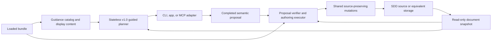

# Guided Addition API v1.0 Architecture

Status: **ACCEPTED**

Phase decision: **ACCEPT**

Human approval: **ACCEPTED on 2026-08-14**

Audience: maintainers of the shared guided-authoring core, the initial `sdd add` client, the proposal executor, and later app or MCP adapters

## 1. Authority, Purpose, And Scope

This document defines the corrective first stable major contract for Guided Addition. Its authority, in order, is:

1. [UX Brief for a Guided Addition API](./ux_brief_guided_addition_api.md).
2. [SDD-Add: Observed Usability Issues](./sdd-add_observed_usability_issues.md).
3. `AGENTS.md`, including bundle authority and acceptance-before-snapshots.
4. The loaded bundle under `bundle/v0.1/`.
5. The accepted [Guided Addition UX Acceptance Transcripts](./guided_addition_ux_acceptance_transcripts.md).
6. The accepted [Guided Addition Phase 3 UX Addendum](./guided_addition_phase_3_ux_addendum.md).
7. [Guided Addition Remediation Strategy](./guided_addition_remediation_strategy.md).

The rejected [Guided Addition API Architecture](./guided_addition_api_architecture.md) and failed [Guided Addition API Implementation Plan](./guided_addition_api_implementation_plan.md) are historical evidence only. They do not supply compatibility requirements or missing defaults.

This architecture covers:

- a pure, bundle-aware, caller-carried Guided Addition workflow;
- display-ready, client-neutral prompt and review content;
- standalone-node addition, no-node relationship launch, and all four known-node relationship routes;
- diagram-filter discovery, selection, change, and clearing inside each applicable browse step;
- contextual node and relationship forms;
- semantic source organization and material-effect confirmation;
- a completed semantic proposal bound to one document revision and bundle fingerprint;
- a separate authoring executor and the client-owned Save, warning, and Cancel flow.

It does not authorize Phase 4 implementation. It does not change runtime code, CLI behavior, public metadata, public documentation, or the rejected historical documents.

## 2. Locked Invariants

The v1.0 implementation must satisfy all of these together:

1. **Four routes remain distinct.** Direction and selection order are retained until the relationship and both endpoints are selected.
2. **Each choice constrains the next page.** The client never reconstructs candidates from bundle or document data.
3. **Filtering is a workflow action.** Selecting, changing, or clearing a diagram filter rerenders the same browse page and invalidates unavailable downstream selections.
4. **Content is ready to present.** The API supplies prompt, option, confirmation, warning, and review wording. A client chooses presentation mechanics, not semantics or terminology.
5. **Choices carry actions.** A client returns the exact typed action attached to the selected choice; it does not translate a label back into an action.
6. **Placement is semantic.** Nest, top-level, move, leave, and sibling order are separate decisions. Relationship-line placement is absent from guidance and proposals.
7. **No no-op page is shown.** A single valid relationship, zero-sibling order, or any other one-outcome continuation advances automatically.
8. **Material movement is explicit.** An existing declaration moves only after the accepted move choice and effect-specific confirmation.
9. **One ordinary Save decision.** The workflow completes with proposal and review content. Save/Cancel belongs to the client; only a concrete verification warning creates another human decision.
10. **Guidance remains read-only.** Only the shared authoring executor may translate and write a proposal.
11. **Bundle governs machine behavior.** Relationship triples, structural semantics, forms, IDs, diagram relevance, display classification, display-profile default, and relationship-line insertion come from the loaded bundle.
12. **State is context-bound.** Every advance and proposal is checked against an exact document revision and bundle fingerprint.

## 3. Versioning Decision: Reset As v1.0

The corrected contract is the first stable major contract:

```text
workflow_version: "1.0"
proposal_version: "1.0"
```

The rejected `0.1` workflow and proposal shapes are not a compatibility base. In particular, v1.0 does not accept or emit:

- `endpoint_strategy`;
- the rejected sparse selection bag;
- generic placement recommendations or placement selections;
- a user-facing edge placement;
- `review_proposal` followed by a `complete` action;
- caller-supplied initial `view_id` as the only diagram-filter interaction.

There is no implicit adapter from `0.1` state or proposals. A stale `0.1` payload fails with an unsupported-version diagnostic. Public metadata and old code are replaced only in their later authorized remediation phases.

## 4. System Boundary And Ownership



| Owner | Responsibility | Must not do |
| --- | --- | --- |
| Loaded bundle | Language, forms, relationship semantics, diagrams, display defaults, source-organization policy | Store CLI menu numbers or session state |
| Snapshot builder | Parse and compile a read-only, revision-bound document model | Write source |
| Guided planner | Return available steps, display content, typed actions, and a semantic proposal | Import workspace-write, mutation, or CLI modules |
| Client | Render supplied content, collect inputs, echo supplied actions, own Save/Cancel | Inspect bundle files, sort or combine semantic candidates, infer placement, or write proposal fields |
| Proposal executor | Reverify context and semantics, translate semantic organization, invoke mutations | Re-run the human decision tree or silently substitute choices |
| Mutation engine | Preserve source and serialize the verified operation, including bundle-owned edge insertion | Decide human-facing workflow behavior |

The UX brief's statement that a node-first client shows multiple relationship types on one line is satisfied at the presentation boundary: the planner returns one semantic option per node with an already grouped display string and the exact candidate triples. The client renders that option as one line (or an equivalent visual unit); it does not discover, group, or disambiguate relationships itself.

## 5. Bundle Fields And Generic Consumers

Markdown explains the interaction, but the following bundle data establishes machine behavior:

| Bundle source | v1.0 responsibility | Generic consumer |
| --- | --- | --- |
| `core/vocab.yaml` | Node and relationship names, meanings, and descriptions used in choices | Guidance catalog and content composer |
| `core/contracts.yaml` allowed endpoint triples | Literal direction and exact source/relationship/target compatibility | Route candidate builder and proposal verifier |
| `core/contracts.yaml` relationship authoring semantics | Structural versus non-structural organization and supported relationship fields | Organization decision builder, form builder, and verifier |
| `core/views.yaml` diagram definitions | Stable diagram IDs plus human-readable names and descriptions | Diagram-filter page builder |
| `core/views.yaml` guided relationship display metadata | Regular-first ranking, bridge classification, profile-sensitive visibility, plain-language annotation input | Candidate ranking and content composer |
| `core/authoring.yaml` node ID suggestions and forms | Collision-safe suggestions, primary fields, optional details, labels, and input constraints | Node form builder and verifier |
| `core/authoring.yaml` placement policies | Directional recommendations and structural organization recommendation inputs | Semantic organization page builder |
| `core/authoring.yaml` `edge_in_source_body` | Relationship-line insertion after relationship content and before nested nodes | Shared mutation engine only |
| Proposed `core/authoring.yaml` `guided_addition.default_display_profile_id` | Explicit display profile used when a diagram filter is selected | Filter normalization and display evaluator |

The Phase 4 bundle-contract step must add and validate the explicit display default before planner behavior consumes it. Its conceptual shape is:

```yaml
guided_addition:
  default_display_profile_id: simple
```

Validation must prove that the value names a declared profile and can be resolved for every diagram with guided display metadata. No profile-list ordering and no TypeScript literal may act as a fallback.

No additional bundle field for nest-versus-same-level behavior is introduced by this architecture. The relationship's bundle-owned authoring semantics, direction, endpoint existence, and document structure supply the inputs; the generic v1.0 organization state machine interprets them.

## 6. Public Runtime Contract

The shared runtime is constructed from one loaded bundle and is otherwise stateless:

```ts
interface ExistingNodeRef {
  kind: "existing_node";
  handle: Handle;
  node_id: string;
  node_type: string;
  name: string;
}

interface NewNodeRef {
  kind: "new_node";
  local_node_id: string;
}

type ExistingOrNewNodeRef = ExistingNodeRef | NewNodeRef;

interface GuidedAdditionRuntimeV1 {
  begin(
    snapshot: GuidedDocumentSnapshot,
    request: BeginGuidedAdditionRequestV1
  ): GuidedAdditionResultV1;

  advance(
    snapshot: GuidedDocumentSnapshot,
    state: GuidedAdditionStateV1,
    action: GuidedAdditionActionV1
  ): GuidedAdditionResultV1;
}

interface BeginGuidedAdditionRequestV1 {
  workflow_version: "1.0";
  anchor?: ExistingNodeRef;
}
```

An anchor is optional. When supplied, it must exactly match one node in the snapshot. The request does not accept a hidden diagram-filter initialization that bypasses the accepted browsing interaction.

### 6.1 Display-ready pages and choices

Every step is a page whose content is sufficient for direct presentation:

```ts
interface GuidedPageContent {
  title: string;
  prompt?: string;
  lines: string[];
}

interface GuidedChoice<A extends GuidedAdditionActionV1> {
  choice_id: string;
  display: string;
  chosen: string;
  recommended: boolean;
  action: A;
}

interface GuidedChoicePage<A extends GuidedAdditionActionV1> {
  page_id: string;
  page_kind: GuidedChoicePageKind;
  content: GuidedPageContent;
  choices: Array<GuidedChoice<A>>;
}
```

`display` is the complete option text excluding client-chosen numbering or visual controls. `chosen` is the exact confirmation text, such as `Chosen: P-100 CONTAINS VS-100`. Clients may adapt layout and accessibility, but they must preserve the supplied meaning and must not expose internal IDs by substituting their own diagnostic representation.

Choice IDs are opaque replay protection, not user-facing text. Every choice carries its full typed action. The runtime recomputes the current page and accepts an action only when it exactly matches an offered action.

Form pages similarly supply display-ready field labels, descriptions, requiredness, suggested values, disclosure prompts, and a typed submission descriptor. The client fills only the declared value slot:

```ts
interface GuidedFormPage {
  page_id: string;
  page_kind: "edit_new_node" | "edit_relationship_details";
  content: GuidedPageContent;
  fields: GuidedFieldDefinition[];
  submit_action:
    | { kind: "submit_new_node_fields"; local_node_id: string; field_group: "primary" | "additional" }
    | { kind: "submit_relationship_fields"; local_edge_id: string; field_group: "required" | "additional" };
}

interface GuidedFieldDefinition {
  field_id: string;
  label: string;
  description?: string;
  required: boolean;
  value_kind: string;
  suggested_raw_value?: string;
  allowed_values?: Array<{ value: string; display: string }>;
}

type GuidedPageV1 =
  | GuidedChoicePage<GuidedAdditionActionV1>
  | GuidedFormPage;
```

### 6.2 Step kinds

```ts
type GuidedChoicePageKind =
  | "choose_addition_kind"
  | "browse_starting_node"
  | "choose_relationship_route"
  | "browse_standalone_node_type"
  | "browse_relationship_combination"
  | "browse_relationship_endpoint"
  | "browse_existing_endpoint"
  | "choose_relationship_for_endpoint"
  | "choose_node_detail_disclosure"
  | "choose_relationship_detail_disclosure"
  | "choose_new_target_organization"
  | "choose_existing_target_organization"
  | "choose_new_source_organization"
  | "choose_sibling_order"
  | "choose_same_level_order"
  | "confirm_material_effect"
  | "browse_diagram_filter";
```

The page kind tells a generic client what interaction shape it is rendering. It does not ask the client to derive labels, candidates, or next steps.

### 6.3 Action union

```ts
type GuidedAdditionActionV1 =
  | { kind: "choose_addition_kind"; addition_kind: "standalone_node" | "relationship" }
  | { kind: "choose_starting_node"; node: ExistingNodeRef }
  | {
      kind: "choose_relationship_route";
      direction: "outgoing" | "incoming";
      selection_order: "relationship_first" | "existing_node_first";
    }
  | { kind: "open_diagram_filter"; browse_id: string }
  | { kind: "set_diagram_filter"; browse_id: string; diagram_id: string }
  | { kind: "clear_diagram_filter"; browse_id: string }
  | { kind: "choose_standalone_node_type"; node_type: string }
  | { kind: "choose_relationship_combination"; triple: EndpointTriple }
  | { kind: "choose_existing_endpoint"; node: ExistingNodeRef }
  | { kind: "create_new_endpoint"; node_type: string }
  | { kind: "choose_relationship_for_endpoint"; triple: EndpointTriple }
  | GuidedFormSubmissionAction
  | { kind: "set_node_detail_disclosure"; disclose: boolean }
  | { kind: "set_relationship_detail_disclosure"; disclose: boolean }
  | { kind: "choose_new_target_organization"; organization: "nested" | "top_level" }
  | { kind: "choose_existing_target_organization"; organization: "move_under_source" | "leave_current" }
  | { kind: "choose_new_source_organization"; organization: "wrap_target" | "leave_target_current" }
  | { kind: "choose_sibling_order"; order: "first" | "last" }
  | { kind: "choose_same_level_order"; order: SemanticSameLevelOrder }
  | { kind: "confirm_material_effect"; effect_id: string }
  | { kind: "go_back"; target_page_id: string };

interface EndpointTriple {
  from_type: string;
  relationship_type: string;
  to_type: string;
}

type GuidedFieldValue = {
  field_id: string;
  raw_value: string;
};

type GuidedFormSubmissionAction =
  | {
      kind: "submit_new_node_fields";
      local_node_id: string;
      field_group: "primary" | "additional";
      values: GuidedFieldValue[];
    }
  | {
      kind: "submit_relationship_fields";
      local_edge_id: string;
      field_group: "required" | "additional";
      values: GuidedFieldValue[];
    };

type SemanticSameLevelOrder =
  | { kind: "top_level_first" }
  | { kind: "top_level_last" }
  | { kind: "before_existing"; node: ExistingNodeRef }
  | { kind: "after_existing"; node: ExistingNodeRef };
```

There is intentionally no `complete`, `select_placement`, `set_filter` with a caller-constructed raw filter, or edge-placement action.

### 6.4 Explicit route identity

Once a relationship route is chosen, state contains exactly:

```ts
interface RelationshipRouteV1 {
  addition_kind: "relationship";
  direction: "outgoing" | "incoming";
  selection_order: "relationship_first" | "existing_node_first";
}
```

The four combinations are separate route identities. `endpoint_strategy` does not exist. Existing versus new endpoint is a later outcome available only on relationship-first routes; it cannot erase selection order.

### 6.5 Caller-carried state

```ts
interface GuidedAdditionStateV1 {
  kind: "sdd-guided-addition-state";
  workflow_version: "1.0";
  document_context: {
    document_ref: string;
    revision: DocumentRevision;
    bundle_fingerprint: BundleFingerprint;
  };
  anchor?: ExistingNodeRef;
  browse_filters: Record<string, { diagram_id: string | null }>;
  progress: GuidedProgressV1;
  accepted_material_effects: AcceptedMaterialEffect[];
}

type GuidedProgressV1 =
  | { kind: "choose_addition_kind" }
  | { kind: "browse_starting_node" }
  | { kind: "choose_relationship_route"; anchor: ExistingNodeRef }
  | StandaloneProgressV1
  | RelationshipFirstProgressV1
  | ExistingNodeFirstProgressV1;

type StandaloneProgressV1 =
  | { kind: "standalone.browse_node_type" }
  | { kind: "standalone.edit_primary_fields"; node_type: string }
  | { kind: "standalone.choose_details"; draft: ProposedNodeV1 }
  | { kind: "standalone.edit_additional_fields"; draft: ProposedNodeV1 }
  | { kind: "standalone.choose_order"; draft: ProposedNodeV1 };

type RelationshipFirstProgressV1 =
  | { kind: "relationship_first.browse_combination"; route: RelationshipRouteV1; anchor: ExistingNodeRef }
  | {
      kind: "relationship_first.browse_endpoint";
      route: RelationshipRouteV1;
      anchor: ExistingNodeRef;
      triple: EndpointTriple;
    }
  | { kind: "relationship_first.edit_new_node"; draft: NewEndpointDraftV1 }
  | { kind: "relationship_first.continue"; draft: RelationshipDraftV1 };

type ExistingNodeFirstProgressV1 =
  | { kind: "existing_node_first.browse_endpoint"; route: RelationshipRouteV1; anchor: ExistingNodeRef }
  | { kind: "existing_node_first.choose_relationship"; draft: ExistingEndpointDraftV1 }
  | { kind: "existing_node_first.continue"; draft: RelationshipDraftV1 };

interface NewEndpointDraftV1 {
  route: RelationshipRouteV1;
  anchor: ExistingNodeRef;
  triple: EndpointTriple;
  remote_endpoint: { kind: "new_node"; local_node_id: string; node_type: string };
}

interface ExistingEndpointDraftV1 {
  route: RelationshipRouteV1;
  anchor: ExistingNodeRef;
  remote_endpoint: ExistingNodeRef;
  candidate_triples: EndpointTriple[];
}

interface RelationshipDraftV1 {
  route: RelationshipRouteV1;
  anchor: ExistingNodeRef;
  triple: EndpointTriple;
  remote_endpoint: ExistingNodeRef | NewNodeRef;
  new_node?: ProposedNodeV1;
  relationship_fields: GuidedFieldValue[];
  node_organization: SemanticNodeOrganization[];
  pending_material_effect?: ProposedMaterialEffect;
  continuation:
    | "choose_node_details"
    | "edit_node_details"
    | "choose_relationship_details"
    | "edit_relationship_details"
    | "choose_organization"
    | "choose_order"
    | "confirm_material_effect";
}
```

`GuidedProgressV1` is a discriminated union, not one sparse bag of mutually incompatible selections. Relationship-first state cannot carry an existing-node-first stage, and neither route can exist without its explicit `RelationshipRouteV1`. The `continuation` member is further validated against the complete draft and the page recomputed from it; it does not permit skipping a required form, organization choice, order, or confirmation. State stores semantic selections, not page copy, general candidate lists, document contents, or low-level operations. The sole retained candidate list is the exact-triple set bound to a chosen node while a node-first route awaits relationship disambiguation.

A filter is scoped by `browse_id`. It rerenders only that browse context and cannot silently alter the decision order or become an unrequested filter on a later browse page.

### 6.6 Results

```ts
type GuidedAdditionResultV1 =
  | {
      kind: "sdd-guided-addition-step";
      api_version: "1.0";
      state: GuidedAdditionStateV1;
      page: GuidedPageV1;
      diagnostics: Diagnostic[];
    }
  | {
      kind: "sdd-guided-addition-complete";
      api_version: "1.0";
      state: GuidedAdditionStateV1;
      proposal: CompletedAdditionProposalV1;
      review: GuidedProposalReview;
      diagnostics: Diagnostic[];
    };
```

The final selection returns `complete` directly. There is no `review_proposal` step and no ordinary `complete` action. `review` contains the exact human-facing lines needed for the accepted review screen.

## 7. Required Step Graphs

### 7.1 No known node

```text
choose addition kind
├─ standalone node
│  → browse node type (filter available)
│  → edit primary fields
│  → optional node details when available
│  → choose meaningful top-level order
│  → complete with proposal + review
└─ relationship
   → browse starting node (filter available)
   → choose one of four relationship routes
   → continue below
```

### 7.2 Relationship first

Outgoing and incoming use the same generic machinery but preserve literal direction:

```text
browse relationship + remote-node-type combinations (filter available)
→ choose one exact endpoint triple
→ browse matching named existing endpoints plus Create new <type>
├─ existing endpoint
│  → relationship details when supported
│  → contextual organization
│  → material confirmation only if an existing declaration will move
│  → complete
└─ new endpoint
   → edit primary fields
   → optional node details when available
   → relationship details when supported
   → contextual organization and meaningful order
   → material confirmation only if an existing declaration will move
   → complete
```

The selected triple constrains the endpoint node type. Incoming uses the remote node as the literal source and the anchor as the literal target; no inverse relationship is inferred.

### 7.3 Existing node first

```text
browse one option per named existing endpoint (filter available)
→ choose a node
├─ exactly one valid exact-type relationship
│  → select it automatically; do not show a one-option page
└─ more than one valid exact-type relationship
   → show only those relationships for disambiguation
→ relationship details when supported
→ contextual organization
→ material confirmation only if an existing declaration will move
→ complete
```

Each node option includes ID, name, type, direction, and a display-ready aggregation of its candidate relationships. The planner—not the client—recomputes exact triples after selection.

## 8. Diagram Filtering

The following browse pages always expose the filter control as their first choice:

- standalone node type;
- initial starting node;
- outgoing or incoming relationship-first combination;
- outgoing or incoming existing-node-first endpoint.

The control opens `browse_diagram_filter`. Diagram choices contain bundle ID, display name, description, current status, and typed `set_diagram_filter` or `clear_diagram_filter` actions. Selecting an action:

1. applies the bundle-owned default display profile;
2. recomputes candidates for the same `browse_id`;
3. returns the same browse page kind;
4. preserves the already chosen direction and selection order;
5. clears only downstream selections no longer offered;
6. ranks regular relationships before bridge relationships;
7. retains bridge choices with the supplied plain-language `Cross-diagram connection` annotation.

Neither the client nor the API exposes raw role, presence, or label classifications in ordinary copy.

## 9. Forms And Progressive Disclosure

Node and relationship forms are constructed from bundle metadata and the selected exact triple.

- Primary new-node fields are ID, name, and description in the accepted order.
- The ID suggestion is collision-safe, but the user supplies the final value.
- Additional node fields appear only after the explicit contextual disclosure choice and only when that node type offers them.
- Relationship details appear only when the selected exact relationship supports or requires them.
- Optional navigation details use the accepted trigger/guard wording; relationships with no supported details skip the disclosure page entirely.
- Requiredness, value kind, constraints, labels, and descriptions are bundle-derived.
- Submitting a form validates against the current bundle and snapshot before progression.

No generic `Advanced` page may be shown without explaining the fields it contains.

## 10. Semantic Source Organization

### 10.1 Decision table

| Context | Required human pages | Automatic behavior |
| --- | --- | --- |
| Standalone new node with meaningful top-level alternatives | Same-level order | None |
| New target, structural relationship | Nest versus top-level | If nested parent has zero children, record `only` and skip sibling order |
| New target nested with one or more children | Nest, then sibling order | Relationship-line position remains internal |
| Existing target, structural relationship | Move-under-source versus leave-current | Leave-current ends organization with no order page |
| Existing target moved to parent with children | Move, sibling order, effect confirmation | None |
| Existing target moved to empty parent | Move, effect confirmation | Record `only`; skip sibling order |
| New incoming structural source wrapping existing target | Wrap/leave decision using accepted wording | On wrap, new source takes target's former position; target becomes only child |
| New incoming structural source while target remains | Leave decision, then graph-consistent new-source order | Existing target remains byte-for-byte in place |
| Existing non-structural endpoint | No organization page | Keep declaration where it is |
| New non-structural outgoing target | Graph-consistent same-level order | Never offer before origin |
| New non-structural incoming source | Graph-consistent same-level order | Never offer after destination |

### 10.2 Proposal organization types

```ts
type SemanticNodeOrganization =
  | {
      kind: "add_new_node_top_level";
      node: NewNodeRef;
      order: "first" | "last" | { before: ExistingNodeRef } | { after: ExistingNodeRef };
    }
  | {
      kind: "add_new_node_nested";
      node: NewNodeRef;
      parent: ExistingOrNewNodeRef;
      order: "only" | "first" | "last";
    }
  | {
      kind: "place_new_source_at_target_position";
      source: NewNodeRef;
      target: ExistingNodeRef;
    }
  | {
      kind: "keep_existing_node";
      node: ExistingNodeRef;
    }
  | {
      kind: "move_existing_node";
      node: ExistingNodeRef;
      destination_parent: ExistingOrNewNodeRef;
      order: "only" | "first" | "last";
      accepted_effect_id: string;
    };
```

These types describe human-approved source organization. They are not raw source offsets, body streams, mutation operations, or relationship-line placements.

### 10.3 Material confirmation

Before an existing declaration moves, the API returns `confirm_material_effect` containing display-ready lines for:

- the node being moved;
- its exact current parent or top-level location;
- its exact destination parent and sibling position;
- preservation of existing relationships and nested content;
- any wrapper placement, as in A01.

The accept choice carries `confirm_material_effect`; the back choice carries `go_back`. An accepted effect is bound to the current state, document revision, and computed effect. Any relevant upstream change invalidates it.

## 11. Completed Proposal And Review Contract

```ts
interface ProposedNodeV1 {
  ref: NewNodeRef;
  node_type: string;
  node_id: string;
  name: string;
  fields: GuidedFieldValue[];
}

interface ProposedRelationshipV1 {
  from: ExistingNodeRef | NewNodeRef;
  triple: EndpointTriple;
  to: ExistingNodeRef | NewNodeRef;
  fields: GuidedFieldValue[];
}

type GuidedAdditionContentV1 =
  | { kind: "standalone_node"; node: ProposedNodeV1 }
  | {
      kind: "relationship";
      relationship: ProposedRelationshipV1;
      new_node?: ProposedNodeV1;
    };

interface AcceptedMaterialEffect {
  effect_id: string;
  kind: "move_existing_node";
  node: ExistingNodeRef;
  from_parent: ExistingNodeRef | null;
  destination_parent: ExistingNodeRef | NewNodeRef;
  order: "only" | "first" | "last";
  coupled_organization_kinds: SemanticNodeOrganization["kind"][];
}

interface ProposedMaterialEffect {
  effect_id: string;
  kind: "move_existing_node";
  node: ExistingNodeRef;
  from_parent: ExistingNodeRef | null;
  destination_parent: ExistingNodeRef | NewNodeRef;
  order: "only" | "first" | "last";
  coupled_organization_kinds: SemanticNodeOrganization["kind"][];
}

interface CompletedAdditionProposalV1 {
  kind: "sdd-addition-proposal";
  proposal_version: "1.0";
  proposal_id: string;
  document_context: {
    document_ref: string;
    path?: string;
    base_revision: DocumentRevision;
    bundle_fingerprint: BundleFingerprint;
  };
  intent: {
    addition_kind: "standalone_node" | "relationship";
    direction?: "outgoing" | "incoming";
    selection_order?: "relationship_first" | "existing_node_first";
  };
  guidance_context: {
    diagram_filters: Array<{ browse_id: string; diagram_id: string | null }>;
    display_profile_id?: string;
  };
  addition: GuidedAdditionContentV1;
  node_organization: SemanticNodeOrganization[];
  accepted_material_effects: AcceptedMaterialEffect[];
}

interface GuidedProposalReview {
  title: "Review proposed addition";
  lines: string[];
}
```

The proposal contains no edge placement, `PlacementSelection`, internal source location, display copy as an executable instruction, or caller-authored mutation. Relationship insertion is resolved by the executor through the loaded bundle policy.

The proposal retains route intent for traceability even when two routes converge on the same graph change. The executor validates semantic equivalence, not the order in which the human reached it.

## 12. Verification, Save, Warning, And Cancel

The guided runtime is finished when it returns the completed proposal and review content.

The client then:

1. renders the supplied review;
2. asks the accepted `Save these changes?` Save/Cancel question;
3. on Cancel, discards the proposal and performs no verification or write;
4. on Save, asks the authoring executor to verify/dry-run the same proposal;
5. if warning-free, commits without another human decision;
6. if a concrete warning is returned, renders its supplied human wording and asks `Save anyway?`;
7. commits the same proposal only after warning acceptance.

Verification and commit may remain separate internal calls. That separation must not become two routine confirmation pages. A warning acceptance is bound to the exact proposal, base revision, bundle fingerprint, and warning set so it cannot be replayed after a changed effect.

The executor must verify:

- proposal and API version;
- proposal canonical identity;
- exact document revision and bundle fingerprint;
- existing-node identities and new-node ID uniqueness;
- literal relationship triple and field validity;
- semantic node organization against the current structure;
- exact material-effect acceptance;
- bundle-owned relationship-line policy;
- dry-run and commit effect parity.

Only after verification does it translate semantic node organization into private low-level mutations. Explicit low-level mutation placement remains an internal authoring capability and is not accepted from v1.0 Guided Addition proposals.

## 13. Diagnostics And Security Properties

- Invalid or stale state is rejected, never normalized into a different route.
- An action not present on the recomputed current page is rejected.
- Opaque IDs may appear in diagnostic payloads but not ordinary display content.
- Parse or compile errors that prevent a trustworthy snapshot block the workflow.
- Validation warnings do not become browsing rules unless the bundle contract makes them relevant to current availability.
- The runtime never treats incoming as an inverse edge.
- A filter change cannot preserve a now-unavailable downstream selection.
- A material confirmation cannot survive a changed node, order, relationship, revision, or bundle.
- Missing bundle authoring support or display default is an explicit unsupported-bundle error, not a code fallback.

## 14. Implementation Ownership And Replacement Boundary

The implementation should retain the current bundle loader, catalog foundations, snapshot/revision logic, form validation, fingerprinting, proposal-executor boundary, and source-preserving mutations after focused coupling audits.

It must replace rather than patch around:

- current `contracts.ts` workflow, step, action, state, proposal placement, and completion shapes;
- current planner route normalization and relationship-first-only graph;
- generic guided placement recommendations;
- CLI semantic option construction, raw filter construction, proposal-ID display, and two-stage ordinary confirmation;
- contract metadata describing the rejected `0.1` workflow.

Phase 4 owns planner behavior and client-visible workflow tests. Phase 5 owns proposal translation and exact source organization. Phase 6 owns CLI rebuilding, machine-readable contract metadata, and adapter-facing conformance. This Phase 3 document changes none of them.

## 15. UX-Invariant Traceability

| UX invariant | v1.0 contract evidence | Required later proof |
| --- | --- | --- |
| Four known-node trees | `RelationshipRouteV1.direction + selection_order`; separate graphs in sections 7.2 and 7.3 | Four exact step-order suites; negative cross-route assertions |
| Each choice constrains next | Offered action replay check; exact triple selection; discriminated progress state | Unavailable-action and exact-type constraint tests |
| Diagram browsing | Scoped filter actions and same-page recomputation in section 8 | Select/change/clear tests at all six browse contexts |
| Shield internal complexity | Display-ready content; opaque IDs excluded from ordinary copy | Transcript string assertions and prohibited-term scan |
| Contextual placement | Decision table and `SemanticNodeOrganization` | T08–T12 and A01–A03 semantic step tests |
| One ordinary Save | Complete result with review; external flow in section 12 | T16–T18 client/executor tests |
| Content delivery | Pure runtime plus separate executor | Import-boundary and no-write planner tests |
| Bundle authority | Field/consumer table in section 5; no default fallback | Bundle mutation, validation, and consumer tests |

## 16. Accepted-Transcript Traceability

The sequences below name the v1.0 page/action that supplies every accepted decision. `complete` means the result variant, not a client action.

| Evidence | Exact v1.0 sequence and contract result |
| --- | --- |
| T01 | `choose_addition_kind(standalone_node)` → node-type browse `open/set/open/set/open/clear_diagram_filter` with same-page rerenders → `choose_standalone_node_type(Place)` → primary node form → decline optional details → `choose_same_level_order(last)` → complete + review |
| T02 | route `outgoing + relationship_first` → relationship-combination browse → choose `Place NAVIGATES_TO Place` → `choose_existing_endpoint(P-300)` → decline relationship details → automatic `keep_existing_node` → complete + review |
| T03 | route `outgoing + relationship_first` → choose `Place NAVIGATES_TO Place` → `create_new_endpoint(Place)` → node form and declined details → declined navigation details → graph-consistent `after P-100` order → complete + review |
| T04 | route `outgoing + existing_node_first` → choose grouped `P-210` option → exact constrained relationship page → choose `P-100 NAVIGATES_TO P-210` → details → automatic keep-current → complete + review |
| T05 | route `incoming + relationship_first` → choose `Place NAVIGATES_TO P-100` → choose `P-210` with exact-match annotation in display content → details → automatic keep-current → complete + review; warning belongs to T17 |
| T06 | route `incoming + relationship_first` → choose `Place NAVIGATES_TO P-100` → create new Place → node and relationship detail disclosures → graph-consistent `before P-100` order → complete + review |
| T07 | route `incoming + existing_node_first` → choose grouped `P-210` option → exact `CONTAINS/NAVIGATES_TO` relationship page → choose navigation → details → automatic keep-current → complete + review |
| T08 | outgoing relationship-first structural new target → node form → `choose_new_target_organization(nested)` → `choose_sibling_order(last)` because C-100 exists → complete + review |
| T09 | same structural route → `choose_new_target_organization(top_level)` → meaningful top-level order → complete + review |
| T10 | structural existing target → `choose_existing_target_organization(move_under_source)` → sibling order → display-ready material effect → `confirm_material_effect` → complete + review |
| T11 | structural existing target → `choose_existing_target_organization(leave_current)` → automatic keep-current with no order or confirmation → complete + review |
| T12A | non-structural new outgoing target → same-level choices limited to after-origin or last; no nesting page |
| T12B | non-structural new incoming source → same-level choices limited to before-destination or first; no nesting page |
| T13 | relationship-first combination browse → `open/set/open/set/open/clear_diagram_filter`; every result has the same browse ID, direction, and selection order with recomputed ordering/annotations |
| T14 | existing-node-first browse → `open/set/open/set/open/clear_diagram_filter`; every result remains the same named-node browse and retains exact-type constraint metadata |
| T15 | primary node form → accept node details → additional node form → accept relationship details → additional relationship form → graph-consistent order → complete + review; blank optional values are omitted |
| T16 | complete result supplies review → client Save → warning-free verify/dry-run → commit without another human decision |
| T17 | complete result supplies review → client Save → exact duplicate warning → client Save anyway → commit same proposal with bound warning acceptance |
| T18 | complete result supplies review → client Cancel → proposal discarded; verifier and writer are not invoked |
| T19 | no-anchor `choose_addition_kind(relationship)` → starting-node browse filter select/change/clear → `choose_starting_node(P-100)` → route page → T03 sequence |
| A01 | incoming relationship-first `Area CONTAINS P-100` → create Area → node form → `choose_new_source_organization(wrap_target)` → automatic target-position replacement and `only` child order → material-effect confirmation → complete + review |
| A02 | same incoming structural creation → `choose_new_source_organization(leave_target_current)` → graph-consistent `before P-100` new-source order → automatic keep-current → complete + review |
| A03 | structural new target under empty P-300 → choose nested → automatic `only` order; no sibling-order page → complete + review |
| A04 | outgoing existing-node-first → choose grouped VS-100 option → planner auto-selects sole `Place CONTAINS ViewState` triple → existing-target organization page → leave-current → complete + review |

Every displayed prompt, option, annotation, confirmation, and review line is supplied by the page or review content. The client supplies numbering and interaction controls only.

## 17. Phase 3 Acceptance Gate

Human architecture acceptance must confirm that:

- v1.0 is an intentional reset, without rejected `0.1` workflow compatibility;
- the route, step, action, state, and choice contracts can reproduce T01–T19 and A01–A04;
- display-ready content and action-bearing choices leave no client-side semantic reconstruction;
- the diagram filter is a scoped workflow action with a bundle-owned display-profile default;
- source organization is semantic and relationship-line placement is absent from guidance and proposals;
- single-outcome pages advance automatically;
- the completed result includes review content without a `review_proposal → complete` handshake;
- Save/Cancel and concrete-warning acceptance remain at the client/executor boundary;
- the bundle fields and generic consumers are explicit enough to plan Phase 4 without hardcoded conventions.

The explicit acceptance above authorizes Phase 4 planning. Phase 4 implementation remains subject to an approved Phase 4 plan.

Phase decision: **ACCEPT**
