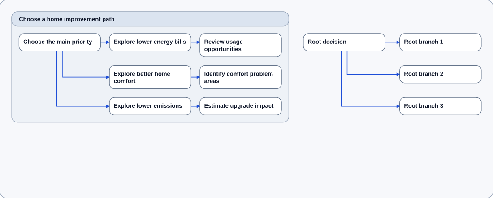
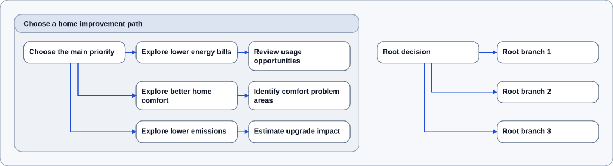
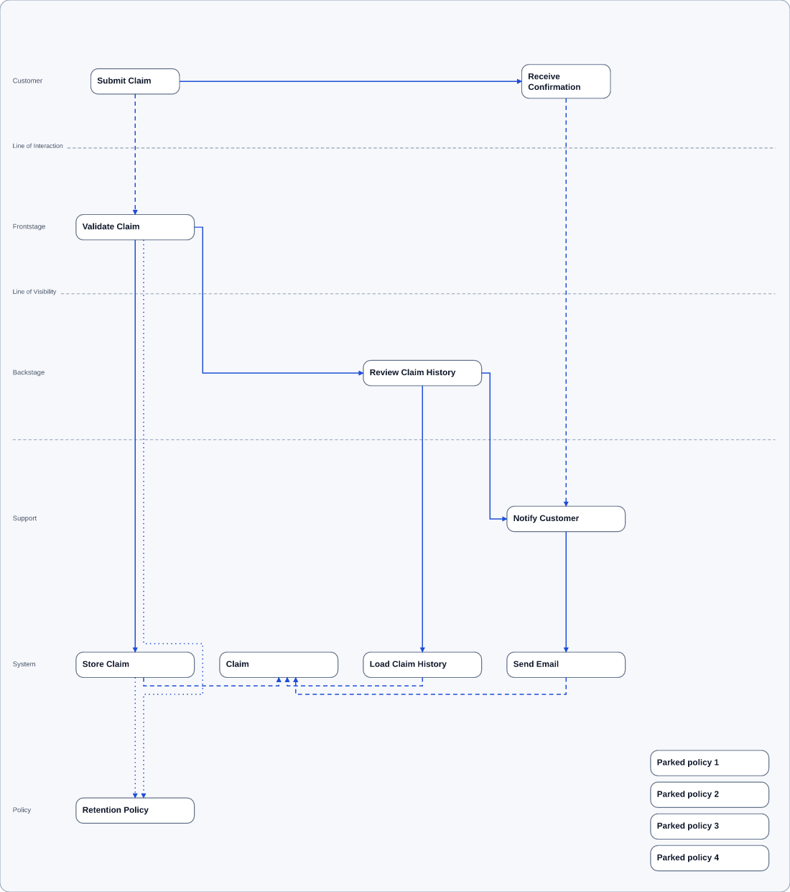
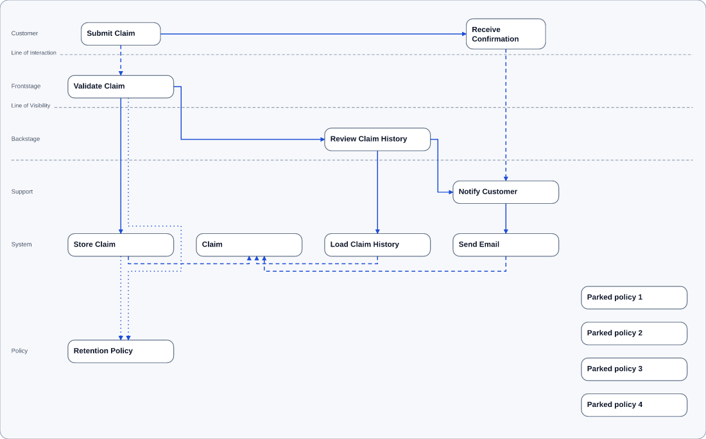

# Visible spacing proofs

8-31-26

These are compact-detail renders of identical source files before and after the spacing fix. Each PNG is scaled to the same 1100-pixel width; the dimensions below are the native SVG dimensions. The before images preserve the previous renderer output for comparison.

## Journey Map: bounds-only option 1

The source combines the canonical three-branch Stage with three uncontained root branches. Node positions, Stage geometry, and diagram width are unchanged; only obsolete bottom canvas space is removed.

[Source](journey-mixed-root-3.sdd) · [Before SVG](journey-mixed-root-3.before.svg) · [After SVG](journey-mixed-root-3.after.svg)

| Before: 1352 × 544 | After: 1352 × 368 |
| --- | --- |
|  |  |

## Service Blueprint: four parked policies

The source adds four disconnected policies to the canonical service blueprint. Individual node tiers share a height across the diagram. Only the Policy row needs multiple tiers; the other rows retain a single tier. Stacks remain centered in their rows, and node boxes retain their measured dimensions.

[Source](service-blueprint-parked-4.sdd) · [Before SVG](service-blueprint-parked-4.before.svg) · [After SVG](service-blueprint-parked-4.after.svg)

| Before: 1496 × 1688 | After: 1496 × 932 |
| --- | --- |
|  |  |

The matching geometry assertions are in `tests/stagedSpacingRegression.spec.ts`. See [the spacing contract](../renderer_spacing.md) for policy and measurement details.
